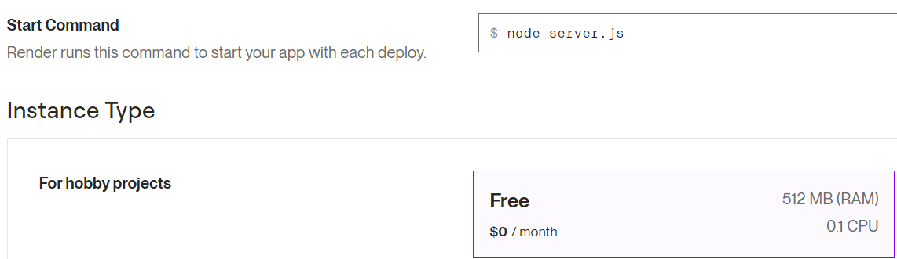
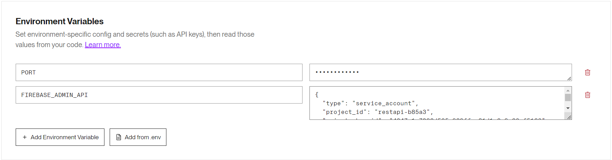

<style type="text/css" media="screen">
  details {
    margin: 5% 0%;
    padding: 2%;
    border: dashed 2px black;
    border-radius: 11px;
    box-shadow: 5px 5px 15px rgba(0, 0, 0, 0.3);
  }

  details div {
    color: lightseagreen;
    font-weight: bold;
    cursor: pointer;
    text-align: center;
  }

  img.description {
    width: 50%;
    text-align: center;
    margin: 0 25%;
  }
</style>

## Guía 17

[DAWM](/DAWM/) / [Proyecto04](/DAWM/proyectos/2024/proyecto04)

### Actividades previas

1. Obtenga una cuenta en [Render](https://render.com/) con su cuentan en GitHub.
2. Active su cuenta desde el enlace en el correo electrónico.
3. Complete su perfil con su información básica.

### Actividades en clases

1. Clone localmente tu repositorio **restapi**.

#### Render

1. En el [Dashboard Render](https://dashboard.render.com/), seleccione la opción **Web Services**.
2. Conecte el repositorio remoto **restapi** de GitHub.

<div align="center">
  
</div>

3. En la configuración:
    + Cambie el valor de _Start Command_ por **node server.js**
    + En _Instance Type_ seleccione la opción gratuita **Free**

<div align="center">
  
</div>

4. En _Environment Variables_, haga clic en **Add from .env** y pegue todo el contenido el archivo `.env` del proyecto _restapi_.

<div align="center">
  
</div>

<div align="center">
  
</div>

5. Haga click en **Deploy Web Service**.
6. Acceda al servicio e inspeccione el proceso de despliegue en la opción **Event**.

<div align="center">
  
</div>

7. (STOP 1) Del _URL_ (`https://restapi-<ID>.onrender.com`) copie en solo el _host_ (`restapi-<ID>.onrender.com`).

<div align="center">
  
</div>

#### REST API - Swagger

1. En el archivo de configuración de `./swagger.js`:
    + Modifique el valor **host** por el valor de _host_ del servicio web. 
    + Agregue la clave **schemes** con los valores **[http, https]**.

    ```typescript
    ...

    const doc = {
      ...
      //"host": 'localhost:5500',
      "host": 'restapi-<ID>.onrender.com',
      "schemes": [
        "http", "https"
      ],
      ...
    };

    ...
    ```

2. Desde la línea de comandos, genere el archivo de configuración (`./swagger_output.json`) de Swagger, con el comando:

    ```command
    npm run swagger
    ```

3. Acceda al servicio e inspeccione el proceso de despliegue en la opción **Event**.
4. (STOP 2) Compruebe los endpoints de la documentación en Render. Agregue el `path` _/documentation_ al URL.

### Documentación

* En [Render - docs](https://docs.render.com/) puedes encontrar la documentación necesaria para desplegar su aplicación web desarrollada en diferentes lenguajes y frameworks.

### Fundamental

* Plataformas de hosting con planes gratuito

<blockquote class="twitter-tweet"><p lang="es" dir="ltr">¡Oh no! HEROKU deja de ser GRATIS... 😱<br>¿Donde puedes DESPLEGAR tus PROYECTOS ahora?<br><br>5️⃣ PLATAFORMAS de HOSTING con plan GRATUITO 🧵⬇️</p>&mdash; Miguel Ángel Durán (@midudev) <a href="https://twitter.com/midudev/status/1562861949427523589?ref_src=twsrc%5Etfw">August 25, 2022</a></blockquote> <script async src="https://platform.twitter.com/widgets.js" charset="utf-8"></script>

### Términos

despliegue, URL, host, path

### Referencias

* Deploy a Node Express App on Render. (n.d.). Retrieved from https://docs.render.com/deploy-node-express-app
* Clinton, E. O. (2023). How to deploy a Node.js and PostgreSQL App on Render. Retrieved from https://mattermost.com/blog/deploy-nodejs-app-on-render/