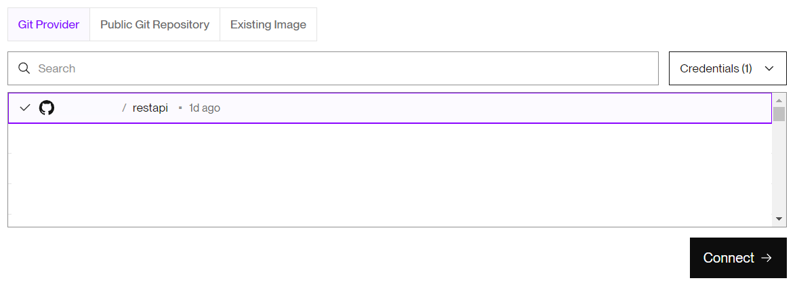
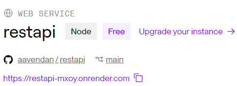

## Guía 17

[DAWM](/DAWM/) / [Proyecto04](/DAWM/proyectos/2024/proyecto04)

<link href="styles/mystyle.css" rel="stylesheet"></link>

### Actividades previas

1. Acceda a [Render](https://render.com/) y obtenga una cuenta con GitHub.
2. Active su cuenta desde el enlace en el correo electrónico.
3. Complete su perfil con su información básica.

### Actividades en clases

#### Render - Despliegue desde GitHub

1. En el [Dashboard Render](https://dashboard.render.com/), seleccione la opción **Web Services**.
2. Conecte el servicio web con el repositorio remoto _restapi_.

    <div align="center">
      
    </div>

3. En la configuración, cambie el valor de _Start Command_ por **node server.js**.

    <div align="center">
      
    </div>

4. En la sección _Instance Type_, seleccione la opción gratuita **Free**.

    <div align="center">
      
    </div>

5. En la sección _Environment Variables_:
    + Haga clic en **Add from .env**. 
    + Pegue todo el contenido el archivo `.env` del proyecto _restapi_. 
    + Haga clic en **Add Variables**.

    <div align="center">
      
    </div>

6. Haga click en **Deploy Web Service**.
7. (STOP 1) Acceda a la opción **Events** del servicio web e inspeccione el proceso de despliegue.

    <div align="center">
      
    </div>

#### Render - URL del servicio web

1. Identifique el **URL del servicio web**. 

    ```command
    https://restapi-<ID>.onrender.com/
    ``` 

    <div align="center">
      
    </div>

2. Agregue la `ruta`  _/documentation_ a la URL del servicio web y acceda a la página con la documentación en Swagger: 
    
    ```command
    https://restapi-<ID>.onrender.com/documentation
    ```

    <div align="center">
      
    </div>

3. (STOP 2) Compruebe el endpoint **GET** de la documentación en Swagger e identifique el error en la respuesta.

    <div align="center">
      
    </div>

#### REST API - host

1. Copie en solo el _host_ (`restapi-<ID>.onrender.com`) del URL del servicio web.
2. En el archivo de configuración de `./swagger.js`:
    + Modifique la clave _"host"_ coloque el _host_ del servicio web. 
    + Agregue la clave _"schemes"_ coloque el valor _["https"]_.

    ```typescript
    ...

    const doc = {
      ...
      //"host": 'localhost:5500',
      "host": 'restapi-<ID>.onrender.com',
      "schemes": [
        "https"
      ],
      ...
    };

    ...
    ```

3. Desde la línea de comandos, genere el archivo de configuración (`./swagger_output.json`) de Swagger, con el comando:

    ```command
    npm run swagger
    ```

4. Versione local y remotamente el repositorio **restapi**
5. Acceda a la opción **Events** del servicio web e inspeccione el proceso de despliegue.
6. (STOP 3) Compruebe el endpoint **GET** de la documentación en Swagger e identifique la respuesta exitosa.

    <div align="center">
      
    </div>
    

### Documentación

* En [Render - docs](https://docs.render.com/) puedes encontrar la documentación necesaria para desplegar su aplicación web desarrollada en diferentes lenguajes y frameworks.

### Fundamental

* Plataformas de hosting con planes gratuito

<blockquote class="twitter-tweet"><p lang="es" dir="ltr">¡Oh no! HEROKU deja de ser GRATIS... 😱<br>¿Donde puedes DESPLEGAR tus PROYECTOS ahora?<br><br>5️⃣ PLATAFORMAS de HOSTING con plan GRATUITO 🧵⬇️</p>&mdash; Miguel Ángel Durán (@midudev) <a href="https://twitter.com/midudev/status/1562861949427523589?ref_src=twsrc%5Etfw">August 25, 2022</a></blockquote> <script async src="https://platform.twitter.com/widgets.js" charset="utf-8"></script>

### Términos

despliegue, URL, host, path

### Referencias

* Deploy a Node Express App on Render. (n.d.). Retrieved from https://docs.render.com/deploy-node-express-app
* Clinton, E. O. (2023). How to deploy a Node.js and PostgreSQL App on Render. Retrieved from https://mattermost.com/blog/deploy-nodejs-app-on-render/