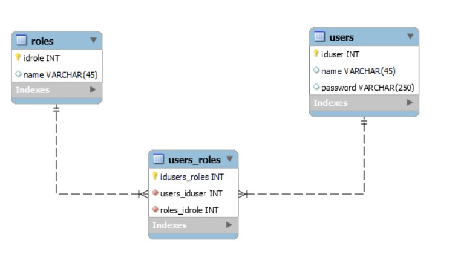
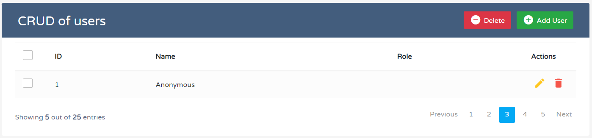

## Guía 18

[DAWM](/DAWM/) / [Proyecto04](/DAWM/proyectos/2024/proyecto04)

<style type="text/css" media="screen">
  details {
    margin: 5% 0%;
    padding: 2%;
    border: dashed 2px black;
    border-radius: 11px;
    box-shadow: 5px 5px 15px rgba(0, 0, 0, 0.3);
  }

  details div {
    color: lightseagreen;
    font-weight: bold;
    cursor: pointer;
    text-align: center;
  }

  img.description {
    width: 50%;
    text-align: center;
    margin: 0 25%;
  }
</style>

### Actividades previas

#### Schema DB

1. Descargue el archivo [security](recursos/security.sql).
2. Acceda a MySQL Workbench y ejecute el script.
3. Obtenga el diagrama entidad-relación de la base en la opción: **Database** > **Reverse engineer**


    <div align="center">
      
    </div>


#### CRUD UI

1. Descargue el archivo [template_crud](recursos/template_crud.zip).
2. Compruebe el funcionamiento de las ventanas modales con las **Add User**, **Edit** y **Delete**.

    <div align="center">
      
    </div>

### Actividades en clases

#### Github

1. Cree un repositorio en GitHub con el nombre **security**.
2. Asegúrese de marcar la opción **Add .gitignore** y seleccione la opción **Node**.
3. Clone y acceda a la carpeta en el directorio local.


#### Módulos globales 

1. Instale los módulos [**mysql2**](## "conector para MySQL"), express-generator y express-cli de manera global. 

    ```command
    npm i -g mysql2 express-generator express-cli
    ```

#### Express - Proyecto Base

1. Dentro de la carpeta _security_, mediante la línea de comandos: 

    + Inicialice un proyecto en Express, con: 

    ```command
    express --view=ejs .
    ```

    + Instale localmente los módulos `sequelize` (`ORM` para acceder a la BD mediante Objetos), mysql2, dotenv y nodemon. 

    ```command
    npm install --save sequelize mysql2 dotenv nodemon
    ```

2. Agregue el script _autostart_ en _./package.json_.

    ```typescript
    ...
      "scripts": {
        "start": "node ./bin/www",
        "autostart": "nodemon ./bin/www"
      },
    ...
    ```

3. Desde la línea de comandos, inicie el servidor:

    ```command
    npm run autostart
    ```

4. Compruebe la salida de la URL [http://localhost:3000/users](http://localhost:3000/users)
5. (STOP 1) Versiona local y remotamente el repositorio **security**.

#### Express - Archivos estáticos y Vistas

1. Coloque los `archivos estáticos`:
    + _'crud-style.css'_ dentro de la carpeta _'security/public/stylesheets'_.
    + _'crud-javascript.js'_ dentro de la carpeta _'security/public/javascripts'_.

2. Cree el archivo **_'security/views/crud.ejs'_**. Copie todo el contenido de _test.html_ dentro de _'security/views/crud.ejs'_.

3. Edite la `vista` _'security/views/crud.ejs'_, con:
    
    + Coloque la ruta a la carpeta con los archivos estáticos.

    ```html
    ...
    <!-- 1. Referencia al archivo estático dentro de public -->

    <!-- <link rel="stylesheet" href="./crud-style.css"> -->
    <link rel="stylesheet" href="stylesheets/crud-style.css">
    
    ...
    
    <!-- 2. Referencia al archivo estático dentro de public -->

    <!-- <script src="./crud-javascript.js" defer></script> -->
    <script src="javascripts/crud-javascript.js" defer></script>
    ...
    ```

4. Edite el `enrutador` _'security/routes/users.js'_, con:
    
    + El nombre de la vista, sin la extensión _'ejs'_.
    
    ```typescript
    ...

    /* GET users listing. */
    router.get('/', function(req, res, next) {
    
      /* 1. Renderización de la vista crud.ejs */
      res.render('crud');
    
    });

    module.exports = router;

    ```

5. Compruebe la salida de la URL [http://localhost:3000/users](http://localhost:3000/users)
6. (STOP 2) Versiona local y remotamente el repositorio **security**.

#### Express - Users.findAll

1. Dentro de la carpeta _security_, mediante la línea de comandos: 

    + Genere los archivos de configuración de Sequelize, con: 

    ```command
    sequelize init
    ```

    + Reconstruya los modelos con las credenciales de acceso al motor de bases de datos, con: 

    ```command
    sequelize-auto -h 127.0.0.1 -d security  -p 3306 -u <USUARIO_ADMIN> -x <CONTRASEÑA>
    ```

2. Modifique el archivo _'config/config.json'_, en el `ambiente` **development**, con las credenciales de acceso al motor de bases de datos.

    ```json
    "development": {
      "username": "<USUARIO_ADMIN>",
      "password": "<CONTRASEÑA>",
      "database": "security",
      "host": "127.0.0.1",
      "dialect": "mysql"
    }
    ```

3. Edite el enrutador _'security/routes/users.js'_, con: 
    
    + Configuración de conexión (en _'models/index.js'_),
    + Estructura de [modelos](https://sequelize.org/docs/v6/core-concepts/model-basics/) (de _'models/init-models'_),
    + Carga los modelos de acuerdo con la configuración de la conexión,
    + Cargar la colección de usuarios mediante el método [findAll](https://sequelize.org/docs/v6/core-concepts/model-querying-basics/#simple-select-queries).
    + Pasar la colección de usuarios a la vista.
    
    ```typescript
    ...
    var express = require('express');
    var router = express.Router();

    /* 1. Cargue los modelos de acuerdo con la configuración de la conexión */
    const sequelize = require('../models/index.js').sequelize;
    var initModels = require("../models/init-models");
    var models = initModels( sequelize );  

    /* GET users listing. */
    /* 2. Convierta el callback en asíncrono */
    router.get('/', async function(req, res, next) {

      /* 3. Uso del método findAll */
      let usersCollection = await models.users.findAll({ })

      /* 4. Paso de parámetros a la vista */
      res.render('crud', { title: 'CRUD with users', usersArray: usersCollection });

    });

    module.exports = router;
    ```

4. Edite la vista _'security/views/crud.ejs'_, con:

    + La `renderización` de las variables mediante las [etiquetas](https://ejs.co/#docs) **<%= %>** y **<% %>**, de EJS.

    ```html
    ...
    <!-- 3. Título de la página -->
    <title><%= title %></title>
    ...
    <!-- 4. Título de la tabla -->
    <h2><%= title %></h2>
    ...
    <!-- 5. Arreglo de usuarios -->
    <tbody>
        <% usersArray.forEach( user => { %>
        <tr>
            <td>
                <span class="custom-checkbox">
                    <input type="checkbox" id="checkbox1"
                        name="options[]" value="1">
                    <label for="checkbox1"></label>
                </span>
            </td>
            <td><%= user.iduser %></td>
            <td><%= user.name %></td>
            <td>
                <!-- 
                    Dato relacionado

                    users->users_roles->roles.name
                 -->
            </td>
            <td>
                <a href="#editEmployeeModal" class="edit"
                    data-toggle="modal"><i
                        class="material-icons"
                        data-toggle="tooltip"
                        title="Edit">&#xE254;</i></a>
                <a href="#deleteEmployeeModal"
                    class="delete" data-toggle="modal"><i
                        class="material-icons"
                        data-toggle="tooltip"
                        title="Delete">&#xE872;</i></a>
            </td>
        </tr>
        <% }) %>
    </tbody>
    ```

5. Compruebe la salida de la URL [http://localhost:3000/users](http://localhost:3000/users)

    <div align="center">
      
    </div>

6. Versiona local y remotamente el repositorio **security**.
7. (STOP 3) Descargue y complete el diagrama de secuencia para completar un requerimiento GET exitoso.

    [Diagrama de secuencia](recursos/diagrama_guia18.pdf)


### Documentación

* Documentación de [Express](https://expressjs.com/) y [Sequelize](https://sequelize.org/docs/v6/getting-started/).

### Fundamental

* Introduction to Sequelize: Simplifying Database Operations in Node.js en [X](https://x.com/prod42net/status/1806236123217158619)

<blockquote class="twitter-tweet"><p lang="en" dir="ltr">&quot;Discover the power of Sequelize for simplifying database operations in Node.js with <a href="https://twitter.com/vaishnavirawool?ref_src=twsrc%5Etfw">@VaishnaviRawool</a>&#39;s insightful guide. From advantages to getting started, it&#39;s a must-read for developers. <a href="https://twitter.com/hashtag/NodeJS?src=hash&amp;ref_src=twsrc%5Etfw">#NodeJS</a> <a href="https://twitter.com/hashtag/Sequelize?src=hash&amp;ref_src=twsrc%5Etfw">#Sequelize</a> <a href="https://twitter.com/hashtag/DatabaseOps?src=hash&amp;ref_src=twsrc%5Etfw">#DatabaseOps</a> <a href="https://twitter.com/hashtag/ORM?src=hash&amp;ref_src=twsrc%5Etfw">#ORM</a>&quot; <a href="https://t.co/DvopupkfYV">https://t.co/DvopupkfYV</a></p>&mdash; prod42net (@prod42net) <a href="https://twitter.com/prod42net/status/1806236123217158619?ref_src=twsrc%5Etfw">June 27, 2024</a></blockquote> <script async src="https://platform.twitter.com/widgets.js" charset="utf-8"></script>

* Encriptación de una contraseña, con SALT en [X](https://twitter.com/El_Pop/status/1560356275774447618)

<blockquote class="twitter-tweet" data-media-max-width="560"><p lang="es" dir="ltr">Como almacenar passwords en una BD para que estos no estén expuestos en el caso de un acceso a esta base:<br><br>el truco es reconstruir el password a partir de su hash y el salt previamente generado y almacenado. <a href="https://t.co/sdESoBZOeg">pic.twitter.com/sdESoBZOeg</a></p>&mdash; Fernando Romo (@El_Pop) <a href="https://twitter.com/El_Pop/status/1560356275774447618?ref_src=twsrc%5Etfw">August 18, 2022</a></blockquote> <script async src="https://platform.twitter.com/widgets.js" charset="utf-8"></script>

### Términos

Sequelize, ORM, archivos estáticos, vista, enrutador, modelo, renderización, encriptación, SALT

### Referencias

* Bootstrap Crud Data Table for Database with Modal Form. (n.d.). Retrieved from https://www.tutorialrepublic.com/snippets/preview.php?topic=bootstrap&file=crud-data-table-for-database-with-modal-form
* (N.d.). Retrieved from https://expressjs.com/en/guide/using-template-engines.html