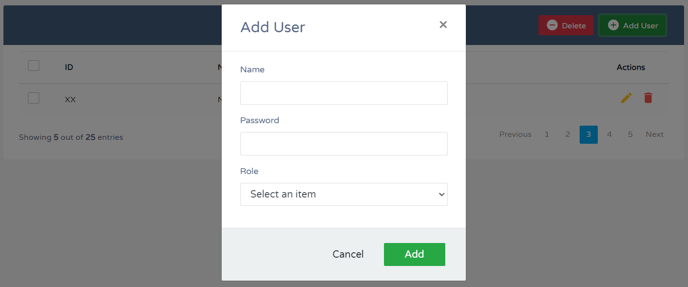

## Guía 18

[DAWM](/DAWM/) / [Proyecto04](/DAWM/proyectos/2024/proyecto04)

<style type="text/css" media="screen">
  details {
    margin: 5% 0%;
    padding: 2%;
    border: dashed 2px black;
    border-radius: 11px;
    box-shadow: 5px 5px 15px rgba(0, 0, 0, 0.3);
  }

  details div {
    color: lightseagreen;
    font-weight: bold;
    cursor: pointer;
    text-align: center;
  }

  img.description {
    width: 50%;
    text-align: center;
    margin: 0 25%;
  }
</style>

### Actividades previas

#### Schema DB

1. Descargue el archivo [security](recursos/security.sql).
2. Acceda a MySQL Workbench y ejecute el script.

#### CRUD UI

1. Descargue el archivo [crud](recursos/crud.zip).
2. Compruebe el funcionamiento de las ventanas modales con las **Add User**, **Edit** y **Delete**.

    <div align="center">
      
    </div>

### Actividades en clases

#### Github

1. Cree un repositorio en GitHub con el nombre **security**.
2. Asegúrese de marcar la opción **Add .gitignore** y seleccione la opción **Node**.
3. Clone y acceda a la carpeta en el directorio local.


#### Módulos globales 

1. Instale el módulo **mysql2** (conector con MySQL) de manera global. 

    ```command
    npm i -g mysql2
    ```

#### Express - Proyecto Base

1. Dentro de la carpeta _security_, mediante la línea de comandos: 
    + Inicialice un proyecto en Express, con: 

    ```command
    express --view=ejs .
    ```

    + Instale los módulos **sequelize** (`ORM` para el acceso a la BD), **mysql2** (conector con MySQL), **dotenv** y **nodemon** de manera local. 

    ```command
    npm install --save sequelize mysql2 dotenv nodemon
    ```

2. Agregue el script **autostart** en _./package.json_.

    ```typescript
    ...
      "scripts": {
        "start": "node ./bin/www",
        "autostart": "nodemon ./bin/www"
      },
    ...
    ```

3. Desde la línea de comandos, inicie el servidor:

    ```command
    npm run autostart
    ```

4. Compruebe la salida de la URL [http://localhost:3000/users](http://localhost:3000/users)
5. (STOP 1) Versiona local y remotamente el repositorio **security**.

#### Express - Archivos estáticos y Vistas

1. Coloque los `archivos estáticos`:
    + _crud-style.css_ dentro de la carpeta _security/public/stylesheets_.
    + _crud-javascript.js_ dentro de la carpeta _security/public/javascripts_.

2. Cree el archivo _security/views/crud.ejs_. Copie todo el contenido de _test.html_ dentro del archivo _crud.ejs_.

3. Edite la `vista` _security/views/crud.ejs_ con la ruta a la carpeta con los archivos estáticos.

    ```html
    ...
    <!-- 1. Referencia al archivo estático en public -->

    <!-- <link rel="stylesheet" href="./crud-style.css"> -->
    <link rel="stylesheet" href="stylesheets/crud-style.css">
    
    ...
    
    <!-- 2. Referencia al archivo estático en public -->

    <!-- <script src="./crud-javascript.js" defer></script> -->
    <script src="javascripts/crud-javascript.js" defer></script>
    ...
    ```

4. Edite el enrutador _security/routes/users.js_ con la renderización de la vista.
    
    ```typescript
    ...

    /* GET users listing. */
    router.get('/', function(req, res, next) {
    
      /* 1. Renderización de la vista */
      res.render('crud');
    
    });

    module.exports = router;

    ```

5. Compruebe la salida de la URL [http://localhost:3000/users](http://localhost:3000/users)
6. (STOP 2) Versiona local y remotamente el repositorio **security**.

#### Express - Users.findAll

1. Dentro de la carpeta _security_, mediante la línea de comandos: 
    + Genere los archivos de configuración de Sequelize, con: 

    ```command
    sequelize init
    ```

    + Reconstruya los modelos con las credenciales de acceso y el esquema de la base de datos, con: 

      ```command
      sequelize-auto -h 127.0.0.1 -d security -u <USUARIO_ADMIN> -x <CONTRASEÑA> -p 3306
      ```

2. Modifique el archivo `config/config.json`, en el ambiente **development**, con los datos de conexión con el motor de bases de datos.

    ```json
    "development": {
      "username": "<USUARIO_ADMIN>",
      "password": "<CONTRASEÑA>",
      "database": "security",
      "host": "127.0.0.1",
      "dialect": "mysql"
    },
    ...
    ```

3. Edite el enrutador _security/routes/users.js_ con: 

    + Importe el [modelo](https://sequelize.org/docs/v6/core-concepts/model-basics/) users e instance **Users**.
    + Seleccione de todos los registros, mediante el método [findAll](https://sequelize.org/docs/v6/core-concepts/model-querying-basics/#simple-select-queries).
    
    ```typescript
    ...
    var express = require('express');
    var router = express.Router();

    /* 1. Modelos y Operadores */
    const Users = require('../models').users;

    /* GET users listing. */
    /* 2. Callback asíncrono */
    router.get('/', async function(req, res, next) {

      /* 3. Requerimiento a la BD mediante la instancia */
      let users = await Users.findAll({ })

      /* 4. Paso de la respuesta en la vista */
      res.render('crud', { title: 'CRUD with users', users: users });

    });

    module.exports = router;
    ```

4. Edite la vista _security/views/crud.ejs_, con:
    + La `renderización` de las variables mediante las [etiquetas](https://ejs.co/#docs) **<%= %>** y **<% %>**, de EJS.

    ```html
    ...
    <!-- 3. Título de la página -->
    <title><%= title %></title>
    ...
    <!-- 4. Título de la tabla -->
    <h2><%= title %></h2>
    ...
    <!-- 5. Arreglo de usuarios -->
    <tbody>
        <% users.forEach( user => { %>
        <tr>
            <td>
                <span class="custom-checkbox">
                    <input type="checkbox" id="checkbox1"
                        name="options[]" value="1">
                    <label for="checkbox1"></label>
                </span>
            </td>
            <td><%= user.iduser %></td>
            <td><%= user.name %></td>
            <td></td>
            <td>
                <a href="#editEmployeeModal" class="edit"
                    data-toggle="modal"><i
                        class="material-icons"
                        data-toggle="tooltip"
                        title="Edit">&#xE254;</i></a>
                <a href="#deleteEmployeeModal"
                    class="delete" data-toggle="modal"><i
                        class="material-icons"
                        data-toggle="tooltip"
                        title="Delete">&#xE872;</i></a>
            </td>
        </tr>
        <% }) %>
    </tbody>
    ```

5. Compruebe la salida de la URL [http://localhost:3000/users](http://localhost:3000/users)

    <div align="center">
      
    </div>

6. (STOP 3) Versiona local y remotamente el repositorio **security**.

### Actividad en grupo - Roles.findAll

En grupos de tres (3) personas, completen las siguientes tareas. Pueden utilizar la documentación oficial o los servicios de un LLM.

1. Edite el enrutador _security/routes/users.js_: 
    
    ```typescript
    ...
    /* 1. Modelos y Operadores */
    const Users = require('../models').users;
    const Roles = /* Importe el modelo roles */

    /* GET users listing. */
    /* 2. Callback asíncrono */
    router.get('/', async function(req, res, next) {

      /* 3. Requerimiento a la BD mediante la instancia */
      let users = await Users.findAll({ })
      let roles = /* recupere de todos los registros mediante la instancia Roles. */

      /* 4. Paso de la respuesta en la vista */
      res.render('crud', { title: 'CRUD of users', users: users, roles: /* Pase la respuesta en la vista */   });

    });

    module.exports = router;
    ...
    ```

    <details>
      <summary><div>Haga click aquí para ver la solución</div></summary>
      <pre lang="typescript"><code>
        ...
        /* 1. Modelos y Operadores */
        const Users = require('../models').users;
        const Roles = require('../models').roles;

        /* GET users listing. */

        /* 2. Callback asíncrono */
        router.get('/', async function(req, res, next) {
          
          /* 3. Requerimiento a la BD mediante la instancia */
          let users = await Users.findAll({ })
          let roles = await Roles.findAll({ })

          /* 4. Paso de la respuesta en la vista */
          res.render('crud', { title: 'CRUD of users', users: users, roles: roles });

        });
      </code></pre>
    </details>

2. Edite la vista _security/views/crud.ejs_ con la renderización del arreglo roles. 
    
    En cada option, considere:
    + Asigne el atributo _value_ es el atributo **idrole**, y 
    + El texto del elemento es el atributo **name**.

    ```html
    ...
    <!-- 6. Arreglo de roles -->
    <select name="idrole" class="form-control">
        <option value="null" selected disabled
            class="form-control">Select an item</option>

    </select>
    ```

    <details>
      <summary><div>Haga click aquí para ver la solución</div></summary>
      <pre lang="html"><code>
          &lt;!-- 6. Arreglo de roles --&gt;
          &lt;select name="idrole" class="form-control"&gt;
              &lt;option value="null" selected disabled
                  class="form-control"&gt;Select an
                  item&lt;/option&gt;
              &lt;% roles.forEach( role =&gt; { %&gt; 
                  &lt;option 
                  value="&lt;%=role.idrole%&gt;"
                  class="form-control"&gt;&lt;%=role.name%&gt;&lt;/option&gt;
              &lt;% }) %&gt; 
          &lt;/select&gt;
      </code></pre>
    </details>

3. Compruebe la salida de la URL [http://localhost:3000/users](http://localhost:3000/users)
4. (STOP 4) Versiona local y remotamente el repositorio **security**.


#### SALT

1. Desde otra línea de comandos, acceda a la interfaz de **nodeJS**, con:
  
    ```typescript
    node
    ```

2. Genere y copie la secuencia de caracteres aleatorios, con:

    ```typescript
    > require('crypto').randomBytes(16).toString('base64');
    ```

3. Salga de la consola, con:

    ```typescript
    > .exit
    ```

4. En la raíz del proyecto, cree el archivo `.env`. Agregue la variable **SALT** y asígnele la secuencia de caracteres aleatorios.

    ```
    SALT='...8uUYwT...'
    ```

5. En el archivo `app.js`, agregue el módulo `dotenv` y cargue los datos de configuración.

    ```typescript
    /* Carga de variables de entorno */
    require('dotenv').config()

    var createError = require('http-errors');
    var express = require('express');
    ...
    ```

#### Express - Users.create

1. Edite el enrutador _security/routes/users.js_ con la creación un registro, utilizaremos el método [create](https://sequelize.org/docs/v6/core-concepts/model-instances/#a-very-useful-shortcut-the-create-method).

    ```typescript
    var express = require('express');
    var router = express.Router();

    /* 1. Módulo crypto */
    let crypto = require('crypto');

    ...
    /* GET users listing. */
    router.get('/', async function(req, res, next) { ... });
    
    /* POST user. */
    router.post('/', async (req, res) => {

      /* 2. Parámetros en el cuerpo del requerimiento */
      let { name, password, idrole } = req.body;

      try {

        /* 3. Encripte la contraseña con SALT */
        let salt = process.env.SALT
        let hash = crypto.createHmac('sha512', salt).update(password).digest("base64");
        let passwordHash = salt + "$" + hash

        /* 4. Guarde los datos del usuario */
        let user = await Users.create({ name: name, password: passwordHash })

        /* 5. Redireccione a la vista principal */
        res.redirect('/users')

      } catch (error) {

        res.status(400).send(error)

      }

    })

    module.exports = router;
    ```

2. Edite la vista _security/views/crud.js_. 

    + Identifique el modal con el id **addEmployeeModal**
    + Modifique el formulario con el método (**post**) de envío de datos al servidor y la ruta (**'/users'**) que procesará los datos en el servidor. 

    ```html
    ...
    <!-- Edit Modal HTML -->
    <div id="addEmployeeModal" class="modal fade">
      ...
      <form method="post" action="/users">
      ...
    ...
    ```

3. Acceda a URL [http://localhost:3000/users](http://localhost:3000/users) y complete el formulario para crear un nuevo usuario con los siguientes datos:
    
    ```text
    Name: admin
    Password: admin
    Role: admin
    ```

    <div align="center">
      
    </div>

4. (STOP 5) Versiona local y remotamente el repositorio **security**.

### Actividad en grupo - CRUD

En grupos de tres (3) personas, completen las siguientes tareas. Pueden utilizar la documentación oficial o los servicios de un LLM.

#### UsersRoles.create

1. Complete el proceso de la creación de usuario en el enrutador _security/routes/users.js_:
    + Importe el modelo **user_roles**.
    + Instancie **UsersRoles** para crear la relación entre Users (con el id del usuario en **user.iduser**) y Roles (el id del rol en **idrole**). 

    <details>
      <summary><div>Haga click aquí para ver la solución</div></summary>
      <pre lang="javascript"><code>
        ...
        /* 1. Modelos y Operadores */
        ...
        const UsersRoles = require('../models').users_roles;

        /* POST user. */
        router.post('/', async (req, res) => {

            ...

            try {

                ...

                await UsersRoles.create({ users_iduser: user.iduser, roles_idrole: idrole })

                /* 5. Redireccione a la vista principal */
                res.redirect('/users')

            } catch (error) {

                res.status(400).send(error)

            }
        })

        module.exports = router;
      </code></pre>
    </details>

#### Roles.findOne

1. [findOne](https://sequelize.org/api/v6/class/src/model.js~model#static-method-findOne)

#### Roles.findOne

1. Actualización de los datos de un usuario.

#### Users.destroy

2. Eliminación de un usuario.
3. Eliminación de un grupo de usuarios.

### Documentación

* Documentación de [Express](https://expressjs.com/) y [Sequelize](https://sequelize.org/docs/v6/getting-started/).

### Fundamental

* Introduction to Sequelize: Simplifying Database Operations in Node.js en [X](https://x.com/prod42net/status/1806236123217158619)

<blockquote class="twitter-tweet"><p lang="en" dir="ltr">&quot;Discover the power of Sequelize for simplifying database operations in Node.js with <a href="https://twitter.com/vaishnavirawool?ref_src=twsrc%5Etfw">@VaishnaviRawool</a>&#39;s insightful guide. From advantages to getting started, it&#39;s a must-read for developers. <a href="https://twitter.com/hashtag/NodeJS?src=hash&amp;ref_src=twsrc%5Etfw">#NodeJS</a> <a href="https://twitter.com/hashtag/Sequelize?src=hash&amp;ref_src=twsrc%5Etfw">#Sequelize</a> <a href="https://twitter.com/hashtag/DatabaseOps?src=hash&amp;ref_src=twsrc%5Etfw">#DatabaseOps</a> <a href="https://twitter.com/hashtag/ORM?src=hash&amp;ref_src=twsrc%5Etfw">#ORM</a>&quot; <a href="https://t.co/DvopupkfYV">https://t.co/DvopupkfYV</a></p>&mdash; prod42net (@prod42net) <a href="https://twitter.com/prod42net/status/1806236123217158619?ref_src=twsrc%5Etfw">June 27, 2024</a></blockquote> <script async src="https://platform.twitter.com/widgets.js" charset="utf-8"></script>

* Encriptación de una contraseña con SALT en [X](https://twitter.com/El_Pop/status/1560356275774447618)

<blockquote class="twitter-tweet" data-media-max-width="560"><p lang="es" dir="ltr">Como almacenar passwords en una BD para que estos no estén expuestos en el caso de un acceso a esta base:<br><br>el truco es reconstruir el password a partir de su hash y el salt previamente generado y almacenado. <a href="https://t.co/sdESoBZOeg">pic.twitter.com/sdESoBZOeg</a></p>&mdash; Fernando Romo (@El_Pop) <a href="https://twitter.com/El_Pop/status/1560356275774447618?ref_src=twsrc%5Etfw">August 18, 2022</a></blockquote> <script async src="https://platform.twitter.com/widgets.js" charset="utf-8"></script>

### Términos

vistas, orm, encriptación, salt

### Referencias

* Bootstrap Crud Data Table for Database with Modal Form. (n.d.). Retrieved from https://www.tutorialrepublic.com/snippets/preview.php?topic=bootstrap&file=crud-data-table-for-database-with-modal-form
* (N.d.). Retrieved from https://expressjs.com/en/guide/using-template-engines.html