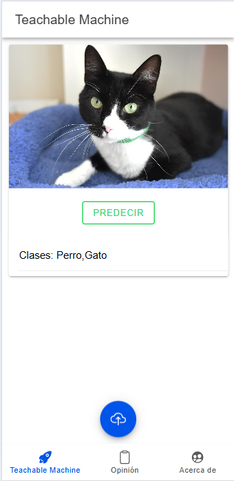
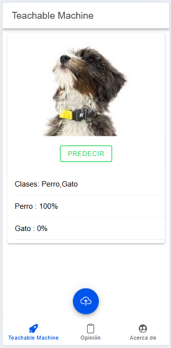

## Guía 19

[DAWM](/DAWM/) / [Proyecto04](/DAWM/proyectos/2024/proyecto04)

<link href="styles/mystyle.css" rel="stylesheet" />

### Objetivo general

<pre class="purpose">Desarrollar una aplicación híbrida utilizando tecnologías que integren modelos de aprendizaje automático previamente entrenados en un entorno funcional y accesible para resolver problemas específicos mediante el reconocimiento de patrones, objetos o sonidos fomentando habilidades prácticas en el desarrollo de aplicaciones móviles con tecnologías modernas y la implementación de inteligencia artificial.</pre>

### Actividades previas

#### Hibrida

1. Clona localmente tu repositorio **hibrida**.
2. Instale los paquetes de su proyecto.
3. Levante los servicios

### Actividades en clases

#### TensorFlow.js y TeachableMachine.js

1. Descargue las librerías JS [@tensorflow/tfjs - tf.min.js](https://cdn.jsdelivr.net/npm/@tensorflow/tfjs@1.3.1/dist/tf.min.js) y [@teachablemachine/image - teachablemachine-image.min.js](https://cdn.jsdelivr.net/npm/@teachablemachine/image@0.8.3/dist/teachablemachine-image.min.js)
2. En su proyecto: 
	- Cree la estructura _src/assets/javascript_ y copie los archivos **tf.min.js** y **teachablemachine-image.min.js** dentro de la carpeta. 
	- Edite el archivo _angular.json_, con la ruta a las librerías JS.

	```json
	"projects": { ...
		"app": { ...
			"architect":{ ...
				"build": { ...
					"options" : { ...
						"scripts": [
				        	"src/assets/javascript/tf.min.js",
				        	"src/assets/javascript/teachablemachine-image.min.js",
						]
					}
				}
			}
		}
	}
	```

4. Reinicie el servidor.
5. (STOP 1) Inspeccione en el navegador y compruebe la carga de los archivos en la opción **Network**, en el archivo **scripts.js**.

#### Servicio de Teacheable Machine - Cargar el modelo y clases

1. Desde la línea de comandos, cree el servicio proveedor de datos, con:

	```command
	ionic g s services/teachablemachine
	```

2. Edite el servicio _src/app/services/teachablemachine.service.ts_, con:

	- Agregue los atributos _URL_, _classLabels_ y _model_.
	- Agregue el método _loadModel_.

	```typescript
	...
	export class TeachablemachineService {

		private URL = "https://teachablemachine.withgoogle.com/models/<ID-MODELO>/"
		private model: any;
		private classLabels: string[] = [];


		constructor() { }

		async loadModel() {
			try {
				const modelURL = this.URL + 'model.json';
				const metadataURL = this.URL + 'metadata.json';

				const tmImage = (window as any).tmImage;
				this.model = await tmImage.load(modelURL, metadataURL);
				this.classLabels = this.model.getClassLabels();

			} catch (error) {
				console.error('Error al cargar el modelo:', error);
				throw new Error('No se pudo cargar el modelo.');
			}
		}

		getClassLabels(): string[] {
			return this.classLabels;
		}

	}
	```

3. Edite _src/app/tab1/tab1.page.ts_, con:

	+ Importe y registre los componentes visuales mediante el decorador de la clase.
	+ Importe y registre el servicio en el constructor.
	+ Declare los atributos _modelLoaded_ y _classLabels_ para almacenar el modelo y la lista de clases, respectivamente.
	+ Agregue el método _ngOnInit_ con el que carga el modelo y las clases

	```typescript
	
	...
	import {  

		  /* Importe los componentes de la UI */
		  IonCardContent, IonButton, IonList, IonItem, IonLabel,

		... 
	} from '@ionic/angular/standalone';

	/* Importe el servicio */
	import { TeachablemachineService } from '../services/teachablemachine.service';
	
	@Component({
		...
		imports: [

		    /* Registre los componentes de la UI */
		    IonCardContent, IonButton, IonList, IonItem, IonLabel,

			...
		]
	})
	export class Tab1Page {

		...

		/* Declare los atributos para almacenar el modelo y la lista de clases */
		modelLoaded = signal(false);
  		classLabels: string[] = [];

  		/* Registre el servicio en el constructor */
		constructor(private teachablemachine: TeachablemachineService) { ... }

		/* Método ngOnInit para cargar el modelo y las clases */
		async ngOnInit() {
			await this.teachablemachine.loadModel()
			this.classLabels = this.teachablemachine.getClassLabels()
			this.modelLoaded.set(true)
		}
	}
	```

4. Edite el archivo _src/app/tab1/tab1.page.html_, con:

	```html
	...
	<!-- CARGA DE PREDICCIÓN - INICIO -->
    @if(modelLoaded()) {

      <div class="ion-text-center ion-padding-top ion-padding-bottom">
        <ion-button fill="outline" color="success">Predecir</ion-button>
      </div>

      <ion-list>
        <ion-item>
          <ion-label>Clases:  {{ classLabels  }} </ion-label>
        </ion-item>
      </ion-list>

    }
    <!-- CARGA DE PREDICCIÓN - FIN -->
	...
	```

5. (STOP 2) Compruebe el resultado en el navegador.

<p style="text-align: center;">
	
</p>

#### Servicio de Teacheable Machine - Predicción

1. Edite el servicio _src/app/services/teachablemachine.service.ts_, con:

	- Agregue el método _predict_.

	```typescript
	...
	export class TeachablemachineService {

		...

		getClassLabels(): string[] { ... }

		/* Método para la predicción a partir de la imagen */
		async predict(imageElement: HTMLImageElement): Promise<any[]> {

			if (!this.model) {
				throw new Error('El modelo no está cargado.');
			}

			return await this.model.predict(imageElement);
		}

	}
	```

3. Edite _src/app/tab1/tab1.page.ts_, con:

	+ Importe los componentes **@ViewChild** y **ElementRef** 
	+ Declare la referencia al elemento con el id image.
	+ Declare el atributo _predictions_ para almacenar la lista de predicciones.
	+ Agregue el método _predict_ para obtener la predicción a partir de la imagen

	```typescript
	/* Importe los componentes */
	import { ViewChild, ElementRef, ... } from '@angular/core';
	...
	
	@Component({ ... })
	export class Tab1Page {

		/* Declare la referencia al elemento con el id image */
		@ViewChild('image', { static: false }) imageElement!: ElementRef<HTMLImageElement>;

		...

		/* Lista de predicciones */
  		predictions: any[] = [];


		/* Método para obtener la predicción a partir de la imagen */
		async predict() {
			try {
				const image = this.imageElement.nativeElement;
				this.predictions = await this.teachablemachine.predict(image);
			} catch (error) {
				console.error(error);
				alert('Error al realizar la predicción.');
			}
		}
	}
	```

4. Edite el archivo _src/app/tab1/tab1.page.html_, con:

	+ Agregue el identificador **#image** al elemento _&lt;img&gt;_
	+ Registro de la función **predict()** para el evento **click**, en el elemento _&lt;ion-button&gt;_
	+ Itere sobre la lista de predicciones

	```html
	...

	<!-- Identificador #image -->
	

	@if( ... ) {

		<div ... >

			<!-- Registro de la función predict para el evento click -->
			<ion-button ... (click)="predict()">Predecir</ion-button>

		</div>

		<ion-list>
			...

			<!-- Itere sobre la lista de predicciones -->
			@for (item of predictions; track $index) {
		    	<ion-item>
		        	<ion-label> {{  item?.className  }} :  {{  item?.probability  }} </ion-label>
		      	</ion-item>
		    }

		</ion-list>
	}
	...
	```

5. (STOP 3) Compruebe el resultado en el navegador.

<p style="text-align: center;">
	
</p>

### Documentación

* Paquete de [Teachable Machine](https://www.npmjs.com/package/@teachablemachine/image)

### Fundamental

* Proyectos educativos de [Teachable Machine](https://x.com/TheEduTools/status/1788870128852984159)

<blockquote class="twitter-tweet"><p lang="en" dir="ltr">Unlock the potential of AI in your classroom! Join me in exploring image, sound, and pose recognition with Teachable Machine. 🍚🔓 Equip the next generation with vital tech skills.<br><br>Know more about Teachable Machine:<a href="https://t.co/dw8QJHd6kZ">https://t.co/dw8QJHd6kZ</a><a href="https://twitter.com/hashtag/teachablemachine?src=hash&amp;ref_src=twsrc%5Etfw">#teachablemachine</a> <a href="https://twitter.com/hashtag/AIProjects?src=hash&amp;ref_src=twsrc%5Etfw">#AIProjects</a>… <a href="https://t.co/C36s1POeOF">pic.twitter.com/C36s1POeOF</a></p>&mdash; The Educational Tools (@TheEduTools) <a href="https://twitter.com/TheEduTools/status/1788870128852984159?ref_src=twsrc%5Etfw">May 10, 2024</a></blockquote> <script async src="https://platform.twitter.com/widgets.js" charset="utf-8"></script>

### Términos

tensorflow, teachable machine

### Referencias

* @teachablemachine/image. (n.d.). Retrieved from https://www.npmjs.com/package/@teachablemachine/image
