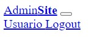
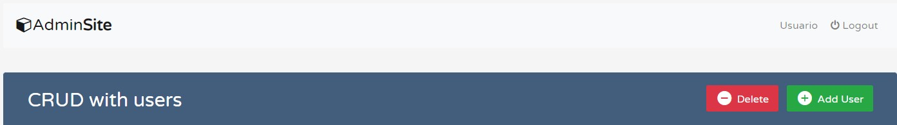
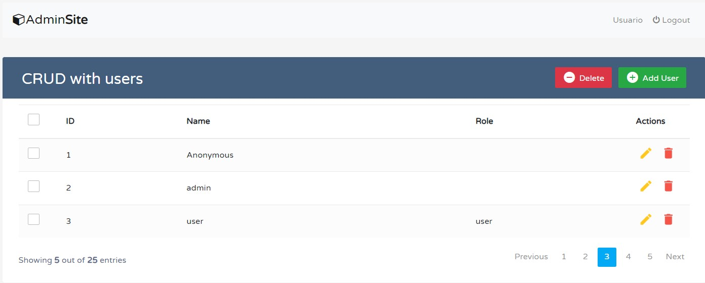

## Guía 19

[DAWM](/DAWM/) / [Proyecto04](/DAWM/proyectos/2024/proyecto04)

<link href="styles/mystyle.css" rel="stylesheet"></link>

### Actividades previas

#### Navbar UI

1. Descargue el archivo [template_navbar](recursos/template_navbar.zip). Fuente: [Tutorial Republic - Snippets](https://www.tutorialrepublic.com/snippets/preview.php?topic=bootstrap&file=all-in-one-navbar)

    <div align="center">
      
    </div>

#### Módulos globales 

1. Instale los módulos mysql2, express-generator, express-cli, sequelize, sequelize-cli y sequelize-auto de manera global. 

    ```command
    npm i -g mysql2 express-generator express-cli sequelize sequelize-cli sequelize-auto
    ```

2. Compruebe el funcionamiento de los comandos, con:

    ```command
    express --help
    sequelize-cli --help
    sequelize-auto --help
    ```

    **NOTA:** En caso de no obtener una respuesta de los comandos, consulte la sección de errores [**No se reconoce como comando**](https://dawmfiec.github.io/DAWM/paginas/errores.html#no-se-reconoce-como-comando).

### Actividades en clases

#### Github

1. Clone localmente tu repositorio **security**.
2. Desde la línea de comandos, inicie el servidor:

    ```command
    npm run autostart
    ```

#### Express - Partials

1. Cree el archivo **_'security/views/partials/navbar.ejs'_**. Copie todo el contenido de _navbar.html_ dentro de _'security/views/partials/navbar.ejs'_.

3. Edite la `vista` _'security/views/crud.ejs'_, con:

    + Coloque la ruta a la carpeta con los archivos estáticos.

    ```html
    ...
    <div class="container-xl">
            
            <!-- 1. Navbar -->
            <%- include('partials/navbar.ejs') %>
            

            <div class="table-responsive">
            ...
            </div>
    </div>
    ...
    ```

5. Compruebe la salida de la URL [http://localhost:3000/users](http://localhost:3000/users)
    
    <div align="center">
      
    </div>

6. (STOP 1) Versiona local y remotamente el repositorio **security**.


#### SALT

1. Desde la línea de comandos, acceda a la interfaz de NodeJS, con:
  
    ```typescript
    node
    ```

2. Genere y copie la secuencia de caracteres aleatorios, con:

    ```typescript
    > require('crypto').randomBytes(16).toString('base64');
    ```

    + Para salir de la consola, utilice:

    ```typescript
    > .exit
    ```

3. En la raíz del proyecto, cree el archivo _'.env'_. Agregue la variable **SALT** y asigne la secuencia de caracteres aleatorios.

    ```
    SALT='...8uUYwT...'
    ```

4. Edite el `servidor` _'app.js'_, con: 
    
    + Carga las variables de entorno mediante el módulo **dotenv**.

    ```typescript
    /* 1. Carga de variables de entorno */
    require('dotenv').config()

    var createError = require('http-errors');
    var express = require('express');
    ...
    ```

#### Express - Users.create

1. Edite el enrutador _'security/routes/users.js'_, con:

    + Importe el módulo **crypto**,
    + El callback para los requerimientos del método **POST**,
    + Encripte la contraseña con la variable **SALT**, y 
    + Utilice el método [create](https://sequelize.org/docs/v6/core-concepts/model-instances/#a-very-useful-shortcut-the-create-method).
     

    ```typescript
    var express = require('express');
    var router = express.Router();

    /* 1. Importe el módulo crypto */
    let crypto = require('crypto');

    ...
    /* GET users listing. */
    router.get( ... );
    
    /* POST user. */
    /* 2. Cree el callback asíncrono que responda al método POST */
    router.post('/', async (req, res) => {

      /* 3. Desestructure los elementos en el cuerpo del requerimiento */
      let { name, password, idrole } = req.body;

      try {

        /* 4. Utilice la variable SALT para encriptar la variable password. */
        let salt = process.env.SALT
        let hash = crypto.createHmac('sha512', salt).update(password).digest("base64");
        let passwordHash = salt + "$" + hash

        /* 5. Guarde el registro mediante el método create */
        let user = await models.users.create({ name: name, password: passwordHash })

        /* 6. Redireccione a la ruta con la vista principal '/users' */
        res.redirect('/users')

      } catch (error) {

        res.status(400).send(error)

      }

    })

    module.exports = router;
    ```

2. Edite la vista _'security/views/crud.ejs'_. 

    + Busque el modal con el identificador **addEmployeeModal**
    + Agregue al formulario el método (**post**) de envío de datos al servidor y la ruta (**'/users'**) que procesará los datos en el servidor. 

    ```html
    ...
    <!-- Edit Modal HTML -->
    <div id="addEmployeeModal" class="modal fade">
      ...
      <form method="post" action="/users">
      ...
    ...
    ```

3. Acceda a URL [http://localhost:3000/users](http://localhost:3000/users), acceda al botón **Add User** y complete el formulario para crear un nuevo usuario con los siguientes datos:
    
    ```text
    Name: admin
    Password: admin
    ```

    <div align="center">
      
    </div>

4. (STOP 2) Versiona local y remotamente el repositorio **security**.

### Actividad en grupo

En grupos de tres (3) personas:

#### Diagrama de secuencia

* Completen el [diagrama de secuencia](recursos/diagrama_guia19.pdf) de un requerimiento POST exitoso.

#### Roles.findAll

Completen las siguientes tareas. Pueden utilizar la documentación oficial o los servicios de un LLM.

1. Edite el enrutador _'security/routes/users.js'_, con:
    
    + La colección de roles mediante el método findAll
    + Pase la colección de roles a la vista.
    
    ```typescript
    ...

    router.get('/', async function(req, res, next) {

      /* 3. Uso del método findAll */
      ...
      let rolesCollection = /* Recupere de todos los registros mediante la instancia Roles. */

      /* 4. Paso de parámetros a la vista */
      res.render('crud', { ... rolesArray: /* Colección de roles */   });

    });

    module.exports = router;
    ...
    ```

    <details>
      <summary><div>Haga click aquí para ver la solución</div></summary>
      <pre lang="typescript"><code>
        ...
         /* 1. Instanciación del modelo */
        const sequelize = require('../models/index.js').sequelize;
        var initModels = require("../models/init-models");
        var models = initModels( sequelize );

        /* GET users listing. */
        /* 2. Convierta el callback en asíncrono */
        router.get('/', async function(req, res, next) {
          
          /* 3. Uso del método findAll */
          let usersCollection = await models.users.findAll({ })
          let rolesCollection = await models.roles.findAll({ })

          /* 4. Paso de parámetros a la vista */
          res.render('crud', { title: 'CRUD of users', usersArray: usersCollection, rolesArray: rolesCollection   });

        });
      </code></pre>
    </details>

2. Edite la vista _'security/views/crud.ejs'_, con: 
    
    + Por cada elemento (_role_) en el arreglo rolesArray:
        - Renderice una etiqueta **&lt;option&gt;**, cuyo atributo _value_ sea **role.idrole**, y el texto del elemento sea **role.name**.

    ```html
    ...
    <!-- 6. Arreglo de roles -->
    <select name="idrole" class="form-control">
        <option value="null" selected disabled
            class="form-control">Select an item</option>

    </select>
    ```

    <details>
      <summary><div>Haga click aquí para ver la solución</div></summary>
      <pre lang="html"><code>
          &lt;!-- 6. Arreglo de roles --&gt;
          &lt;select name="idrole" class="form-control"&gt;
              &lt;option value="null" selected disabled
                  class="form-control"&gt;Select an
                  item&lt;/option&gt;
              &lt;% rolesArray.forEach( role =&gt; { %&gt; 
                  &lt;option 
                  value="&lt;%=role.idrole%&gt;"
                  class="form-control"&gt;&lt;%=role.name%&gt;&lt;/option&gt;
              &lt;% }) %&gt; 
          &lt;/select&gt;
      </code></pre>
    </details>

3. Acceda a URL [http://localhost:3000/users](http://localhost:3000/users), acceda al botón **Add User** y verifique que se muestren los roles.

4. (STOP 3) Versiona local y remotamente el repositorio **security**.

#### UsersRoles.create

Completen las siguientes tareas. Pueden utilizar la documentación oficial o los servicios de un LLM.

1. Edite el enrutador _'security/routes/users.js'_, con:

    + Utilice el modelo **user_roles** para crear la relación **user.iduser** (id del usuario) y **idrole** (id del rol). 

    ```typescript
    ...

    /* POST user. */
    router.post('/', async (req, res) => {

        ...

        try {

            ...
            let user = ...

            /* 5.1. Utilice el model.user_roles para crear la relación ( user.iduser , idrole) */


            /* 6. Redireccione a la ruta con la vista principal '/users' */
            ...

        } catch (error) {

            res.status(400).send(error)

        }
    })

    module.exports = router;
    ```

    <details>
      <summary><div>Haga click aquí para ver la solución</div></summary>
      <pre lang="javascript"><code>
        ...
        
        /* POST user. */
        router.post('/', async (req, res) => {

            ...

            try {

                ...
                let user = ...

                /* 5.1. Utilice el model.user_roles para crear la relación ( user.iduser , idrole) */
                await models.users_roles.create({ users_iduser: user.iduser, roles_idrole: idrole })

                /* 6. Redireccione a la ruta con la vista principal '/users' */
                ...

            } catch (error) {

                res.status(400).send(error)

            }
        })

        module.exports = router;
      </code></pre>
    </details>

2. Acceda a URL [http://localhost:3000/users](http://localhost:3000/users), acceda al botón **Add User** y complete el formulario para crear un nuevo usuario con los siguientes datos:
    
    ```text
    Name: user
    Password: user
    Role: user
    ```

3. (STOP 4) Versiona local y remotamente el repositorio **security**.

#### Sequelize - Eager Loading

Completen las siguientes tareas. Pueden utilizar la documentación oficial o los servicios de un LLM.

1. Edite el enrutador _'security/routes/users.js'_, con: 

    + Incluya todos los modelos asociados con el modelo **users** y sus asociaciones anidadas (recursivamente). Revise [Including everything](https://sequelize.org/docs/v6/advanced-association-concepts/eager-loading/#including-everything)

    + Agregue la clave _raw_ para que la respuesta solo contenga datos (_raw: true_) y la clave _nest_ para habilitar el acceso anidado (_nest: true_). Revise [Raw Queries](https://sequelize.org/docs/v6/core-concepts/raw-queries/)
    
    ```typescript
    ...

    router.get('/', async function(req, res, next) {

      /* 3. Uso del método findAll */
      let usersCollection = await models.users.findAll({ 

        /* 3.1. Including everything */


        /* 3.2. Raw Queries */
        
        
        })

      ...

      res.render( ... );

    });

    module.exports = router;
    ...
    ```

    <details>
      <summary><div>Haga click aquí para ver la solución</div></summary>
      <pre lang="javascript"><code>
        ...
        
        router.get('/', async function(req, res, next) {

          /* 3. Uso del método findAll */
          let usersCollection = await models.users.findAll({ 

            /* 3.1. Including everything */
            include: { all: true, nested: true },
            
            /* 3.2. Raw Queries */
            raw: true,
            nest: true,
            
            
            })

          ...

          res.render( ... );

        });

        module.exports = router;
      </code></pre>
    </details>

2. Edite la vista _'security/views/crud.ejs'_, con:

    + Acceda a los objetos y la relación: **users->users_roles->(alias de la relación)->roles.name**

    ```html
    ...
    <td>
        <!-- 
            Dato relacionado

            users->users_roles->roles.name
        -->
    </td>
    ...
    ```
    <details>
      <summary><div>Haga click aquí para ver la solución</div></summary>
      <pre lang="javascript"><code>

        ...

        &lt;td&gt;

            &lt;!-- 
                Dato relacionado

                users->users_roles->roles.name
            --&gt;

            &lt;%= user.users_roles.roles_idrole_role.name %&gt;

        &lt;/td&gt;

      </code></pre>
    </details>

5. Compruebe la salida de la URL [http://localhost:3000/users](http://localhost:3000/users)

    <div align="center">
      
    </div>

6. (STOP 5) Versiona local y remotamente el repositorio **security**.

### Documentación

* Documentación de [Express](https://expressjs.com/) y [Sequelize](https://sequelize.org/docs/v6/getting-started/).

### Fundamental

* Encriptación de una contraseña, con SALT en [X](https://twitter.com/El_Pop/status/1560356275774447618)

<blockquote class="twitter-tweet" data-media-max-width="560"><p lang="es" dir="ltr">Como almacenar passwords en una BD para que estos no estén expuestos en el caso de un acceso a esta base:<br><br>el truco es reconstruir el password a partir de su hash y el salt previamente generado y almacenado. <a href="https://t.co/sdESoBZOeg">pic.twitter.com/sdESoBZOeg</a></p>&mdash; Fernando Romo (@El_Pop) <a href="https://twitter.com/El_Pop/status/1560356275774447618?ref_src=twsrc%5Etfw">August 18, 2022</a></blockquote> <script async src="https://platform.twitter.com/widgets.js" charset="utf-8"></script>

### Términos

Sequelize, ORM, archivos estáticos, vista, enrutador, modelo, renderización, encriptación, SALT

### Referencias

* Bootstrap Crud Data Table for Database with Modal Form. (n.d.). Retrieved from https://www.tutorialrepublic.com/snippets/preview.php?topic=bootstrap&file=crud-data-table-for-database-with-modal-form
* (N.d.). Retrieved from https://expressjs.com/en/guide/using-template-engines.html
