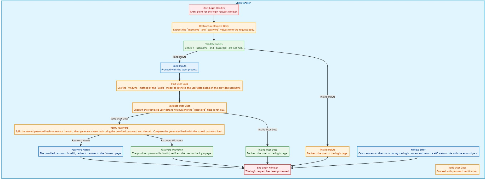

## Guía 20

[DAWM](/DAWM/) / [Proyecto04](/DAWM/proyectos/2024/proyecto04)

<style type="text/css" media="screen">
  details {
    margin: 5% 0%;
    padding: 2%;
    border: dashed 2px black;
    border-radius: 11px;
    box-shadow: 5px 5px 15px rgba(0, 0, 0, 0.3);
  }

  details div {
    color: lightseagreen;
    font-weight: bold;
    cursor: pointer;
    text-align: center;
  }

  img.description {
    width: 50%;
    text-align: center;
    margin: 0 25%;
  }
</style>

### Actividades previas

#### Login UI

1. Descargue el archivo [template_login](recursos/template_login.zip). Fuente: [Tutorial Republic - Snippets](https://www.tutorialrepublic.com/snippets/preview.php?topic=bootstrap&file=simple-login-form)

    <div align="center">
      
    </div>

### Actividades en clases

#### Github

1. Clone localmente tu repositorio **security**.
2. Desde la línea de comandos, inicie el servidor:

    ```command
    npm run autostart
    ```

#### Usuarios y Roles

1. Ingrese los siguientes usuarios con los roles:

    |   Usuario  | Contraseña |   Rol   |
    | :--------: | :--------: | :-----: |
    | superadmin | superadmin |  admin  |
    | someuser   | someuser   |  user   | 

#### Express - GET '/'

1. Coloque el archivo estático _login-style.css_ dentro de la _'security/public/stylesheets'_.
2. Reemplace el contenido de _'security/views/index.ejs'_ por todo el contenido de _template_login.html_.
3. Edite la vista _'security/views/index.ejs'_ 
    + Con la ruta a la carpeta con los archivos estáticos.
    
    ```html
    ...
    <link rel="stylesheet" href="stylesheets/login-style.css">
    ...
    ```

    + Con el método (**method**) de envío de datos y la ruta (**/login**) de procesamiento de datos. Además, del nombre (atributo **name**) en cada elemento del formulario

    ```html
    ...
    <form action="/login" method="post">
      ...
      <input type="text" 
            name="username" 
            class="form-control" 
            placeholder="Username"
            required="required">
      ...
      <input type="password" 
            name="password" 
            class="form-control" 
            placeholder="Password"
            required="required">
    ...
    ```

4. Compruebe la salida de la URL [http://localhost:3000/](http://localhost:3000/)
5. (STOP 1) Versiona local y remotamente el repositorio **security**.

#### Express - POST '/login'

1. Edite el enrutador _'security/routes/index.js'_, con:

    + La referencia al módulo crypto.
    + Carga de los modelos
    + Método POST.

    ```typescript
    ...
        /* 1. Importe el módulo crypto */
        let crypto = require('crypto');

        /* 2. Cargue los modelos de acuerdo con la configuración de la conexión */
        const sequelize = require('../models/index.js').sequelize;
        var initModels = require("../models/init-models");
        var models = initModels(sequelize);
        ...

        /* POST user. */
        /* 3. Cree el callback asíncrono que responda al método POST */
        router.post('/login', async function (req, res, next) {

          /* 4. Desestructure los elementos en el cuerpo del requerimiento */
          let { username, password } = req.body

          /* 5. Verifique que username sea diferente de null, y que password sea diferente de null. */
          if (username != null && password != null) {

            try {

              /* 6. 
                Del modelo users, use el método findOne para encontrar un registro
                cuyo campo name sea igual que username
              */
              let userData = await models.users.findOne({
                where: {
                  name: username
                }
              })

              /* 7. Verifique que userData sea diferente de null, y que userData.password sea diferente de null. */
              if (userData != null && userData.password != null) {

                /* 8. Divida userData.password por el símbolo "$", y use el primer elemento como SALT. */
                let salt = userData.password.split("$")[0]
                let hash = crypto.createHmac('sha512', salt).update(password).digest("base64");
                let passwordHash = salt + "$" + hash

                /* 9. Compare passwordHash y userData.password que sean iguales. */
                if (passwordHash === userData.password) {
                  /* 10. En caso de éxito, redirija a '/users' */
                  res.redirect('/users');
                } else {
                  /* 11. En caso de fallo, redirija a '/' */
                  res.redirect('/');
                }
              } else {
                res.redirect('/');
              }

            } catch (error) {
              /* 12. En caso de error, retorne el estado 400 y el objeto error */
              res.status(400).send(error)
            }
          } else {
            res.redirect('/');
          }

        });
    ...
    ```

#### `Pruebas`

1. Compruebe la salida de la URL [http://localhost:3000/](http://localhost:3000/)
2. Verifique la `control de acceso` de usuarios y la redirección basada en las credenciales.

    + `Criterio de aceptación`: El usuario ingresa las credenciales correctas y es redirigido a _'/users'_.
      - usuario: superadmin <br/> contraseña: superadmin
      - usuario: someuser <br/> contraseña: someuser 

    + Criterio de aceptación: El usuario ingresa las credenciales incorrectas y es redirigido a _'/'_.
      - usuario: superadmin <br/> contraseña: evil
      - usuario: hacker <br/> contraseña: evil 

3. Corrija los errores y aplique las pruebas.
4. (STOP 2) Versiona local y remotamente el repositorio **security**.

#### Diagrama de flujo

Analice: 

  + La explicación del código con [ChatGPT](https://chatgpt.com/share/de8e9c13-34af-48e9-80e0-aad3d57d7c3c), o
  + El diagrama de flujo, generador en [https://codetoflow.com/](https://codetoflow.com/).
  
  <div align="center">
    
  </div>


### Documentación

* Documentación de [Express](https://expressjs.com/) y [Sequelize](https://sequelize.org/docs/v6/getting-started/).

### Fundamental

* Data Association in MongoDB with Express.js en [X](https://x.com/SinghYadav58685/status/1797660631501561956?ref_src=twsrc%5Etfw)

<blockquote class="twitter-tweet"><p lang="en" dir="ltr">🚀 Mini-Project: Data Association in MongoDB with Express.js!<br><br>1️⃣ Create userSchema<br>2️⃣ User Registration Functionality<br>3️⃣ LogIn LogOut Functionality<br>4️⃣ isLoggedIn Middleware<br>5️⃣ Profile Route Setup<br>6️⃣ Like Edit Functionality<br>7️⃣ Update Post<a href="https://twitter.com/hashtag/MongoDB?src=hash&amp;ref_src=twsrc%5Etfw">#MongoDB</a> <a href="https://twitter.com/hashtag/ExpressJS?src=hash&amp;ref_src=twsrc%5Etfw">#ExpressJS</a> <a href="https://twitter.com/hashtag/WebDev?src=hash&amp;ref_src=twsrc%5Etfw">#WebDev</a> <a href="https://t.co/yRyAK1hDM6">pic.twitter.com/yRyAK1hDM6</a></p>&mdash; Ayushmaan Singh Yadav (@SinghYadav58685) <a href="https://twitter.com/SinghYadav58685/status/1797660631501561956?ref_src=twsrc%5Etfw">June 3, 2024</a></blockquote> <script async src="https://platform.twitter.com/widgets.js" charset="utf-8"></script>

### Términos

Pruebas, control de acceso, criterios de aceptación

### Referencias

* Autenticación y autorización en node.js mediante Express.js. (n.d.). Retrieved from https://ull-esit-pl-1617.github.io/estudiar-cookies-y-sessions-en-expressjs-victor-pamela-jesus/cookies/chapter6.html
* Adams, D. (2024). Basic Login System with Node.js, Express, and MySQL. Retrieved from https://codeshack.io/basic-login-system-nodejs-express-mysql/
* Ram, P. (2021). Difference between Session Cookies vs. JWT (JSON Web Tokens), for session management. Retrieved from https://medium.com/@prashantramnyc/difference-between-session-cookies-vs-jwt-json-web-tokens-for-session-management-4be67d2f066e
* express-session. (n.d.). Retrieved from https://expressjs.com/en/resources/middleware/session.html
* Chan, A. (2021). Cookie and Session (II) - How session works in express-session. Retrieved from https://medium.com/@alysachan830/cookie-and-session-ii-how-session-works-in-express-session-7e08d102deb8