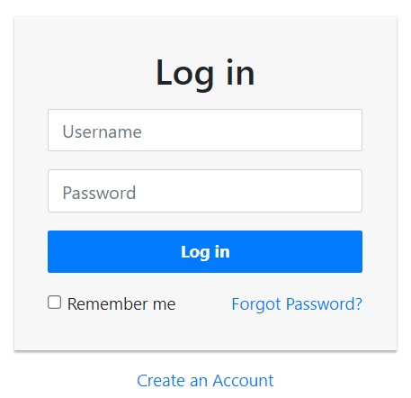

## Guía 20

[DAWM](/DAWM/) / [Proyecto04](/DAWM/proyectos/2024/proyecto04)

<style type="text/css" media="screen">
  details {
    margin: 5% 0%;
    padding: 2%;
    border: dashed 2px black;
    border-radius: 11px;
    box-shadow: 5px 5px 15px rgba(0, 0, 0, 0.3);
  }

  details div {
    color: lightseagreen;
    font-weight: bold;
    cursor: pointer;
    text-align: center;
  }

  img.description {
    width: 50%;
    text-align: center;
    margin: 0 25%;
  }
</style>

### Actividades previas

#### Login UI

1. Descargue el archivo [template_login](recursos/template_login.zip). Fuente: [Tutorial Republic - Snippets](https://www.tutorialrepublic.com/snippets/preview.php?topic=bootstrap&file=simple-login-form)

    <div align="center">
      
    </div>

### Actividades en clases

#### Express - GET '/'

1. Coloque el archivo estático _login-style.css_ dentro de la _'security/public/stylesheets'_.
2. Reemplace el contenido de _'security/views/index.ejs'_ por todo el contenido de _template_login.html_.
3. Edite la vista _'security/views/index.ejs'_ con la ruta a la carpeta con los archivos estáticos.
4. Compruebe la salida de la URL [http://localhost:3000/](http://localhost:3000/)
5. (STOP 1) Versiona local y remotamente el repositorio **security**.

#### Express - POST '/login'

1. Edite la vista _'security/views/index.js'_, con:

    + El método de envío y la ruta que procesará los datos del formulario
    + El atributo **name** para ambos elementos _input_.

    ```typescript
    ...
    <form action="/login" method="post">
      ...
      <input name="username" 
            type="text" 
            class="form-control" 
            placeholder="Username"
            required="required">
      ...
      <input 
            name="password" 
            type="password" 
            class="form-control" 
            placeholder="Password"
            required="required">
    ```

2. Edite el enrutador _'security/routes/index.js'_, con:

    + `Operador` [Op.and](https://sequelize.org/docs/v6/core-concepts/model-querying-basics/#logical-combinations-with-operators) de Sequelize.

    ```typescript
    /* 1. Importe el módulo crypto y el objeto Op de sequelize */
    let crypto = require('crypto');
    const { Op } = require("sequelize");

    /* 2. Cargue los modelos de acuerdo con la configuración de la conexión */
    const sequelize = require('../models/index.js').sequelize;
    var initModels = require("../models/init-models");
    var models = initModels(sequelize);

    ...
    router.post('/login', async function (req, res, next) {

      let { username, password } = req.body

      if (username && password) {

        try {

          /* 3. Utilice la variable SALT para encriptar la variable password. */
          let salt = process.env.SALT
          let hash = crypto.createHmac('sha512', salt).update(password).digest("base64");
          let passwordHash = salt + "$" + hash

          /* 4. Uso del método findOne */
          let usersData = await models.users.findOne({
            where: {
              [Op.and]: {
                name: username,
                password: passwordHash
              }

            }
          })

          if (usersData != null) {
            res.redirect('/users');
          } else {
            res.redirect('/');
          }

        } catch (error) {
          res.status(400).send(error)
        }

      } else {
        res.redirect('/');
      }

    });
    ...
    ```

3. Compruebe la salida de la URL [http://localhost:3000/](http://localhost:3000/)
4. (STOP 2) Versiona local y remotamente el repositorio **security**.

#### Cookies

const options = {
  expires: new Date(
    Date.now() + (60 * 1000)
  )
}

res.cookie("username", username, options)

<a href="#" class="nav-link user-action"> <%= username %> </a>

Revisar la consola

#### Session

node
require('crypto').randomBytes(64).toString('base64');
TOKEN_SECRET='...9udMMwr...'

npm install express-session --save

const session = require('express-session');

app.use(session({
  secret: process.env.TOKEN_SECRET,
  name: 'session.security', 
  resave: false,
  saveUninitialized: false,
}));

request.session.loggedin = true;
request.session.username = username;

<a href="/logout" class="nav-item nav-link messages"><i class="fa fa-power-off"></i> Logout</a></a>

#### Autenticación

/middleware/authentication_session.js

/* Autenticación */

var authenticateSession = (req, res, next) => {
    if(req.session.loggedin) {
        return next()
    } else{
        return res.redirect("/")
    }
}

module.exports = authenticateSession;

app.use('/users', authenticateSession,  usersRouter);

#### Autorización

/middleware/authorization_session.js

/* Autorización */

var authorizationSession = (req, res, next) => {
    if(req.session.role === 'admin') {
        return next()
    } else{
        return res.redirect("/")
    }
}

module.exports = authorizationSession;

app.use('/users', authenticateSession, authorizationSession, usersRouter);

### Documentación

### Fundamental

### Términos

Operador

### Referencias

* Autenticación y autorización en node.js mediante Express.js. (n.d.). Retrieved from https://ull-esit-pl-1617.github.io/estudiar-cookies-y-sessions-en-expressjs-victor-pamela-jesus/cookies/chapter6.html
* Adams, D. (2024). Basic Login System with Node.js, Express, and MySQL. Retrieved from https://codeshack.io/basic-login-system-nodejs-express-mysql/
* Ram, P. (2021). Difference between Session Cookies vs. JWT (JSON Web Tokens), for session management. Retrieved from https://medium.com/@prashantramnyc/difference-between-session-cookies-vs-jwt-json-web-tokens-for-session-management-4be67d2f066e
* Chan, A. (2021). Cookie and Session (II) - How session works in express-session. Retrieved from https://medium.com/@alysachan830/cookie-and-session-ii-how-session-works-in-express-session-7e08d102deb8