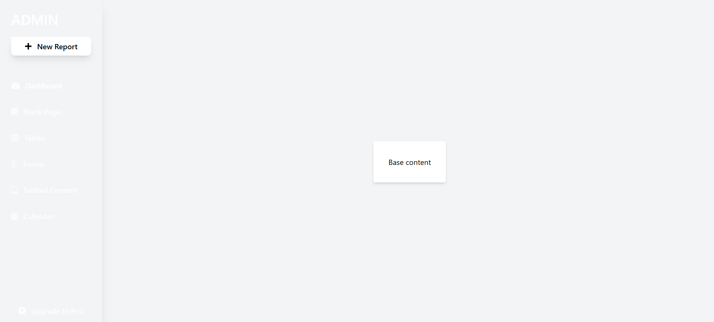
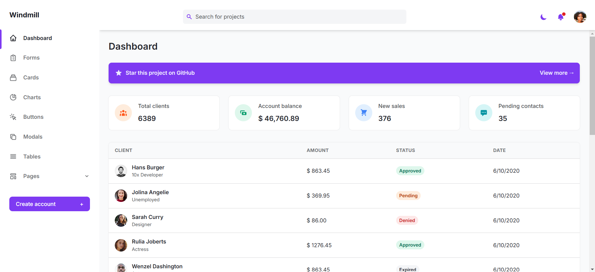
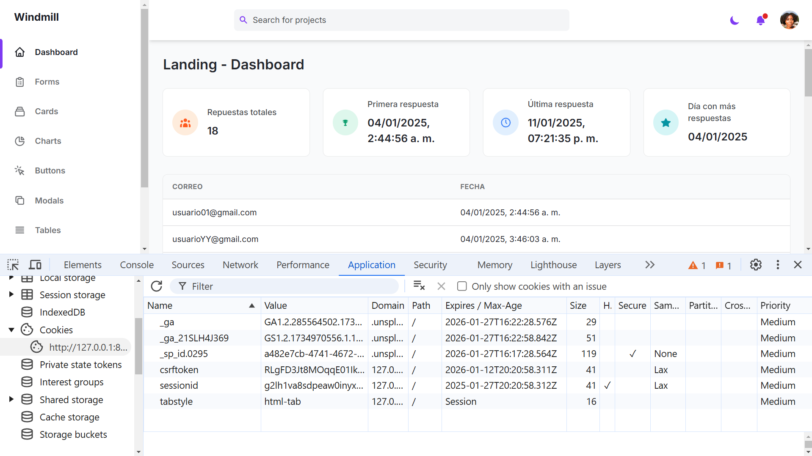

## Guía 21

[DAWM](/DAWM/) / [Proyecto05](/DAWM/proyectos/2024/proyecto05)

<link href="styles/mystyle.css" rel="stylesheet" />

### Objetivo general

<pre class="purpose">Desarrollar una aplicación backend robusta y escalable utilizando Django que integre una interfaz de administrador intuitiva para la gestión eficiente de datos y funcionalidades junto con un REST API completo que facilite la comunicación con las aplicaciones cliente de tal forma que garantice la seguridad, el rendimiento y la extensibilidad del sistema.</pre>

### Actividades previas

#### Ambiente de desarrollo

1. Desde la línea de comandos

	+ Cree y habilite el ambiente de desarrollo, con:

	```command
	python -m venv environment
	environment\Scripts\activate
	```

#### Repositorio local y remoto

1. Crea un repositorio en GitHub con el nombre **backend**.
2. Desde la línea de comandos
	
	+ Clone localmente y acceda al repositorio _backend_.
	+ Instale **django**, con:

	```command
	pip install django 
	```

### Actividades en clases

#### Proyecto: Backend

1. Desde la línea de comandos
	
	+ Acceda y cree el proyecto **backend**, con:

	```command
	cd backend
	django-admin startproject backend .
	```

	+ Abra el proyecto con VSCode, con:

	```command
	code .
	```

	+ Levante el servidor, con:

	```command
	python manage.py runserver
	```

2. (STOP 1) Revise los cambios en el navegador en el URL: [http://127.0.0.1:8000/](http://127.0.0.1:8000/)

	<div align="center">
		
	</div>

#### Estructura de archivos del proyecto (backend) en Django.

* Archivos de configuración
	+ _manage.py_ es un script principal para interactuar con el proyecto Django, mediante comandos:
		- _runserver_ Inicia el servidor de desarrollo.
		- _migrate_ Aplica migraciones a la base de datos.
		- _createsuperuser_ Crea un usuario administrador para el panel de control.
		- _startapp_ Crea una nueva aplicación dentro del proyecto.

* Carpeta del proyecto 
	+ _\_\_init\_\_.py_ Archivo vacío que indica a Python que esta carpeta es un paquete.
	+ _wsgi.py_ Configuración para el servidor WSGI (Web Server Gateway Interface), usado en el despliegue de aplicaciones Django.
	+ _asgi.py_ Configuración para el servidor ASGI (Asynchronous Server Gateway Interface), usado en aplicaciones asíncronas.
	+ _settings.py_ Archivo de configuración global del proyecto, donde se definen ajustes como la base de datos, aplicaciones instaladas, configuraciones de seguridad, plantillas, etc.
	+ _urls.py_ Archivo donde se definen las rutas principales del proyecto. Estas rutas pueden incluir otras definidas en las aplicaciones.

#### Aplicación: main

1. Desde la línea de comandos
	
	+ Cree la aplicación **main**, con:

	```command
	python manage.py startapp main
	```

2. Edite el archivo _backend/settings.py_, con:

	+ Registre la aplicación

	```python
	INSTALLED_APPS = [
	    ...
	    'main',
	]
	```

3. Edite el archivo _backend/urls.py_, con:

	+ Importe el módulo **include** y asocie la ruta **raíz** ('') con las rutas de la aplicación main

	```python
	from django.urls import ... , include

	urlpatterns = [
	    ...
	    path('', include('main.urls')),
	]
	```

4. Cree y modifique el archivo _main/urls.py_, con:
	
	+ Asocie la ruta **raíz** ('') con el controlador **index** (con el alias **main_index**)

	```python
	from django.urls import path
	from . import views

	urlpatterns = [
	    path('', views.index, name='main_index'),
	]
	```

5. Edite el archivo _main/views.py_, con:

	+ Agregue el controlador **index**

	```python 
	...

	# Create your views here.
	from django.http import HttpResponse

	def index(request):
	    return HttpResponse("Hello, World!")
	```

6. Desde la línea de comandos
	
	+ Levante el servidor, con:

	```command
	python manage.py runserver
	```

7. (STOP 2) Revise los cambios en el navegador para las URLs: 

	+ En la ruta raíz [http://127.0.0.1:8000/](http://127.0.0.1:8000/), y 

	<div align="center">
		
	</div>

	+ En la ruta del admin [http://127.0.0.1:8000/admin](http://127.0.0.1:8000/admin)

	<div align="center">
		
	</div>

#### Estructura de archivos de una aplicación (main) en Django.

* Archivos de la aplicación
	+ _\_\_init\_\_.py_ Indica que esta carpeta es un paquete de Python.
	+ _admin.py_ Archivo donde se registran los modelos para que sean visibles y gestionables desde el panel de administración de Django.
	+ _apps.py_ Archivo que contiene la configuración de la aplicación, como su nombre y metadatos.
	+ _models.py_ Archivo donde se definen las clases que representan las tablas de la base de datos. Cada clase corresponde a un modelo.
	+ _tests.py_ Archivo para escribir pruebas unitarias de la aplicación.
	+ _views.py_ Archivo donde se definen las funciones o clases que gestionan las solicitudes HTTP y devuelven respuestas (por ejemplo, renderizar páginas HTML o devolver datos JSON).

#### Vistas

1. Descargue y descomprima los archivos [static_django.zip](recursos/static_django.zip) y [templates_django.zip](recursos/templates_django.zip) en la raíz del proyecto.

	```html
	backend/					<!-- proyecto -->
	├── backend/ 
	├── main/					<!-- aplicación -->
	├── static/				<!-- archivos estáticos -->
	│   	└──css/
	│   	└──js/
	└── templates/		<!-- plantillas -->
	    	└──base.html
	```

2. Edite el archivo _backend/settings.py_, con:

	+ En el arreglo _TEMPLATES_, en la entrada _'DIRS'_, agregue la ruta _'templates'_

	```python
	TEMPLATES = [
		{
			...
			'DIRS': ['templates'],
			...
		}
	]
	```

3. Edite el archivo _main/views.py_, con:

	+ Agregue la renderización de la plantilla _base.html_

	```python
	...

	def index(request):
		# return HttpResponse("Hello, World!")
		return render(request, 'base.html')
	```

4. (STOP 3) Revise los cambios en el navegador para las URLs: 

	+ En la ruta raíz [http://127.0.0.1:8000/](http://127.0.0.1:8000/), y 

    <div align="center">
      
    </div>

#### Archivos estáticos

1. En el archivo _backend/settings.py_:

	+ Compruebe la carga de la aplicación _django.contrib.staticfiles_ en la lista _INSTALLED_APPS_.

	```python
	INSTALLED_APPS = [
		...
		'django.contrib.staticfiles',
		'main',
	]
	```

	+ Agregue el arreglo de rutas _STATICFILES_DIRS_, con la ruta relativa a los archivos estáticos _BASE\_DIR / STATIC\_URL_

	```python
	...

	# Static files (CSS, JavaScript, Images)
	# https://docs.djangoproject.com/en/5.1/howto/static-files/

	STATIC_URL = ...

	# Directorios adicionales donde buscar archivos estáticos
	STATICFILES_DIRS = [
	   BASE_DIR / STATIC_URL,
	]

	...
	```

2. Modifique el archivo _templates/base.html_, con:

	+ Importe el **tag library** _static_ y utilice la etiqueta _static_ para construir la URLs que apuntan a los archivos estáticos del proyecto.

	```html
	{% load static %}

	<!DOCTYPE html>
	...
	
	<head>
		
		...
		<!-- Local stylesheets -->
		<link rel="stylesheet" href="{% static 'css/base_style.css' %}">

	</head>
	<body>
		
		...
		<!-- Local script files -->
		<script src="{% static 'js/base_script.js' %}"></script>

	</body>
	```

3. (STOP 4) Revise los cambios en el navegador para las URLs: 

	+ En la ruta raíz [http://127.0.0.1:8000/](http://127.0.0.1:8000/), y 

    <div align="center">
      
    </div>

#### Plantillas

1. Descargue y descomprima [index_django.zip](recursos/index_django.zip) dentro de la carpeta _templates_.
2. Edite el archivo _templates/index.html_, con:

	+ Extienda de la plantilla _base.html_.
	+ Defina los bloques _title_ y _content_

	```html
	<!-- Extend "base.html" -->
	{% extends "base.html" %}

	<!-- START - Block title -->
	{% block title %} 

	Backend - Inicio 

	{% endblock %}
	<!-- END - Block title -->

	<!-- START - Block content -->
	{% block content %}

		<div> ... </div>

	{% endblock %}
	<!-- END - Block content -->
	```

3. Modifique el archivo _templates/base.html_, con:

	+ Defina los bloques _title_ y _content_

	```html
	<head>
	...
		<title> 

			{% block title %} 

			Tailwind Admin Template 
			
			{% endblock %} 

	  </title>
	...
	</head>

	<body class="bg-gray-100 font-family-karla flex">
	...

		<!-- START - Block content -->
		{% block content %}

		<div> ... </div>

		{% endblock %}
		<!-- END - Block content -->

	</body>
	...
	```

4. Edite el archivo _main/views.py_, con:

	+ Cambie por la renderización de la plantilla _index.html_:

	```python
	...

	def index(request):
		# return HttpResponse("Hello, World!")
		# return render(request, 'base.html')
		return render(request, 'index.html')
	```

5. (STOP 5) Revise los cambios en el navegador para las URLs: 

	+ En la ruta raíz [http://127.0.0.1:8000/](http://127.0.0.1:8000/), y 

  <div align="center">
    
  </div>

#### Estructura de carpetas adicionales

* Carpetas adicionales
	+ _templates/_ Carpeta donde se almacenan las plantillas HTML. Puede estar en el directorio raíz del proyecto o dentro de cada aplicación.
	+ _static/_ Carpeta donde se almacenan archivos estáticos como CSS, JavaScript e imágenes. Puede ser compartida entre todas las aplicaciones o específica para cada una.

#### Versionamiento local y remoto

1. En la línea de comandos

	+ Genere el archivo **requirements.txt** con la lista de paquetes utilizados, con:

	```command
	pip freeze > requirements.txt
	```

	+ Desactive el ambiente de desarrollo, con:

	```command
	deactivate
	```

2. Versione local y remotamente.

### Documentación

* Documentación de [Django](https://docs.djangoproject.com/en/5.1/)

### Fundamental

* Comparación de frameworks de backend, en Python

<blockquote class="twitter-tweet"><p lang="es" dir="ltr">Si te gusta Python, en este artículo se comparan pros y contras de algunos de los frameworks de desarrollo web más potentes.<br><br>Reflex vs Django vs Flask vs Gradio vs Streamlit vs Dash vs FastAPI<br><br>→ <a href="https://t.co/PiQFOqWWEx">https://t.co/PiQFOqWWEx</a> <a href="https://t.co/3zXjrKsVa4">pic.twitter.com/3zXjrKsVa4</a></p>&mdash; Brais Moure (@MoureDev) <a href="https://twitter.com/MoureDev/status/1870839215161840071?ref_src=twsrc%5Etfw">December 22, 2024</a></blockquote> <script async src="https://platform.twitter.com/widgets.js" charset="utf-8"></script>

### Términos

django, proyecto y aplicaciones

### Referencias

* Django documentation: Django documentation. (n.d.). Retrieved from https://docs.djangoproject.com/en/5.1/
* Davidgrzyb. (n.d.). davidgrzyb/tailwind-admin-template: An admin dashboard template built with Tailwind and Alpine.js. Retrieved from https://github.com/davidgrzyb/tailwind-admin-template
* Built-in template tags and filters: Django documentation. (n.d.). Retrieved from https://docs.djangoproject.com/en/5.1/ref/templates/builtins/