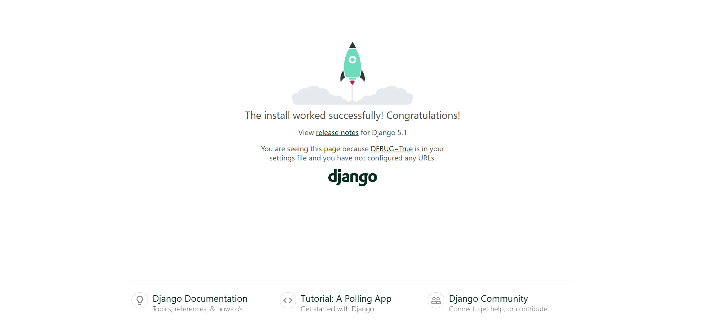
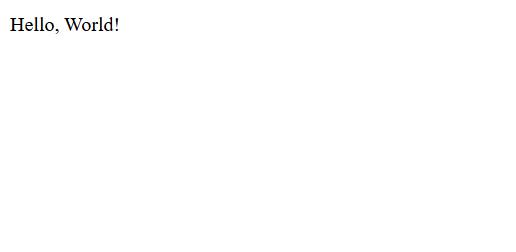
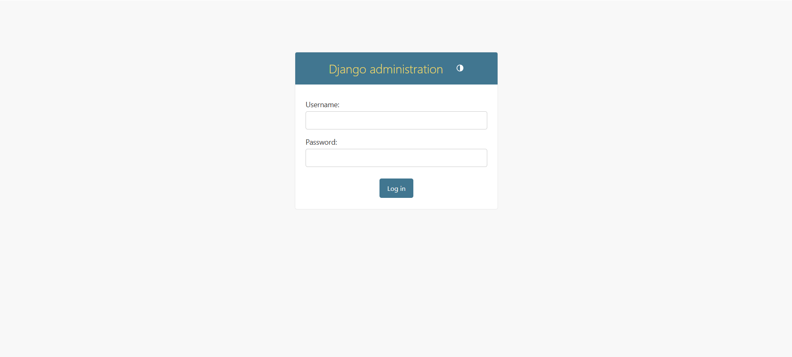

## Guía 21

[DAWM](/DAWM/) / [Proyecto05](/DAWM/proyectos/2024/proyecto05)

<link href="styles/mystyle.css" rel="stylesheet" />

### Objetivo general

<pre class="purpose">Desarrollar una aplicación backend robusta y escalable utilizando Django que integre una interfaz de administrador intuitiva para la gestión eficiente de datos y funcionalidades junto con un REST API completo que facilite la comunicación con las aplicaciones cliente de tal forma que garantice la seguridad, el rendimiento y la extensibilidad del sistema.</pre>

### Actividades previas

1. Desde la línea de comandos
	
	+ Cree un ambiente de desarrollo, con:

	```command
	python -m venv environment
	```

	+ Habilite el ambiente de desarrollo, con:

	```command
	environment\Scripts\activate
	```

	+ Instale **django**, con:

	```command
	pip install django 
	```

### Actividades en clases

#### Proyecto: Backend

1. Desde la línea de comandos
	
	+ Cree y acceda a la carpeta del proyecto **backend**, con:

	```command
	django-admin startproject backend
	cd backend
	```

	+ Abra el proyecto con VSCode.

	```command
	code .
	```

	+ Levante el servidor, con:

	```command
	python manage.py runserver
	```

2. (STOP 1) Revise los cambios en el navegador en el URL: [http://127.0.0.1:8000/](http://127.0.0.1:8000/)

    <div align="center">
      
    </div>

#### Estructura de archivos del proyecto (backend) en Django.

* Archivos de configuración
	+ _manage.py_ es un script principal para interactuar con el proyecto Django, mediante comandos:
		- _runserver_ Inicia el servidor de desarrollo.
		- _migrate_ Aplica migraciones a la base de datos.
		- _createsuperuser_ Crea un usuario administrador para el panel de control.
		- _startapp_ Crea una nueva aplicación dentro del proyecto.

* Carpeta del proyecto 
	+ _\_\_init\_\_.py_ Archivo vacío que indica a Python que esta carpeta es un paquete.
	+ _wsgi.py_ Configuración para el servidor WSGI (Web Server Gateway Interface), usado en el despliegue de aplicaciones Django.
	+ _asgi.py_ Configuración para el servidor ASGI (Asynchronous Server Gateway Interface), usado en aplicaciones asíncronas.
	+ _settings.py_ Archivo de configuración global del proyecto, donde se definen ajustes como la base de datos, aplicaciones instaladas, configuraciones de seguridad, plantillas, etc.
	+ _urls.py_ Archivo donde se definen las rutas principales del proyecto. Estas rutas pueden incluir otras definidas en las aplicaciones.

#### Aplicación: main

1. Desde la línea de comandos
	
	+ Cree la aplicación **main**, con:

	```command
	python manage.py startapp main
	```

2. Edite el archivo _backend/settings.py_

	+ Registre la aplicación, con:

	```python
	INSTALLED_APPS = [
	    ...
	    'main',
	]
	```

3. Edite el archivo _backend/urls.py_

	+ Asocie la ruta **raíz** ('') con las rutas de la aplicación main, con:

	```python
	from django.urls import ... , include

	urlpatterns = [
	    ...
	    path('', include('main.urls')),
	]
	```

4. Cree el archivo _main/urls.py_
	
	+ Asocie la ruta **raíz** ('') con el controlador **index**, con:

	```python
	from django.urls import path
	from . import views

	urlpatterns = [
	    path('', views.index, name='main_index'),
	]
	```

5. Edite el archivo _main/views.py_

	+ Agregue el controlador **index**, con:

	```python 
	...

	# Create your views here.
	from django.http import HttpResponse

	def index(request):
	    return HttpResponse("Hello, World!")
    ```

6. Desde la línea de comandos
	
	+ Levante el servidor, con:

	```command
	python manage.py runserver
	```

7. (STOP 2) Revise los cambios en el navegador para las URLs: 

	+ En la ruta raíz [http://127.0.0.1:8000/](http://127.0.0.1:8000/), y 

    <div align="center">
      
    </div>

    + En la ruta del admin [http://127.0.0.1:8000/admin](http://127.0.0.1:8000/admin)

    <div align="center">
      
    </div>

#### Estructura de archivos de una aplicación (main) en Django.

* Archivos de la aplicación
	+ _\_\_init\_\_.py_ Indica que esta carpeta es un paquete de Python.
	+ _admin.py_ Archivo donde se registran los modelos para que sean visibles y gestionables desde el panel de administración de Django.
	+ _apps.py_ Archivo que contiene la configuración de la aplicación, como su nombre y metadatos.
	+ _models.py_ Archivo donde se definen las clases que representan las tablas de la base de datos. Cada clase corresponde a un modelo.
	+ _tests.py_ Archivo para escribir pruebas unitarias de la aplicación.
	+ _views.py_ Archivo donde se definen las funciones o clases que gestionan las solicitudes HTTP y devuelven respuestas (por ejemplo, renderizar páginas HTML o devolver datos JSON).

#### Plantillas y archivos estáticos

1. Crea una carpeta en el directorio raíz de la aplicación (_backend/templates_), con:
	
	+ El archivo _backend/templates/base.html_ con la plantilla.

	```html
	<!DOCTYPE html>
	<html lang="en">
	<head>
	    <meta charset="UTF-8">
	    <meta name="viewport" content="width=device-width, initial-scale=1.0">
	    
	    <title>  Backend Django  </title>
	    
	    <!-- Incluir Tailwind CSS desde el CDN -->
	    <script src="https://cdn.tailwindcss.com"></script>
	
	</head>
	<body>
	    <header class="bg-blue-500 text-white p-4">
	        <h1 class="text-2xl font-bold">Backend Django</h1>
	    </header>
	    
	    <main class="container mx-auto py-8">
	        
	        
	        <!-- Contenido específico de cada vista -->
	        
	    
	    </main>
	    <footer class="bg-gray-800 text-white text-center p-4">
	        <p>&copy; 2024 - Backend Django</p>
	    </footer>
	</body>
	</html>

	```

	+ El archivo _backend/templates/home.html_ con los elementos para la página principal.

	```html
	

	 Inicio 

	
	<div class="text-center">
	    <h2 class="text-4xl font-semibold text-gray-700">¡Bienvenido a mi aplicación Django!</h2>
	    <p class="mt-4 text-gray-500">Esta es una página de ejemplo utilizando Tailwind CSS.</p>
	</div>
	
	```

3. Edite el archivo _backend/settings.py_, con:

	+ En el arreglo _TEMPLATES_, en la entrada _'DIRS'_, agregue la ruta _'templates'_:

	```python
	TEMPLATES = [
    {
        ...
        'DIRS': ['templates'],
        ...
    }
  ]
	```

4. Edite el archivo _main/views.py_, con:

	+ Agregue la renderización de la plantilla _home.html_:

	```python
	...

	def index(request):
    # return HttpResponse("Hello, World!")
    return render(request, 'home.html')
	```


#### Estructura de carpetas adicionales

* Carpetas adicionales
	+ _templates/_ Carpeta donde se almacenan las plantillas HTML. Puede estar en el directorio raíz del proyecto o dentro de cada aplicación.
	+ _static/_ Carpeta donde se almacenan archivos estáticos como CSS, JavaScript e imágenes. Puede ser compartida entre todas las aplicaciones o específica para cada una.

#### Versionamiento local y remoto

1. Crea un repositorio en GitHub con el nombre **backend**.

2. Desde la línea de comandos:

	+ Inicialice el repositorio local

	```command
	git init .
	```

	+ Agregue la rama **main** y el tag **origin**:

	```command
	git branch -M main
	git remote add origin https://github.com/<SU-USUARIO>/backend.git
	```

	+ Incorpore los cambios del repositorio remoto en el repositorio local:

	```command
	git pull origin main
	```

3. Versiona local y remotamente el repositorio **.**.

	```command
	git add .
	git commit -m "init"
	git push -f origin main 
	```

### Documentación

* Documentación de [Django](https://docs.djangoproject.com/en/5.1/)

### Fundamental

* Comparación de frameworks de backend, en Python

<blockquote class="twitter-tweet"><p lang="es" dir="ltr">Si te gusta Python, en este artículo se comparan pros y contras de algunos de los frameworks de desarrollo web más potentes.<br><br>Reflex vs Django vs Flask vs Gradio vs Streamlit vs Dash vs FastAPI<br><br>→ <a href="https://t.co/PiQFOqWWEx">https://t.co/PiQFOqWWEx</a> <a href="https://t.co/3zXjrKsVa4">pic.twitter.com/3zXjrKsVa4</a></p>&mdash; Brais Moure (@MoureDev) <a href="https://twitter.com/MoureDev/status/1870839215161840071?ref_src=twsrc%5Etfw">December 22, 2024</a></blockquote> <script async src="https://platform.twitter.com/widgets.js" charset="utf-8"></script>

### Términos

django, proyecto y aplicaciones

### Referencias

* Django documentation: Django documentation. (n.d.). Retrieved from https://docs.djangoproject.com/en/5.1/