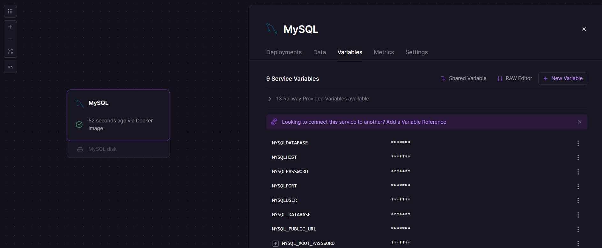
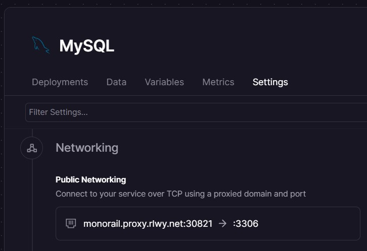
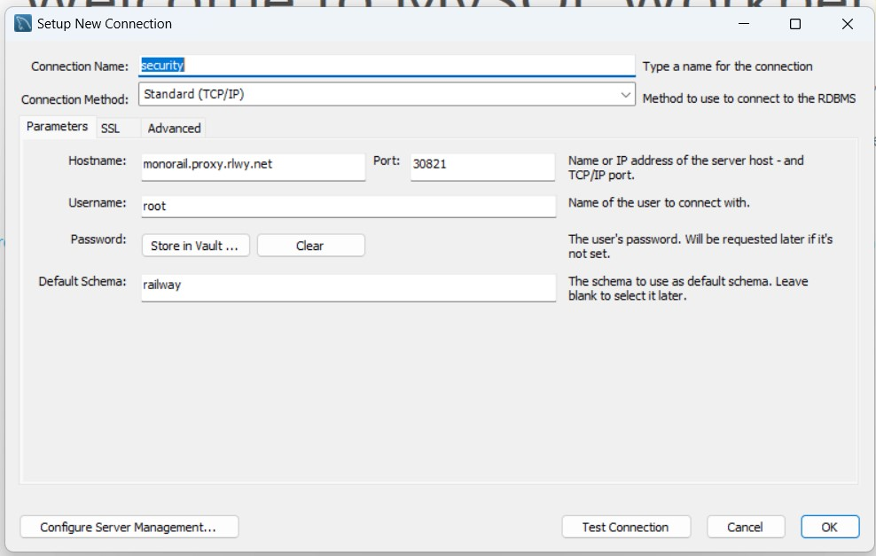

## Guía 22

[DAWM](/DAWM/) / [Proyecto04](/DAWM/proyectos/2024/proyecto04)

### Actividades previas

1. Acceda a [Railway](https://railway.app/) y obtenga una cuenta con GitHub.
2. Active su cuenta desde el enlace en el correo electrónico.
3. Complete su perfil con su información básica.

### Actividades en clases

#### Railway - Servicio MySQL

* Cree un proyecto de Railway con el servicio MySQL, con: `New Project` > `Deploy MySQL`.
* Copie las credenciales de conexión que se encuentran en la opción `Variables`: 
    _MYSQLDATABASE_, _MYSQLHOST_, _MYSQLPASSWORD_, _MYSQLPORT_ y _MYSQLUSER_.

   

    
   

* Copie el datos de conexión que se encuentran en la opción `Settings`: 
    _DOMAIN_ y _PORT_.

   

    
   

#### MySQL Workbench - Migración

* En conexión local:
  + Cree una nueva conexión local
  + Haga clic en la opción **Server** > **Data Export**.
  + Seleccione el esquema con las tablas.
  + Seleccione la opción **Export to Self-Contained File**. 
  + Haga clic en la opción **Start Export**.

* En la conexión de Railway:
  + Cree una nueva conexión con los datos de _DOMAIN_, _PORT_, _MYSQLPORT_ y _MYSQLUSER_.

  

    
  

  + Haga clic en la opción **Server** > **Data Import**.
  + Seleccione la opción **Import from Self-Contained File**. 
  + Seleccione en la opción _Default Target Schema_: **railway**.
  + Haga clic en la opción **Start Import**.

#### Railway - Despliegue desde GitHub

### Documentación

* Documentación de [Docs - Railway](https://docs.railway.app/)

### Fundamental

* Masto Metrics en [X](https://twitter.com/robertvhoesel/status/1626646457980751883)

<blockquote class="twitter-tweet" data-media-max-width="560">
Set up <a href="https://twitter.com/MastoMetrics?ref_src=twsrc%5Etfw">@MastoMetrics</a> deployment today using <a href="https://twitter.com/Railway?ref_src=twsrc%5Etfw">@Railway</a> – it&#39;s almost magic.   → Skip setting up Github Actions or CI/CD → Skip provisioning complex infra → Skip using commits for previewing or debugging small changes  🚅 just ship <a href="https://t.co/DzLIbiYZHn">pic.twitter.com/DzLIbiYZHn</a>
&mdash; Robert van Hoesel (@robertvhoesel) <a href="https://twitter.com/robertvhoesel/status/1626646457980751883?ref_src=twsrc%5Etfw">February 17, 2023</a></blockquote> 

### Términos

despliegue, variables de entorno

### Referencias

* Express Tutorial Part 7: Deploying to production - Learn web development MDN. (2023). Retrieved 2 January 2023, from https://developer.mozilla.org/en-US/docs/Learn/Server-side/Express_Nodejs/deployment
