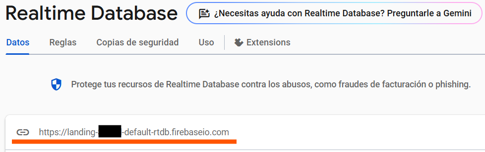
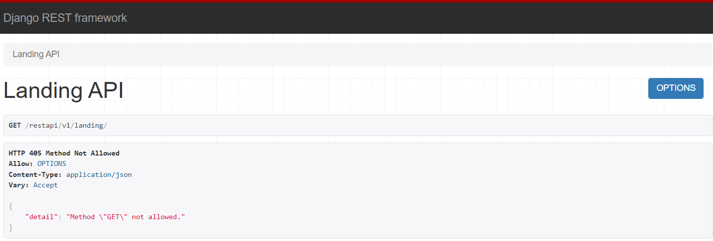
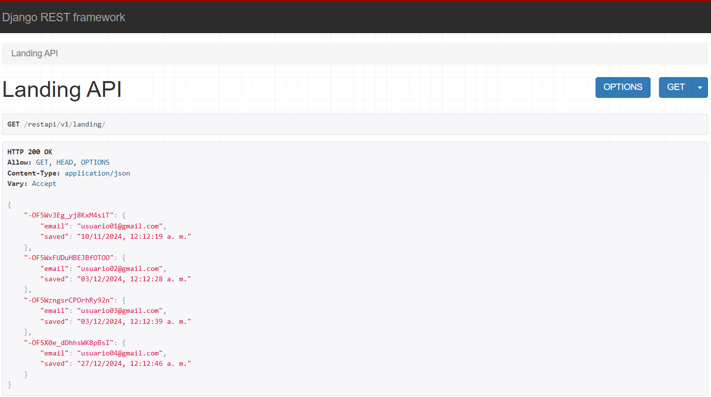
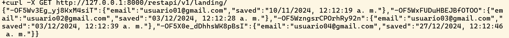
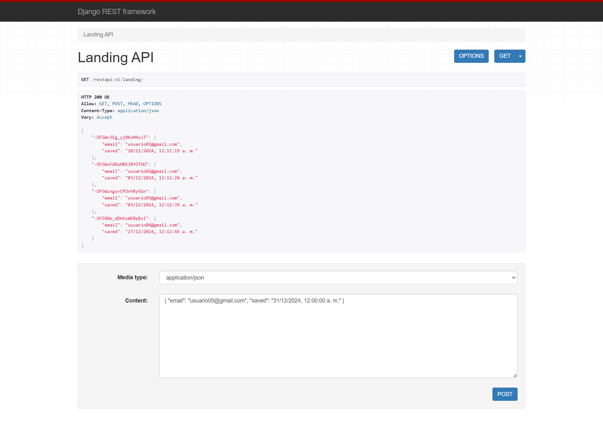
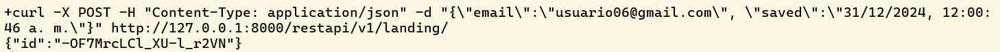

## Guía 22

[DAWM](/DAWM/) / [Proyecto05](/DAWM/proyectos/2024/proyecto05)

<link href="styles/mystyle.css" rel="stylesheet" />

### Objetivo general

<pre class="purpose">Desarrollar una aplicación backend robusta y escalable utilizando Django que integre una interfaz de administrador intuitiva para la gestión eficiente de datos y funcionalidades junto con un REST API completo que facilite la comunicación con las aplicaciones cliente de tal forma que garantice la seguridad, el rendimiento y la extensibilidad del sistema.</pre>

### Actividades previas

#### Ambiente de desarrollo

1. Desde la línea de comandos

	+ Cree y habilite el ambiente de desarrollo, con:

	```command
	python -m venv environment
	environment\Scripts\activate
	```

#### Repositorio local/remoto + librerías

1. Desde la línea de comandos
	
	+ Clone localmente y acceda a la carpeta _backend_.
	+ Instale las librerías de _requirements.txt_, con:

	```command
	pip install -r requirements.txt
	```
	+ Instale **firebase-admin** y **djangorestframework** (DRF), con:

	```command
	pip install firebase-admin djangorestframework
	```

#### Editor y WSGI

1. Abra el proyecto con VSCode, con:

	```command
	code .
	```

2. Levante el servidor, con:

	```command
	python manage.py runserver
	```

### Actividades en clases

#### SDK Firebase Admin: Clave privada

1. Acceda a la [consola de Firebase](https://console.firebase.google.com/)
2. Ingrese al proyecto **landing**
	+ Acceda a la **Configuración de proyecto** > **Cuentas de servicio** > **SDK de Firebase Admin**.
	+ **Genera una clave privada** JSON y descárguela.

4. Cree la carpeta **keys** en el proyecto.

	```text
	backend/	
	├── backend/ 
	├── main/					
	├── static/				
	└── templates/
	├── ....
	└── keys/			<!-- clave -->
	    	└──landing-key.json
	```

5. Renombre el archivo como _landing-key.json_ y guarde el archivo en la carpeta _keys_.

6. En el servicio de **Realtime Database**, copie la URL de referencia.

	<div align="center">
		
	</div>

7. (STOP 1) Edite el archivo _backend/settings.py_, con:

	+ Importe los módulos _firebase\_admin_ y _credentials_
	+ Cargue el archivo con la clave privada
	+ Inicialice la conexión con el Realtime Database con la clave privada y la URL de referencia.

	```python
	...
	from ... import Path

	# Importe los módulos firebase_admin y credentials
	import firebase_admin
	from firebase_admin import credentials

	...

	# Cargue el archivo con la clave privada
	FIREBASE_CRED = credentials.Certificate("keys/landing-key.json")

	# Inicialice la conexión con el Realtime Database con la clave privada y la URL de referencia
	firebase_admin.initialize_app(FIREBASE_CRED, {
	    'databaseURL': 'https://landing-XXXXX-default-rtdb.firebaseio.com/'
	})
	```

#### Aplicación: REST

1. Desde la línea de comandos
	
	+ Cree la aplicación `api`, con:

	```command
	python manage.py startapp api
	```

2. Edite el archivo _backend/settings.py_, con:

	+ Registre la aplicación _api_ y _rest\_framework_

	```python
	INSTALLED_APPS = [
	    ...
		'rest_framework',
		'api',
	]
	```

3. Edite el archivo _backend/urls.py_, con:

	+ Asocie la ruta **api** con las rutas de la aplicación _api_

	```python
	...

	urlpatterns = [
	    ...
	    path('api/', include('api.urls')),
	]
	```

4. Cree y modifique el archivo _api/urls.py_, con:
	
	+ Asocie la ruta **'v1/landing/'** con la vista LandingAPI

	```python
	from django.urls import path
	from . import views

	urlpatterns = [
	    path('v1/landing/', views.LandingAPI.as_view(), name='firebase_resources' ),
	]
	```

5. Edite el archivo _api/views.py_, con:

	+ Importe la clase _APIView_, _Response_ y _status_ de DRF; el módulo _datetime_ y la referencia al _Firebase SDK_.
	+ Agregue **LandingAPI** que herede de _APIView_ (`class-based view`). Incluya los atributos **name** y **collection_name** (nombre de la colección en Realtime Database).

	```python 
	...

	# Create your views here.

	from rest_framework.views import APIView
	from rest_framework.response import Response
	from rest_framework import status

	from datetime import datetime
	
	from firebase_admin import db

	class LandingAPI(APIView):
	    
	    name = 'Landing API'

	    # Coloque el nombre de su colección en el Realtime Database
		collection_name = 'COLLECTION_NAME_REALTIME_DATABASE'
	```

6. Desde la línea de comandos
	
	+ Levante el servidor, con:

	```command
	python manage.py runserver
	```

7. (STOP 2) Revise los cambios en el navegador para las URLs: 

	+ En la ruta raíz [http://127.0.0.1:8000/api/v1/landing/](http://127.0.0.1:8000/api/v1/landing/), y 

	<div align="center">
		
	</div>

#### GET

1. Edite el archivo _api/views.py_, con:

	+ Modifique función _get_ mediante el uso del SDK
		- Obtenga una referencia a la colección, con **reference**
		- Obtenga un arreglo con todos los elementos de la colección en formato JSON, con **get**.

	```python 
	...

	class LandingAPI(APIView):
    
    	...
    
	    def get(self, request):

	        # Referencia a la colección
	        ref = db.reference(f'{self.collection_name}')
		    
	        # get: Obtiene todos los elementos de la colección
	        data = ref.get()

	        # Devuelve un arreglo JSON
       		return Response(data, status=status.HTTP_200_OK)
	```

2. (STOP 3 - I) Revise los cambios en el navegador para las URLs: 

	+ En la ruta raíz [http://127.0.0.1:8000/api/v1/landing/](http://127.0.0.1:8000/api/v1/landing/), y 

	<div align="center">
		
	</div>


3. (STOP 3 - II) Desde una nueva línea de comandos
	
	+ Realice una petición con `cURL`, con:

	```command
	curl -X GET http://127.0.0.1:8000/api/v1/landing/
	``` 

	<div align="center">
		
	</div>

#### POST

1. Edite el archivo _api/views.py_, con:

	+ Modifique función _post_ mediante el uso del SDK
		- Obtenga una referencia a la colección, con **reference**
		- Envíe un objeto JSON a la colección, con **push**.

	```python 
	...

	class LandingAPI(APIView):
    
    	...
    
	    def post(self, request):
	        
	        # Referencia a la colección
	        ref = db.reference(f'{self.collection_name}')

	        current_time  = datetime.now()
	        custom_format = hora_actual.strftime("%d/%m/%Y, %I:%M:%S %p").lower().replace('am', 'a. m.').replace('pm', 'p. m.')
	        request.data.update({"saved": custom_format })
	        
	        # push: Guarda el objeto en la colección
	        new_resource = ref.push(request.data)
	        
	        # Devuelve el id del objeto guardado
	        return Response({"id": new_resource.key}, status=status.HTTP_201_CREATED)
	```

2. (STOP 4 - I) Revise los cambios en el navegador para las URLs: 

	+ En la ruta raíz [http://127.0.0.1:8000/api/v1/landing/](http://127.0.0.1:8000/api/v1/landing/), y 
	+ Utilice el objeto 

	```json
	{
        "email": "usuarioYY@gmail.com"
    }
	```

	<div align="center">
		
	</div>


3. (STOP 4 - II) Desde una nueva línea de comandos
	
	+ Realice una petición con `cURL`, con:

	```command
	curl -X POST -H "Content-Type: application/json" -d "{\"email\":\"usuarioXX@gmail.com\"}" http://127.0.0.1:8000/api/v1/landing/
	``` 

	<div align="center">
		
	</div>


#### Versionamiento local y remoto

1. En la línea de comandos

	+ Genere el archivo **requirements.txt** con la lista de paquetes utilizados, con:

	```command
	pip freeze > requirements.txt
	```

	+ Desactive el ambiente de desarrollo, con:

	```command
	deactivate
	```

2. Agregue la carpeta **keys/** en el archivo _.gitignore_

	```command
	...

	# Keys
	keys/
	```

3. Versione local y remotamente.

### Documentación

* [Django REST framework](https://www.django-rest-framework.org/) es un conjunto de herramientas potente y flexible para crear API web.

### Fundamental

* What is REST API? en [X](https://twitter.com/Terrasoft_ltd/status/1732354546528067738)

<blockquote class="twitter-tweet" data-media-max-width="560"><p lang="en" dir="ltr"><a href="https://twitter.com/hashtag/REST?src=hash&amp;ref_src=twsrc%5Etfw">#REST</a> <a href="https://twitter.com/hashtag/API?src=hash&amp;ref_src=twsrc%5Etfw">#API</a> what is it?<br>Representational State Transfer<br>This means that when a <a href="https://twitter.com/hashtag/client?src=hash&amp;ref_src=twsrc%5Etfw">#client</a> requests a resource using a REST API, the <a href="https://twitter.com/hashtag/server?src=hash&amp;ref_src=twsrc%5Etfw">#server</a> transfers back the current state of the resource in a standardized representation <a href="https://t.co/xCFXw9cQFZ">pic.twitter.com/xCFXw9cQFZ</a></p>&mdash; Terrasoft Ltd (@Terrasoft_ltd) <a href="https://twitter.com/Terrasoft_ltd/status/1732354546528067738?ref_src=twsrc%5Etfw">December 6, 2023</a></blockquote> <script async src="https://platform.twitter.com/widgets.js" charset="utf-8"></script>

### Términos

api, class-based view, cURL

### Referencias

* Christie, T. (n.d.). Django REST Framework. Retrieved from https://www.django-rest-framework.org/
* Django REST Framework (DRF): Crea una REST API (GET, POST, PUT, DELETE) Tutorial desde Cero ✅ (2024). Retrieved from https://www.youtube.com/watch?v=Xts8NmyAc8c