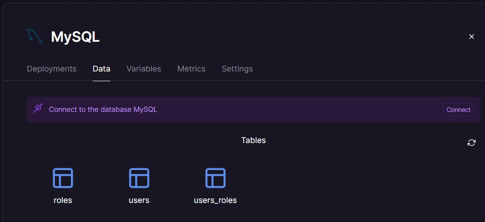
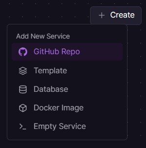
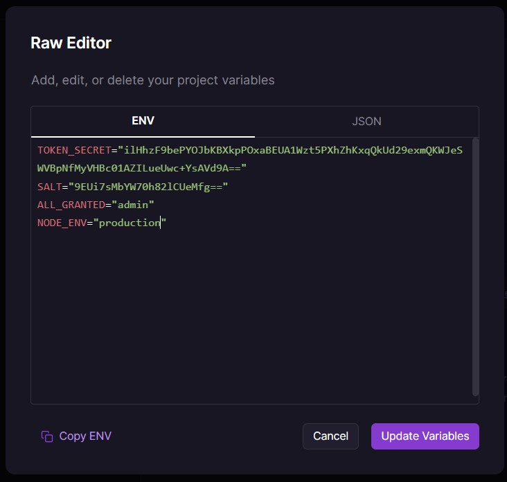
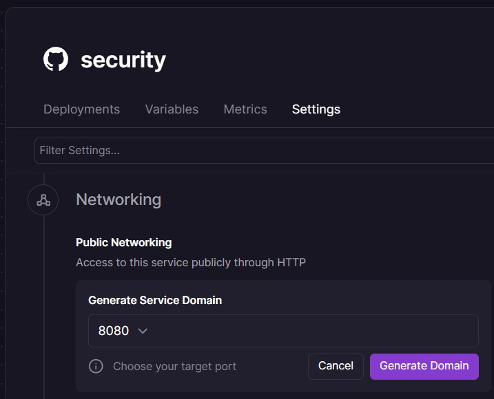

## Guía 22

[DAWM](/DAWM/) / [Proyecto04](/DAWM/proyectos/2024/proyecto04)

<style type="text/css" media="screen">
  details {
    margin: 5% 0%;
    padding: 2%;
    border: dashed 2px black;
    border-radius: 11px;
    box-shadow: 5px 5px 15px rgba(0, 0, 0, 0.3);
  }

  details div {
    color: lightseagreen;
    font-weight: bold;
    cursor: pointer;
    text-align: center;
  }

  img.description {
    width: 50%;
    text-align: center;
    margin: 0 25%;
  }
</style>

### Actividades previas

1. Acceda a [Railway](https://railway.app/) y obtenga una cuenta con GitHub.
2. Active su cuenta desde el enlace en el correo electrónico.
3. Complete su perfil con su información básica.

### Actividades en clases

#### Railway - Servicio MySQL

1. Cree un proyecto de Railway con el servicio MySQL, con: `New Project` > `Deploy MySQL`.
2. Copie las credenciales de conexión que se encuentran en la opción `Variables`: 
    + _MYSQLDATABASE_, _MYSQLPASSWORD_ y _MYSQLUSER_.

   <div align="center">
    
   </div>

3. (STOP 1) Copie el datos de conexión que se encuentran en la opción `Settings`: 
   + _DOMAIN_, p.e.: **monorail.proxy.rlwy.net** , y 
   + _PORT_, p.e.: **30821**.

   <div align="center">
    
   </div>

#### MySQL Workbench - Migración

1. En conexión local:
  + Utilice o cree una nueva conexión local.
  + Haga clic en la opción **Server** > **Data Export**.
  + Seleccione el esquema con las tablas.
  + Seleccione la opción **Export to Self-Contained File**. 
  + Haga clic en la opción **Start Export**.

2. En la conexión a Railway:
  + Establezca una nueva conexión con los datos _DOMAIN_ (en hostname), _MYSQLPORT_ (en Port), _MYSQLUSER_ (en Username), _MYSQLPASSWORD_(en Store in Vault) y _MYSQLDATABASE_ (en Default schema).

  <div align="center">
    
  </div>

  + Haga clic en la opción **Server** > **Data Import**.
  + Seleccione la opción **Import from Self-Contained File** y escoja el script previamente creado. 
  + Seleccione en la opción **Default Target Schema**: _railway_.
  + Haga clic en la opción **Start Import**.

3. (STOP 2) En Railway, verifique las tablas y registros exportados.

    <div align="center">
      
    </div>

#### Express - Credenciales de conexión

1. Modifique el archivo _config/config.json_ con las credenciales de conexión en el ambiente de producción (clave `production`), p.e.: 
  
    ```typescript
    ...
    "production": {
      "username": "root",
      "password": "TwLyrUxFDntKosRbDJntUzFpcbeElwjs",
      "database": "railway",
      "host": "monorail.proxy.rlwy.net",
      "dialect": "mysql",
      "port": "18740"
    }
    ...
    ```

2. Versione los cambios en el repositorio local y remoto.

#### Railway - Despliegue desde GitHub

1. Acceda al proyecto de Railway recientemente creado, y cree un servicio con: **Create** > **GitHub repo**

    <div align="center">
      
    </div>

2. Seleccione el repositorio de GitHub.
3. En la opción **Variables**, 
    - Agregue las variables de entorno que se encuentran en el archivo **.env**.
    - Agregue la variable de entorno `NODE_ENV` con el valor `production`.

    <p style="text-align: center;">
      
    </p>

4. En la opción **Settings** > **Networking**, genere un dominio aleatorio para la aplicación en la opción **Generate Domain**.

    <p style="text-align: center;">
      
    </p>


5. (STOP 3) Versiona local y remotamente el repositorio **security**.

### Documentación

* Documentación de [Docs - Railway](https://docs.railway.app/)

### Fundamental

* Masto Metrics en [X](https://twitter.com/robertvhoesel/status/1626646457980751883)

<blockquote class="twitter-tweet" data-media-max-width="560"><p lang="en" dir="ltr">Set up <a href="https://twitter.com/MastoMetrics?ref_src=twsrc%5Etfw">@MastoMetrics</a> deployment today using <a href="https://twitter.com/Railway?ref_src=twsrc%5Etfw">@Railway</a> – it&#39;s almost magic. <br><br>→ Skip setting up Github Actions or CI/CD<br>→ Skip provisioning complex infra<br>→ Skip using commits for previewing or debugging small changes<br><br>🚅 just ship <a href="https://t.co/DzLIbiYZHn">pic.twitter.com/DzLIbiYZHn</a></p>&mdash; Robert van Hoesel (@robertvhoesel) <a href="https://twitter.com/robertvhoesel/status/1626646457980751883?ref_src=twsrc%5Etfw">February 17, 2023</a></blockquote> <script async src="https://platform.twitter.com/widgets.js" charset="utf-8"></script>

### Términos

despliegue, variables de entorno

### Referencias

* Express Tutorial Part 7: Deploying to production - Learn web development MDN. (2023). Retrieved 2 January 2023, from https://developer.mozilla.org/en-US/docs/Learn/Server-side/Express_Nodejs/deployment
