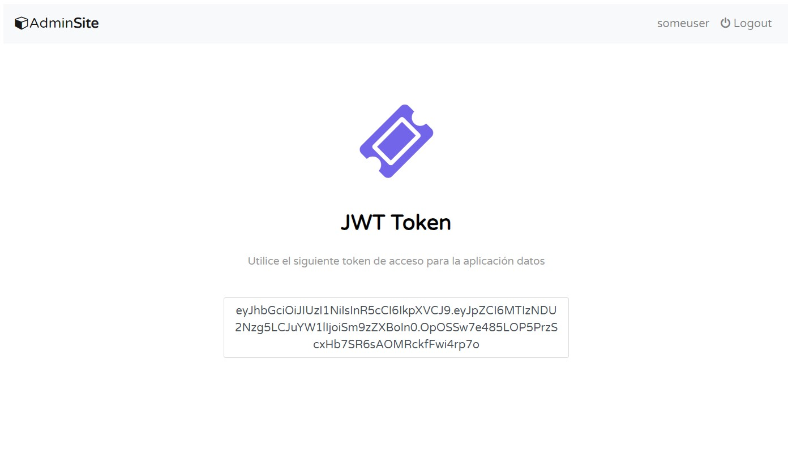

## Guía 23

[DAWM](/DAWM/) / [Proyecto04](/DAWM/proyectos/2024/proyecto04)

<style type="text/css" media="screen">
  details {
    margin: 5% 0%;
    padding: 2%;
    border: dashed 2px black;
    border-radius: 11px;
    box-shadow: 5px 5px 15px rgba(0, 0, 0, 0.3);
  }

  details div {
    color: lightseagreen;
    font-weight: bold;
    cursor: pointer;
    text-align: center;
  }

  img.description {
    width: 50%;
    text-align: center;
    margin: 0 25%;
  }
</style>

### Actividades previas

#### Github - RestAPI

1. Clone localmente tu repositorio **restapi**.
2. Cree el archivo _.env_, con las variables:
    
    ```text
    PORT=5500
    FIREBASE_ADMIN_API = ''
    ```

3. Desde la línea de comandos, inicie el servidor:

    ```command
    npm run autostart
    ```

4. Compruebe el funcionamiento de la aplicación

#### Github - Security

1. Clone localmente tu repositorio **security**.
2. Cree el archivo _.env_, con las variables:
    
    ```text
    SALT='...=='
    TOKEN_SECRET='ly...FNWW/...+yg=='
    ALL_GRANTED="admin"
    ```

3. Desde la línea de comandos, inicie el servidor:

    ```command
    npm run autostart
    ```

4. Compruebe el funcionamiento de la aplicación

### Actividades en clases

**Contexto:** En grupo de tres (3) personas han desarrollando las aplicaciones **restapi** y **seguridad**. 

**Objetivo:** Implementen un mecanismo de acceso entre aplicaciones mediante JSON Web Tokens (JWT).

**Requisitos:**

1. En la aplicación **seguridad**: 
    
    + Implemente la ruta `/token` a la que solo accedan los usuarios autenticados con el rol **user**. En la página debe mostrar un JWT que sea válido por 1 hora.

    Utilice la [template_jwt](recursos/template_jwt.zip). Fuente: [Tutorial Republic - Snippets](https://www.tutorialrepublic.com/snippets/preview.php?topic=bootstrap&file=subscribe-newsletter-form-inside-modal)

    <div align="center">
        
    </div>

2. En la aplicación **restapi**:

    + Implemente un middleware que verifique la validez del JWT en cada solicitud a la ruta `/api`. Si el token es válido, permite el acceso; de lo contrario, devuelve un error 408 (Request Timeout). Los usuarios deben enviar el JWT en el encabezado de autorización de sus solicitudes.


### Documentación

* Documentación del módulo [jsonwebtoken](https://www.npmjs.com/package/jsonwebtoken) para NodeJS y del estándar [RFC 7519](https://jwt.io/) para JWT.

### Fundamental

* JWT para el intercambio de información en [X](https://x.com/AmigosCode/status/1724060365196059019)

<blockquote class="twitter-tweet"><p lang="en" dir="ltr">🌐 Decoding JWT (JSON Web Tokens) 🗝️<br><br>JWTs are compact data formats used for secure information exchange. They consist of three parts: Header, Payload, and Signature.<br><br>🔑 Format:<br>- Header: Describes the token (encoded JSON).<br>- Payload: Contains claims (encoded).<br>- Signature:… <a href="https://t.co/GZyorWZICK">pic.twitter.com/GZyorWZICK</a></p>&mdash; Nelson Djalo | Amigoscode (@AmigosCode) <a href="https://twitter.com/AmigosCode/status/1724060365196059019?ref_src=twsrc%5Etfw">November 13, 2023</a></blockquote> <script async src="https://platform.twitter.com/widgets.js" charset="utf-8"></script>


* JWT para la autenticación en [X](https://twitter.com/ProgressiveCod2/status/1734893719290319143)

<blockquote class="twitter-tweet" data-media-max-width="560"><p lang="en" dir="ltr">What&#39;s the most scalable solution to authentication?<br><br>JSON Web Tokens or JWT.<br><br>A single JWT can contain all the required information about an entity, making it an ideal candidate for authentication.<br><br>There are 3 main components of a JWT.<br><br>Here&#39;s the structure of JWT:<br><br>[1] Header… <a href="https://t.co/gwbX8UJU7l">pic.twitter.com/gwbX8UJU7l</a></p>&mdash; Saurabh Dashora (@ProgressiveCod2) <a href="https://twitter.com/ProgressiveCod2/status/1734893719290319143?ref_src=twsrc%5Etfw">December 13, 2023</a></blockquote> <script async src="https://platform.twitter.com/widgets.js" charset="utf-8"></script>

### Términos

middleware, JSON Web Tokens

### Referencias

* JWT.IO. (2023). Retrieved 21 August 2023, from https://jwt.io/
* How To Use JSON Web Tokens (JWTs) in Express.js DigitalOcean. (2023). Retrieved 21 August 2023, from https://www.digitalocean.com/community/tutorials/nodejs-jwt-expressjs
* Concepts, C., & Basics, M. (2023). Model Querying - Basics Sequelize. Retrieved 21 August 2023, from https://sequelize.org/docs/v6/core-concepts/model-querying-basics/#operators
