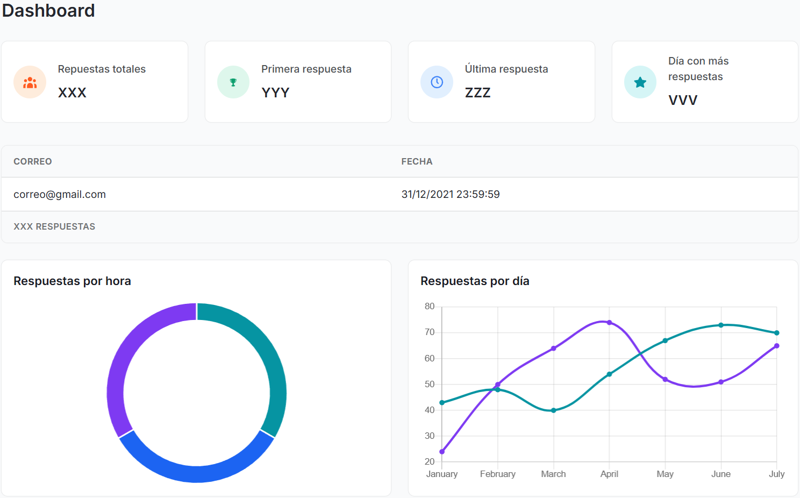
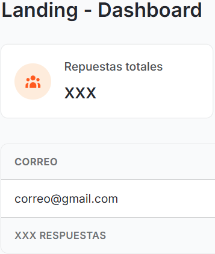
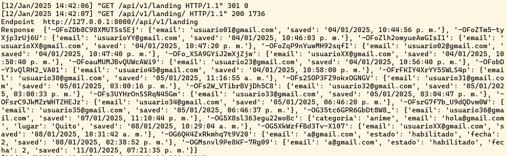
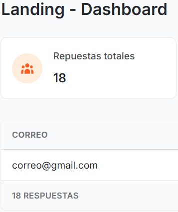
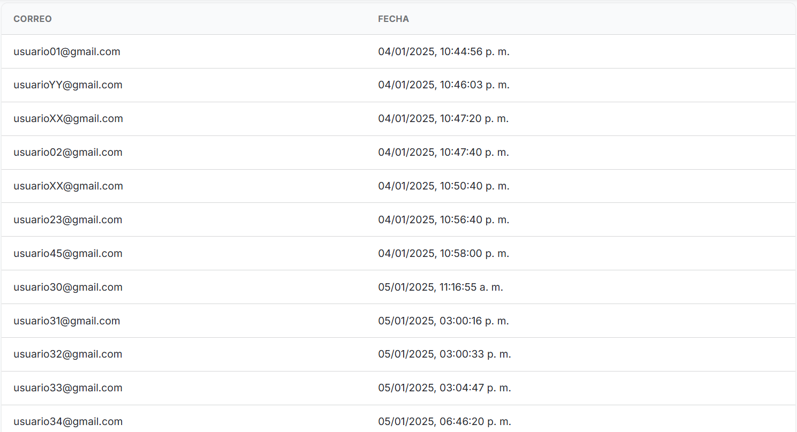
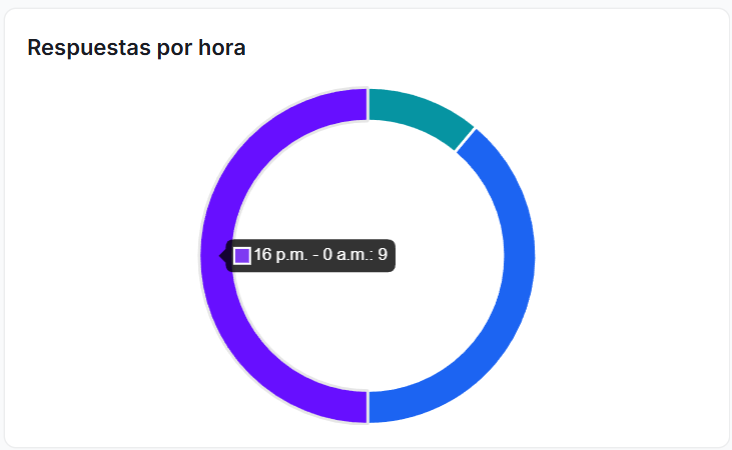

## Guía 23

[DAWM](/DAWM/) / [Proyecto05](/DAWM/proyectos/2024/proyecto05)

<link href="styles/mystyle.css" rel="stylesheet" />

### Objetivo general

<pre class="purpose">Desarrollar una aplicación backend robusta y escalable utilizando Django que integre una interfaz de administrador intuitiva para la gestión eficiente de datos y funcionalidades junto con un REST API completo que facilite la comunicación con las aplicaciones cliente de tal forma que garantice la seguridad, el rendimiento y la extensibilidad del sistema.</pre>

### Actividades previas

#### Ambiente de desarrollo

1. Desde la línea de comandos

    + Cree y habilite el ambiente de desarrollo, con:

    ```command
    python -m venv environment
    environment\Scripts\activate
    ```

#### Repositorio local/remoto + librerías

1. Desde la línea de comandos
    
    + Clone localmente y acceda a la carpeta _backend_.
    + Instale las librerías de _requirements.txt_, con:

    ```command
    pip install -r requirements.txt
    ```

#### SDK Firebase Admin: Clave privada

1. Acceda a la [consola de Firebase](https://console.firebase.google.com/)
2. Ingrese al proyecto **landing**
    + Acceda a la Configuración de proyecto.
    + Genere y descargue una clave privada JSON.

3. Cree la carpeta keys en el proyecto.
4. Renombre el archivo como _landing-key.json_ y guarde el archivo en la carpeta _keys_.

#### Editor y WSGI

1. Abra el proyecto con VSCode, con:

    ```command
    code .
    ```

2. Levante el servidor, con:

    ```command
    python manage.py runserver
    ```

### Actividades en clases

#### Plantilla para datos

1. Descargue y descomprima el archivo [main_content_data_django.zip](recursos/main_content_data_django.zip)
2. Reemplace el archivo descargado por _templates/main/content/data.html_.
3. (STOP 1) Revise los cambios en el navegador en el URL: 

    + [http://127.0.0.1:8000/](http://127.0.0.1:8000/)

    <div align="center">
        
    </div>

#### Vistas y plantillas: Renderización de constantes

1. Edite el archivo _main/views.py_, con:

    + Cree el objeto **data** y renderice en la vista _index_

    ```python
    ...

    def index(request):
        
        # Objeto con los datos a renderizar
        data = {
            'title': 'Landing - Dashboard',
        }


        # Renderización en la plantilla
        return render(request, 'main/index.html', data)
    ```


2. Modifique el archivo _templates/main/content/data.html_, con:

    + Renderice la variable **title**

    ```html
    ...

    <!-- START - title -->
        {{ title }}
    <!-- END - title -->

    ...
    ```

3. (STOP 2) Revise los cambios en el navegador en el URL: 

    + [http://127.0.0.1:8000/](http://127.0.0.1:8000/)

    <div align="center">
        
    </div>

#### Vistas y plantillas: Renderización de variables

1. Edite el archivo _main/views.py_, con:

    + Importe **requests** y **json**.
    + Arme el `endpoint` con la URL del proyecto y la ruta de la aplicación.
    + Realice una petición al REST API al _endpoint_.

    ```python
    ...

    # Importe requests y json
    import requests
    import json

    def index(request):
        
        # Arme el endpoint del REST API
        current_url = request.build_absolute_uri()
        url = current_url + '/api/v1/landing'

        # Petición al REST API
        response_http = requests.get(url)
        response_dict = json.loads(response_http.content)

        print("Endpoint ", url)
        print("Response ", response_dict)

        # Respuestas totales
        total_responses = len(response_dict.keys())

        # Objeto con los datos a renderizar
        data = {
            'title': 'Landing - Dashboard',
            'total_responses': total_responses,
        }

        # Renderización en la plantilla
        return render(request, 'main/index.html', data)
    ```

2. Modifique el archivo _templates/main/content/data.html_, con:

    + Renderice la variable **total_responses** en los bloques _total\_responses_ y _total\_responses\_table_

    ```html
    ...

    <!-- START - total_responses -->
        {{ total_responses }}
    <!-- END - total_responses -->

    ...

    <!-- START - total_responses_table -->
        {{ total_responses }}
    <!-- END - total_responses_table -->
    respuestas
    ```

3. (STOP 3) Revise los cambios: 

    + En la terminal

    <div align="center">
        
    </div>

    + En el navegador en el URL [http://127.0.0.1:8000/](http://127.0.0.1:8000/)

    <div align="center">
        
    </div>

#### Vistas y plantillas: Renderización de arreglos

1. Edite el archivo _main/views.py_, con:

    + Extraiga los valores de la respuesta

    ```python
    ...

    # Importe requests y json
    import requests
    import json

    def index(request):
        
        ...

        # Respuestas totales
        ...

        # Valores de la respuesta
        responses = response_dict.values()

        # Objeto con los datos a renderizar
        data = {
            'title': 'Landing - Dashboard',
            'total_responses': total_responses,
            'responses': responses
        }

        # Renderización en la plantilla
        return render(request, 'main/index.html', data)
    ```

2. Modifique el archivo _templates/main/content/data.html_, con:

    + Itere el arreglo **responses** en la variable **row**.
    + Renderice los valores _row.email_ y _row.saved_.

    ```html
    ...

    <!-- START - responses -->
    {% for row in responses %}
    <tr class="text-gray-700 dark:text-gray-400">
        <td class="px-4 py-3 text-sm">
            <!-- START - row.email -->
            {{ row.email }}
            <!-- END - row.email -->
        </td>
        <td class="px-4 py-3 text-sm">
            <!-- START - row.saved -->
            {{ row.saved }}
            <!-- END - row.saved -->
        </td>
    </tr>
    {% endfor %}
    <!-- END - responses -->

    ...
    ```

3. (STOP 4) Revise los cambios: 

    + En el navegador en el URL [http://127.0.0.1:8000/](http://127.0.0.1:8000/)

    <div align="center">
        
    </div>

#### Javascript: Requerimiento asíncrono

1. Edite el archivo _static/js/charts-pie.js_, con:

    + Agregue la función **countCommentsByHour** que procesa el JSON de respuesta.
    
    ```javascript
    ...
    
    const pieCtx = ...
    window.myPie = ...

    // Función para procesar el JSON
    countCommentsByHour = (data) => {

      // Inicializar contadores por rango de horas
      const labels = ["0 a.m. - 8 a.m.", "8 a.m. - 16 p.m.", "16 p.m. - 0 a.m."];
      const counts = [0, 0, 0];

      Object.values(data).forEach(record => {

          const savedTime = record.saved;
          if (!savedTime) {
              return;
          }

          // Convertir a formato de hora AM/PM
          const formattedTime = savedTime.replace('a. m.', 'AM').replace('p. m.', 'PM');
          
          // Crear objeto Date con la cadena de tiempo
          const dt = new Date(Date.parse(formattedTime.replace(/(\d{2}\/\d{2}\/\d{4}), (\d{2}):(\d{2}):(\d{2}) (AM|PM)/, '$1 $2:$3:$4 $5')));
          const hour = dt.getHours();

          // Clasificar en el rango correspondiente
          if (hour >= 0 && hour < 8) {
              counts[0]++;
          } else if (hour >= 8 && hour < 16) {
              counts[1]++;
          } else {
              counts[2]++;
          }
      });

      return { labels, counts };
    }
    ````

    + Agregue la función **update** con la petición asincrónica al REST API y actualiza el gráfico.

    ```javascript
    ...

    countCommentsByHour = ...

    update = () => {
      fetch('/api/v1/landing')
        .then(response => response.json())
        .then(data => {

          let { labels, counts } = countCommentsByHour(data)

          // Reset data
          window.myPie.data.labels = [];
          window.myPie.data.datasets[0].data = [];

          // New data
          window.myPie.data.labels = [...labels]
          window.myPie.data.datasets[0].data = [...counts]

          window.myPie.update();

        })
        .catch(error => console.error('Error:', error));
    }

    update();
    ```

3. (STOP 5) Revise los cambios: 

    + En el navegador en el URL [http://127.0.0.1:8000/](http://127.0.0.1:8000/)

    <div align="center">
        
    </div>

#### Versionamiento local y remoto

1. En la línea de comandos

    + Genere el archivo **requirements.txt** con la lista de paquetes utilizados, con:

    ```command
    pip freeze > requirements.txt
    ```

    + Desactive el ambiente de desarrollo, con:

    ```command
    deactivate
    ```

2. Versione local y remotamente.

### Documentación

* [Etiquetas y filtros de plantilla integrados](https://docs.djangoproject.com/en/5.1/ref/templates/builtins/) en Django 

### Fundamental

* Renderización web en el lado del servidor en [X](https://x.com/aleyda/status/1094593901493714945)

<blockquote class="twitter-tweet" data-media-max-width="560"><p lang="en" dir="ltr">Rendering on the Web – The SEO Version: Pros and Cons from Server Side to Full Client Side Rendering by <a href="https://twitter.com/jbobbink?ref_src=twsrc%5Etfw">@jbobbink</a> <a href="https://t.co/IioPUtth8Y">https://t.co/IioPUtth8Y</a> <a href="https://t.co/VzZrRGVOOo">pic.twitter.com/VzZrRGVOOo</a></p>&mdash; Aleyda Solis 🕊️ (@aleyda) <a href="https://twitter.com/aleyda/status/1094593901493714945?ref_src=twsrc%5Etfw">February 10, 2019</a></blockquote> <script async src="https://platform.twitter.com/widgets.js" charset="utf-8"></script>

### Términos

SSR, endpoint, etiquetas integradas

### Referencias

* Built-in template tags and filters: Django documentation. (n.d.). Retrieved from https://docs.djangoproject.com/en/5.1/ref/templates/builtins/
* Request and response objects: Django documentation. (n.d.). Retrieved from https://docs.djangoproject.com/en/5.1/ref/request-response/
* Bob Belderbos on 14 June 2022, & Belderbos, B. (2022). How To Make A Nice Graph Using Django And Chart.js. Retrieved from https://pybit.es/articles/how-to-make-a-nice-graph-using-django-and-chart-js/
* Updating Charts. (n.d.). Retrieved from https://www.chartjs.org/docs/latest/developers/updates.html