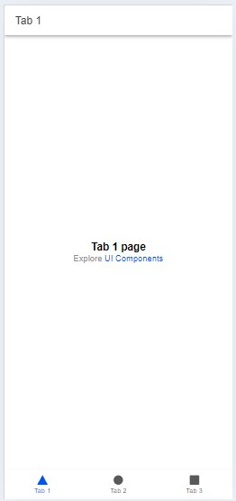
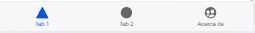
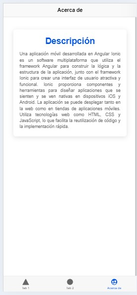

## Guía 24

[DAWM](/DAWM/) / [Proyecto05](/DAWM/proyectos/2024/proyecto05)

### Actividades previas

1. En grupo de tres (3) personas, identifiquen un problema que deseen resolver con una aplicación móvil.
2. Diseñe un prototipo con las interfaces de su aplicación móvil, con al menos cuatro (4) vistas:
  + **Principal** muestra la funcionalidad principal de la aplicación (por ejemplo, feed de noticias, catálogo de productos, resumen de cuentas, album de fotos, etc.). Opcionalmente, puede incluir herramientas de búsqueda y filtros si es necesario.
  + **Detalles de un elemento** en una vista individual muestra los detalles un elemento (por ejemplo, detalles de una publicación, detalles de un producto, total de cuentas por tipo, etc.).
  + **Ingreso de un elemento** contiene las funcionalidades para agregar, ver y gestionar un elemento.
  + **Acerca de** con la información del proyecto y de las personas que intervienen en el proyecto.
3. Seleccione un diseño que se ajuste a su prototipo. Puede considerar alguna de las siguientes fuentes: [Mobbin](https://mobbin.com/browse/android/apps) o [Scrnshts](https://scrnshts.club/) 

### Actividades en clases

#### Dependencias Globales

1. Instale los módulos Ionic CLI, native-run (para ejecutar binarios nativos en dispositivos y simuladores/emuladores) y cordova-res (para generar íconos de aplicaciones nativas y pantallas de presentación), con: 

    ```command
    npm install -g @ionic/cli native-run cordova-res
    ```
#### Ionic Angular - Plantilla inicial

1. Cree un proyecto en Ionic:
  
    + Desde la línea de comandos, utilice el comando **ionic** con: 

    ```command
    ionic start hybrid tabs --type=angular --capacitor
    ```

    + Seleccione el tipo componente Standalone para construir la aplicación

    ```command
    ? Would you like to build your app with NgModules or Standalone Components?
    ...
    > Standalone
    ```

2. Acceda a la carpeta del proyecto y levante el servidor, con:

    ```command
    cd hybrid
    ionic serve
    ```

3. (STOP 1) Revise los cambios en el navegador

    <div align="center">
      
    </div>


#### IonTab

1. Edite el archivo _hybrid/src/app/tabs/tabs.page.ts_, con:

    + El ícono **peopleCirle** de [Ionicons](https://ionic.io/ionicons)

    ```typescript
    ...

    /* 1. Agregue la referencia al ícono peopleCircle */ 
    import { ... , peopleCircle } from 'ionicons/icons';

    ...

    export class TabsPage {
    ...

    constructor() {

        /* 2. Agregue el ícono peopleCircle */
        addIcons({ ... , peopleCircle });

      }
    }
    ```

2. Edite el archivo _hybrid/src/app/tabs/tabs.page.html_, con:

    ```html
    <ion-tabs>
      <ion-tab-bar slot="bottom">
        
        ...

        <ion-tab-button tab="tab3" href="/tabs/tab3">
           
           <!-- 1. Ícono y nombre del tab -->
           <ion-icon name="people-circle"></ion-icon>
           <ion-label>Acerca de</ion-label>

        </ion-tab-button>

      </ion-tab-bar>
    </ion-tabs>
    ```

3. (STOP 2) Revise los cambios en el navegador

    <div align="center">
      
    </div>

#### IonCard

1. Edite el archivo _hybrid/src/app/tab3/tab3.page.ts_, con:

    + Importe el componente [Card](https://ionicframework.com/docs/api/card) y sus asociados.
  
    ```typescript
    ...

    
    import { 
      ...  

      /* 1. Importe los componentes */
      IonCard, IonCardHeader, IonCardSubtitle, IonCardTitle, IonCardContent,
      
      ... 
    } from '@ionic/angular/standalone';

    @Component({
      ...
      imports: [
        ... 

        /* 2. Registre los componentes */
        IonCard, IonCardHeader, IonCardSubtitle, IonCardTitle, IonCardContent,
        
        ...],
    })
    export class Tab3Page {
      constructor() {}
    }
    ```

2. Edite el archivo _hybrid/src/app/tab3/tab3.page.html_, con:

    + Todo el contenido

    ```html
    <ion-header [translucent]="true">
      <ion-toolbar>
        <ion-title>
          Acerca de
        </ion-title>
      </ion-toolbar>
    </ion-header>

    <ion-content [fullscreen]="true" class="ion-padding">

      <ion-card>
        <ion-card-header>

          <ion-card-title class="titulo">Descripción</ion-card-title>
        
        </ion-card-header>
      
        <ion-card-content>
          <p id="descripcion">
          Una aplicación móvil desarrollada en Angular Ionic es un software multiplataforma que utiliza el framework Angular para construir la lógica y la estructura de la aplicación, junto con el framework Ionic para crear una interfaz de usuario atractiva y funcional. Ionic proporciona componentes y herramientas para diseñar aplicaciones que se sienten y se ven nativas en dispositivos iOS y Android. La aplicación se puede desplegar tanto en la web como en tiendas de aplicaciones móviles. Utiliza tecnologías web como HTML, CSS y JavaScript, lo que facilita la reutilización de código y la implementación rápida.
          </p>
        </ion-card-content>

      </ion-card>

    </ion-content>
    ```

3. Edite el archivo _hybrid/src/app/tab3/tab3.page.scss_, con:

    ```css
    .titulo {
      color: var(--ion-color-primary);
        font-weight: bold;
        text-align: center;
    }

    p#descripcion {
      text-align: justify;
    }
    ```

4. (STOP 3) Revise los cambios en el navegador

    <div align="center">
      
    </div>

#### Github

1. Crea un repositorio en GitHub con el nombre **hybrid**.
2. Desde la línea de comandos:
  
  + Agregue la rama **main** y el tag **origin**:
  
    ```command
    git branch -M main
    git remote add origin https://github.com/aavendan/hybrid.git
    ```

3. Versiona local y remotamente el repositorio **hybrid**.

    ```command
    git add .
    git commit -m "first"
    git push origin main --force
    ```

### Documentación

* Ionic Framework en la [página oficial](https://ionicframework.com/).
* Ionic Icons en la [página oficial](https://ionic.io/ionicons)
* Ionic Components en la [página oficial](https://ionicframework.com/docs/components)

### Fundamental

* Vendor Category Management con Ionic en [X](https://twitter.com/Ionicframework)

<blockquote class="twitter-tweet" data-media-max-width="560"><p lang="en" dir="ltr">Wow. Achieved more than I expected this morning.<br><br>Vendor Category Management ✨<br><br>✅ CRUD Endpoints<br>✅ Sortable Endpoint (thanks <a href="https://twitter.com/spatie_be?ref_src=twsrc%5Etfw">@spatie_be</a>)<br>✅ Implemented into app 👌<a href="https://twitter.com/hashtag/buildinpublic?src=hash&amp;ref_src=twsrc%5Etfw">#buildinpublic</a> <a href="https://t.co/yYoqqOUNO2">pic.twitter.com/yYoqqOUNO2</a></p>&mdash; Philip Moore (@philmmoore) <a href="https://twitter.com/philmmoore/status/1741406339924943136?ref_src=twsrc%5Etfw">December 31, 2023</a></blockquote> <script async src="https://platform.twitter.com/widgets.js" charset="utf-8"></script>

* Estructura de componentes de Ionic en [X](https://twitter.com/93alan/status/1512587338962116611)

<blockquote class="twitter-tweet" data-media-max-width="560"><p lang="en" dir="ltr">This is why I love <a href="https://twitter.com/Ionicframework?ref_src=twsrc%5Etfw">@Ionicframework</a>. We can build essentially any UI, sometimes even like this iOS Twitter settings screen with UI Components out of the box. 👨🏼‍🔧<br><br>Everything you see here is from Ionic, <a href="https://twitter.com/ionicons?ref_src=twsrc%5Etfw">@ionicons</a> and styled using Ionic&#39;s theme application colors. <a href="https://t.co/ZocsDvBShH">pic.twitter.com/ZocsDvBShH</a></p>&mdash; Alan Montgomery (@93alan) <a href="https://twitter.com/93alan/status/1512587338962116611?ref_src=twsrc%5Etfw">April 9, 2022</a></blockquote> <script async src="https://platform.twitter.com/widgets.js" charset="utf-8"></script>

### Términos

UI framework

### Referencias

* Ionicframework. (n.d.). Your First Ionic App: Angular: Ionic Documentation. Retrieved from https://ionicframework.com/docs/angular/your-first-app