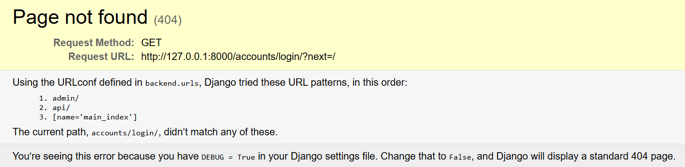
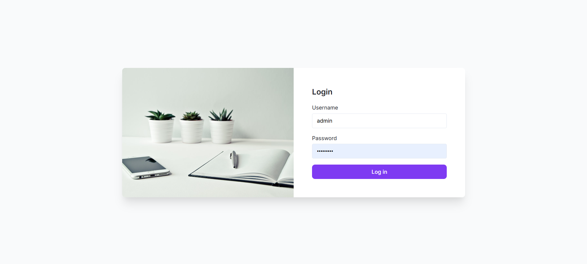
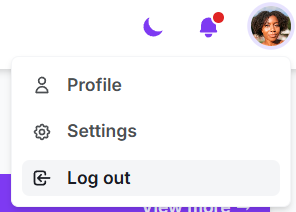
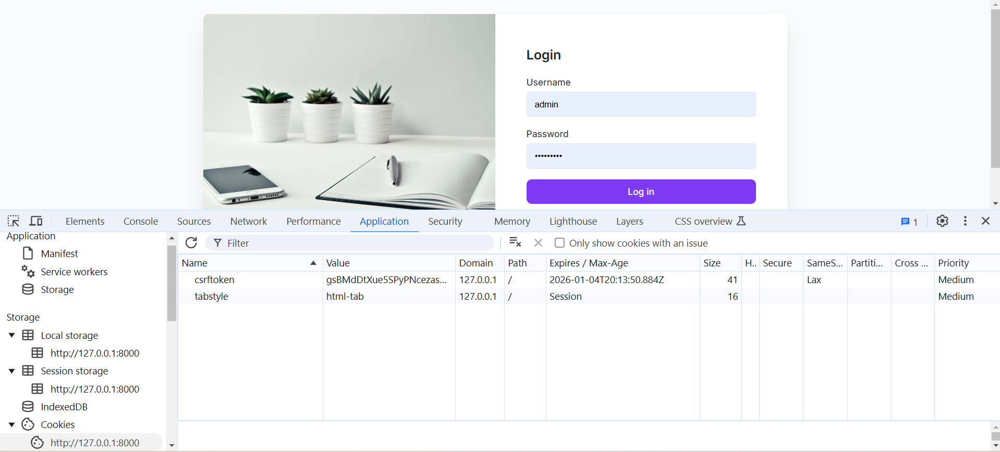
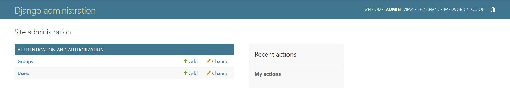
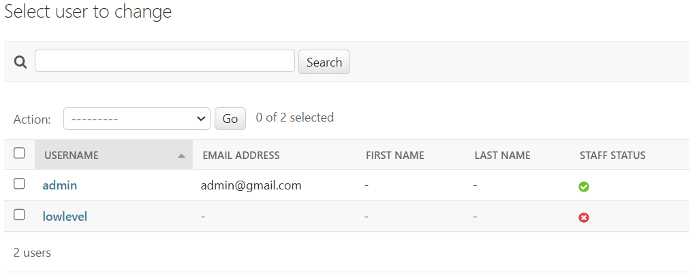

## Guía 24

[DAWM](/DAWM/) / [Proyecto05](/DAWM/proyectos/2024/proyecto05)

<link href="styles/mystyle.css" rel="stylesheet" />

### Objetivo general

<pre class="purpose">Desarrollar una aplicación backend robusta y escalable utilizando Django que integre una interfaz de administrador intuitiva para la gestión eficiente de datos y funcionalidades junto con un REST API completo que facilite la comunicación con las aplicaciones cliente de tal forma que garantice la seguridad, el rendimiento y la extensibilidad del sistema.</pre>

### Actividades previas

#### Ambiente de desarrollo

1. Desde la línea de comandos

    + Cree y habilite el ambiente de desarrollo, con:

    ```command
    python -m venv environment
    environment\Scripts\activate
    ```

#### Repositorio local/remoto + librerías

1. Desde la línea de comandos
    
    + Clone localmente y acceda a la carpeta _backend_.
    + Instale las librerías de _requirements.txt_, con:

    ```command
    pip install -r requirements.txt
    ```

#### SDK Firebase Admin: Clave privada

1. Acceda a la [consola de Firebase](https://console.firebase.google.com/)
2. Ingrese al proyecto **landing**
    + Acceda a la Configuración de proyecto.
    + Genere y descargue una clave privada JSON.

3. Cree la carpeta keys en el proyecto.
4. Renombre el archivo como _landing-key.json_ y guarde el archivo en la carpeta _keys_.

#### Editor y WSGI

1. Abra el proyecto con VSCode, con:

    ```command
    code .
    ```

2. Levante el servidor, con:

    ```command
    python manage.py runserver
    ```

### Actividades en clases

#### Autorización

1. Edite el archivo _main/views.py_, con:

    + Importe el decorador **login_required**
    + Restricción de acceso para la vista _index_

    ```python
    from django.http import ...

    # Importe el decorador login_required
    from django.contrib.auth.decorators import login_required

    # Restricción de acceso con @login_required
    @login_required
    def index(request):
        ...
    ```

2. (STOP 1) Revise los cambios en el navegador en el URL: [http://127.0.0.1:8000/](http://127.0.0.1:8000/)

    <div align="center">
        
    </div>

#### Vistas de autenticación

1. Descargue y descomprima la plantilla [login_django.zip](recursos/login_django.zip) en la carpeta _templates/security_.
2. Edite el archivo _backend/urls.py_, con:

    + Importe las vistas predefinidas para el inicio y el cierre de sesión.
    + Agregue las rutas para que procesen el inicio (**LoginView**) y el cierre (**LogoutView**) de sesión con la configuración correspondiente.

    ```python
    ...
    # Importe las vistas
    from django.contrib.auth import views as auth_views

    urlpatterns = [
        ...

        # Ruta login/ para la vista LoginView para inicio de sesión, uso de plantilla y alias
        path('login/', auth_views.LoginView.as_view(template_name='security/login.html'), name='login'),
        
        # Ruta logout/ para la vista LogoutView para fin de sesión, redirección y alias
        path('logout/', auth_views.LogoutView.as_view(next_page='/login/'), name='logout'),
    ]
    ```

3. Modifique el archivo _backend/settings.py_, con:
    
    + La ruta a redirigir cuando los usuarios que no están autenticados.
    + La ruta a la que se redirigirá a un usuario después de un inicio de sesión exitoso.


    ```python
    ...
    LOGIN_URL = '/login/'
    LOGIN_REDIRECT_URL = '/'
    ```

4. (STOP 2) Revise los cambios en el navegador en el URL: 

    + [http://127.0.0.1:8000/](http://127.0.0.1:8000/)

    <div align="center">
        
    </div>

#### Superusuario

1. Aplique las migraciones

    ```command
    python manage.py makemigrations
    python manage.py migrate
    ```

2. (STOP 3) Cree el super usuario. Recuerde el **usuario** y la **contraseña** para probar el sistema de autenticación.

    ```command
    python manage.py createsuperuser
    ```

#### Inicio de sesión

1. Edite el archivo _templates/security/login.html_

    + Agregue el método **post** y la URL para el **action**
    + Añada la etiqueta de plantilla `CSRF` con el token de seguridad único.
    + Agregue los atributos **name** a los elementos input.

    ```html
    ...
    <!-- Método post y action para el URL (con el alias 'login') -->
    <form method="post" action="{% url 'login' %}">
        <!-- CSRF token -->
        {% csrf_token %}
        ...

        <!-- username -->
        <input name="username" ... >
        ...

        <!-- password -->
        <input name="password" ... >
        ...
    </form>
    ```    

2. (STOP 4) Revise los cambios en el navegador en el URL: [http://127.0.0.1:8000/](http://127.0.0.1:8000/)

    + Ingrese el usuario y contraseña del super usuario. 
    + Revise la `cookie` de `sesión`

    <div align="center">
        
    </div>

#### Fin de sesión

1. Modifique _templates/main/partials/header.html_ en el bloque **logout**

    + Agregue el método **post** y la URL para el **action**
    + Añada la etiqueta de plantilla `CSRF` con el token de seguridad único.

    ```html
    <!-- START - Block Logout -->
    
    <!-- Método post y action para el URL (con el alias 'logout') -->
    <form method="post" action="{% url 'logout' %}" class="w-full">

        <!-- CSRF token -->
        {% csrf_token %}

        <button ...>
         ...
        </button>

    </form>
    <!-- END - Block Logout -->
    ```

2. Haga clic en el botón **Log out**

    <div align="center">
        
    </div>

3. (STOP 5) Revise los cambios en el navegador en el URL: [http://127.0.0.1:8000/](http://127.0.0.1:8000/)

    <div align="center">
        
    </div>

#### Django Admin - Nuevo Usuario

1. Acceda a sitio de Django Admin en [http://127.0.0.1:8000/admin](http://127.0.0.1:8000/admin)
    + Utilice las credenciales del usuario **admin**

    <div align="center">
        
    </div>

2. Agregue las credenciales y datos generales de un usuario nuevo, con:

    + Acceda a la opción **Users**
    + Haga clic en el botón **ADD USER**
    + Complete los campos **Username**, **Password** y **Password confirmation**
    + Guarde los cambios con el botón **SAVE**
    + Complete los datos personales en **Personal info**.
    + Guarde los cambios con el botón **SAVE**

    <div align="center">
        
    </div>

3. Salga del sitio de Django Admin con el botón **LOG OUT**

    <div align="center">
        
    </div>

4. (STOP 6) Revise los cambios en el navegador en el URL: [http://127.0.0.1:8000/](http://127.0.0.1:8000/)

    + Ingrese el usuario y contraseña recientemente creados. 
    + Revise la `cookie` de `sesión`

    <div align="center">
        
    </div>


#### Versionamiento local y remoto

1. En la línea de comandos

    + Genere el archivo **requirements.txt** con la lista de paquetes utilizados, con:

    ```command
    pip freeze > requirements.txt
    ```

    + Desactive el ambiente de desarrollo, con:

    ```command
    deactivate
    ```

2. Versione local y remotamente.


### Documentación

* En [Utilizando el sistema de autenticación de Django](https://docs.djangoproject.com/es/5.1/topics/auth/default/) explica el uso del sistema predeterminado de autenticación y autorización de las aplicaciones

### Fundamental

* Método de autenticación basada en sesiones en [X](https://x.com/Franc0Fernand0/status/1845754683521896944)

<blockquote class="twitter-tweet" data-media-max-width="560"><p lang="en" dir="ltr">What are web sessions? <br><br>Any data exchange on the web is based on a stateless protocol like HTTP. <br><br>Every HTTP request is independent of the previous ones. <br><br>However, users need to relate the requests to each other. <br><br>For example, they want to stay logged in to a website… <a href="https://t.co/YgYjDSihpa">pic.twitter.com/YgYjDSihpa</a></p>&mdash; Fernando 🇮🇹🇨🇭 (@Franc0Fernand0) <a href="https://twitter.com/Franc0Fernand0/status/1845754683521896944?ref_src=twsrc%5Etfw">October 14, 2024</a></blockquote> <script async src="https://platform.twitter.com/widgets.js" charset="utf-8"></script>

* Otros métodos de autenticación en [X](https://twitter.com/alexxubyte/status/1737151765097951544)

<blockquote class="twitter-tweet" data-media-max-width="560"><p lang="en" dir="ltr">Authentication in REST APIs acts as the crucial gateway, ensuring that solely authorized users or applications gain access to the API&#39;s resources.<br><br>Some popular authentication methods for REST APIs include:<br><br>1. Basic Authentication: <br>Involves sending a username and password with… <a href="https://t.co/Y4CKqZUhBF">pic.twitter.com/Y4CKqZUhBF</a></p>&mdash; Alex Xu (@alexxubyte) <a href="https://twitter.com/alexxubyte/status/1737151765097951544?ref_src=twsrc%5Etfw">December 19, 2023</a></blockquote> <script async src="https://platform.twitter.com/widgets.js" charset="utf-8"></script>

### Términos

Built-in, CSRF, cookies, session, autenticación, autorización

### Referencias

* Using the Django authentication system: Django documentation. (n.d.). Retrieved from https://docs.djangoproject.com/en/5.1/topics/auth/default/#module-django.contrib.auth.views
* Nick. (2024). Do not Reinvent the Wheel: Utilize Django’s Built-in Auth App to Create a Robust Authentication System. Retrieved from https://dev.to/odhiambo/do-not-reinvent-the-wheel-utilize-djangos-built-in-auth-app-to-create-a-robust-authentication-system-4840
* Comment, info, M., prathamsahani0368 Follow Improve, prathamsahani0368 Follow, prathamsahani0368, & Follow. (2024). User Authentication System using Django. Retrieved from https://www.geeksforgeeks.org/user-authentication-system-using-django/
* Tang, A. (2024). How to secure your Django applications ⎜Escape Blog. Retrieved from https://escape.tech/blog/best-django-security-practices/#authentication
* Django-Allauth tutorial 2023: Instalación y configuración (N.d.). Retrieved from https://www.youtube.com/watch?v=fsFhti_e5_Q