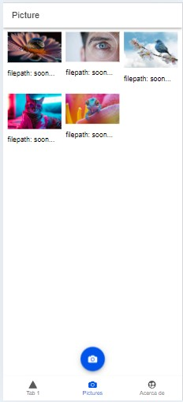
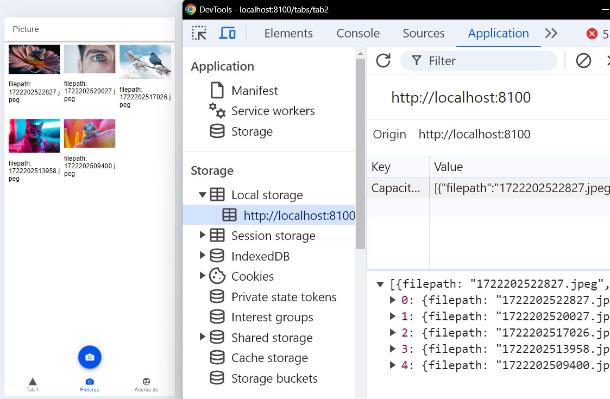

## Guía 25

[DAWM](/DAWM/) / [Proyecto05](/DAWM/proyectos/2024/proyecto05)

### Actividades previas

* Revise la documentación oficial de Ionic Docs con las instrucciones de [Taking Photos with the Camera](https://ionicframework.com/docs/angular/your-first-app/taking-photos)

### Actividades en clases

* Clone localmente tu repositorio **hybrid**.
* Abra el proyecto en VSCode y levante el servidor.
* Instale los módulos con la funcionalidad nativa

  ```command
  npm install @capacitor/camera @capacitor/preferences @capacitor/filesystem
  ```

#### Interfaz

1. Desde la línea de comandos, cree la interfaz _hybrid/src/app/interfaces/UserPhoto_

    ```command
    ionic g interface interfaces/UserPhoto
    ```

2. Modifique el archivo _hybrid/src/app/interfaces/user-photo.ts_

    ```typescript
    export interface UserPhoto {
      filepath: string;
      webviewPath?: string;
    }
    ```


#### Servicio

1. Cree el servicio _hybrid/src/app/services/photo_

    ```command
    ionic g service services/photo
    ```

#### Camera API

1. Modifique el archivo _hybrid/src/app/services/photo.service.ts_.

    ```typescript
    ...

    /* 1. Importe los módulos con la funcionalidad nativa */
    import { Camera, CameraResultType, CameraSource, Photo } from '@capacitor/camera';
    import { Filesystem, Directory } from '@capacitor/filesystem';


    /* 2. Importe la interfaz */
    import { UserPhoto } from '../interfaces/user-photo';

    ...
    export class PhotoService {

      /* 3. Atributo para almacenar las fotos */
      public photos: UserPhoto[] = [];

      constructor() { }

      public async addNewToGallery() {

        /* 4. Tome una foto */
        const capturedPhoto = await Camera.getPhoto({
          resultType: CameraResultType.Uri,
          source: CameraSource.Camera,
          quality: 100
        });

        /* 5. Agregue el archivo al inicio del arreglo */
        this.photos.unshift({
          filepath: "soon...",
          webviewPath: capturedPhoto.webPath!
        });
      }
    }
    ```

5. Edite el archivo _hybrid/src/app/tab2/tab2.page.ts_, con:

    ```typescript
    ...
    /* 1. Importe el módulo con la directiva @ngFor */
    import { CommonModule } from '@angular/common'

    /* 2. Importe los componentes de la UI */
    import { ... , IonFab, IonFabButton, IonIcon, IonImg, IonCol, IonRow, IonGrid } from '@ionic/angular/standalone';

    /* 3. Importe el servicio */
    import { PhotoService } from '../services/photo.service';
    ...
    
    @Component({
      ...
      /* 4. Registre los módulos */
    imports: [ ... , CommonModule, IonFab, IonFabButton, IonIcon, IonImg, IonCol, IonRow, IonGrid]
    })
    export class Tab2Page {

      /* 5. Inyecte la dependencia del servicio */
      constructor(public photoService: PhotoService) {}

      /* 6. Método a invocar */
      addPhotoToGallery() {
        this.photoService.addNewToGallery();
      }

    }
    ```

6. Edite el archivo _hybrid/src/app/tab2/tab2.page.html_, con:

    ```html
    <ion-header [translucent]="true">
      <ion-toolbar>

        <!-- 1. Título de la vista -->
        <ion-title>
          Pictures
        </ion-title>

      </ion-toolbar>
    </ion-header>


    <ion-content [fullscreen]="true">

      <ion-header collapse="condense">
      ...
      </ion-header>

      <!-- 2. Muestra los elementos -->
      <ion-grid>
        <ion-row>
          <ion-col size="4" *ngFor="let photo of photoService.photos; index as position">
            <ion-img [src]="photo.webviewPath"></ion-img>
            <p>filepath:  {{ photo.filepath }} </p>
          </ion-col>
        </ion-row>
      </ion-grid>


      <!-- 3. Muestra el obtón y habilita el servicio de la cámara --> 
      <ion-fab vertical="bottom" horizontal="center" slot="fixed">
        <ion-fab-button (click)="addPhotoToGallery()">
          <ion-icon name="camera"></ion-icon>
        </ion-fab-button>
      </ion-fab>

    </ion-content>
    ```

7. Edite el archivo _hybrid/src/app/tabs/tabs.page.ts_, con:

    + El ícono **camera** de [Ionicons](https://ionic.io/ionicons)

    ```typescript
    ...

    /* 1. Agregue la referencia al ícono camera  */ 
    import { ... , camera } from 'ionicons/icons';

    ...

    export class TabsPage {
    ...

    constructor() {

        /* 2. Agregue el ícono camera  */
        addIcons({ ... , camera });

      }
    }
    ```

8. Edite el archivo _hybrid/src/app/tabs/tabs.page.html_, con:

    ```html
    <ion-tabs>
      <ion-tab-bar slot="bottom">
        
        ...

        <ion-tab-button tab="tab2" href="/tabs/tab2">
           
           <!-- 1. Ícono y nombre del tab -->
           <ion-icon name="camera"></ion-icon>
           <ion-label>Pictures</ion-label>

        </ion-tab-button>

        ...

      </ion-tab-bar>
    </ion-tabs>
    ```

9. Revise los cambios en el navegador, con:

    ```command
    ionic serve
    ```

10. (STOP 1) Compruebe la aplicación en el navegador.

    <div align="center">
      
    </div>
    

#### Filesystem API

1. Edite el servicio _hybrid/src/app/services/photo.service.ts_, con:

    + El método **addNewToGallery**, en el archivo

    ```typescript
    ...
    /* 1. Importa el módulo Platform y Capacitor */
    import { Platform } from '@ionic/angular';
    import { Capacitor } from '@capacitor/core';

    ...
    export class PhotoService {

      ...

      /* 2. Referencia local a la plataforma utilizada 'hybrid' o 'web' */
      private platform: Platform;

      /* 3. Referencia en la inyección de dependencias */
      constructor(platform: Platform) {
        this.platform = platform;
      }

      public async addNewToGallery() {
        ...

        /* 5. Agregue el archivo al inicio del arreglo */
        const savedImageFile = await this.savePicture(capturedPhoto);
        this.photos.unshift(savedImageFile);

        /* 
        this.photos.unshift({
          filepath: "soon...",
          webviewPath: capturedPhoto.webPath!
        }); 
        */
      }

    }
    ```

2. Edite el servicio _hybrid/src/app/services/photo.service.ts_, con:

    + Agregue los métodos **savePicture**, **readAsBase64** y **convertBlobToBase64**.

    ```typescript
    ...
    export class PhotoService {
      

      public async addNewToGallery() { ... }

      /* 1. La función savePicture guarda una foto en el sistema de archivos y gestiona cómo se debe mostrar la imagen dependiendo de si la aplicación está en un entorno híbrido (Cordova o Capacitor) o en la web.*/

      private async savePicture(photo: Photo) {

        const base64Data = await this.readAsBase64(photo);

        const fileName = Date.now() + '.jpeg';
        const savedFile = await Filesystem.writeFile({
          path: fileName,
          data: base64Data,
          directory: Directory.Data
        });

        if (this.platform.is('hybrid')) {

          return {
            filepath: savedFile.uri,
            webviewPath: Capacitor.convertFileSrc(savedFile.uri),
          };
        }
        else {

          return {
            filepath: fileName,
            webviewPath: photo.webPath
          };

        }
      }


      /* 2. La función readAsBase64 convierte una foto a formato base64, ajustando el proceso según la plataforma. */

      private async readAsBase64(photo: Photo) {

        if (this.platform.is('hybrid')) {

          const file = await Filesystem.readFile({
            path: photo.path!
          });

          return file.data;

        } else {

          const response = await fetch(photo.webPath!);
          const blob = await response.blob();

          return await this.convertBlobToBase64(blob) as string;
        }

      }

      /* 3. La función convertBlobToBase64 convierte un blob a formato base64. */

      private convertBlobToBase64 = (blob: Blob) => new Promise((resolve, reject) => {
        const reader = new FileReader();
        reader.onerror = reject;
        reader.onload = () => {
          resolve(reader.result);
        };
        reader.readAsDataURL(blob);
      });

    }
    ```

3. Revise los cambios en el navegador, con:

    ```command
    ionic serve
    ```

4. (STOP 2) Compruebe la aplicación en el navegador.

    <div align="center">
      
    </div>

#### Preferences API

1. Modifique el archivo _hybrid/src/app/services/photo.service.ts_, con:

    ```typescript
    
    /* 1. Importe las preferencias del dispositivo */
    import { Preferences } from '@capacitor/preferences';

    ...
    export class PhotoService {

      /* 2. Clave para el almacenamiento */
      private PHOTO_STORAGE: string = 'photos';

      constructor(platform: Platform) { ... }


      public async addNewToGallery() {

        ...

        this.photos.unshift(...);

        /* 3. Ruta de almacenamiento */
        Preferences.set({
          key: this.PHOTO_STORAGE,
          value: JSON.stringify(this.photos),
        });

        // Agregue el archivo al inicio del arreglo
        // this.photos.unshift({
        //   filepath: "soon...",
        //   webviewPath: capturedPhoto.webPath!
        // });
      }

      ...

      /* 1. La función loadSaved recupera y carga fotos guardadas previamente, 
      adaptando el proceso según la plataforma en la que se ejecuta la aplicación (híbrida o web). */

      public async loadSaved() {

        const { value } = await Preferences.get({ key: this.PHOTO_STORAGE });
        this.photos = (value ? JSON.parse(value) : []) as UserPhoto[];


        if (!this.platform.is('hybrid')) {

          for (let photo of this.photos) {

            const readFile = await Filesystem.readFile({
              path: photo.filepath,
              directory: Directory.Data
            });

            photo.webviewPath = `data:image/jpeg;base64,${readFile.data}`;
          }
        }
      }


    }
    ```

2. Edite el archivo _hybrid/src/app/tab2/tab2.page.ts_, con:

    ```typescript
    ...
    export class Tab2Page {

      ...

      addPhotoToGallery() { ... }
      
      async ngOnInit() {
        await this.photoService.loadSaved();
      }
     

    }
    ```

2. Revise los cambios en el navegador, con:

    ```command
    ionic serve
    ```

3. (STOP 4) Compruebe la aplicación en el navegador.

    <div align="center">
      
    </div>

* Versiona local y remotamente el repositorio **hybrid**.

### Documentación

* Ionic Icons en la [página oficial](https://ionic.io/ionicons)
* Ionic Components en la [página oficial](https://ionicframework.com/docs/components)

### Fundamental

* UI template en [X](https://twitter.com/aashudubey_ad/status/1488243707472416770)

<blockquote class="twitter-tweet" data-media-max-width="560"><p lang="en" dir="ltr">I&#39;ve created a UI template in <a href="https://twitter.com/Ionicframework?ref_src=twsrc%5Etfw">@Ionicframework</a> using <a href="https://twitter.com/capacitorjs?ref_src=twsrc%5Etfw">@capacitorjs</a> with some cool UI and Animations, Do check it out. <br><br>I will continue adding more designs and UI templates to this repo👨🏽‍💻.<a href="https://twitter.com/hashtag/Ionic?src=hash&amp;ref_src=twsrc%5Etfw">#Ionic</a> <a href="https://twitter.com/hashtag/Angular?src=hash&amp;ref_src=twsrc%5Etfw">#Angular</a> <a href="https://twitter.com/hashtag/Templates?src=hash&amp;ref_src=twsrc%5Etfw">#Templates</a> <a href="https://twitter.com/hashtag/Github?src=hash&amp;ref_src=twsrc%5Etfw">#Github</a> <a href="https://twitter.com/hashtag/OpenSource?src=hash&amp;ref_src=twsrc%5Etfw">#OpenSource</a> <a href="https://twitter.com/hashtag/Android?src=hash&amp;ref_src=twsrc%5Etfw">#Android</a> <a href="https://twitter.com/hashtag/iOS?src=hash&amp;ref_src=twsrc%5Etfw">#iOS</a><a href="https://t.co/zGnaxSKwew">https://t.co/zGnaxSKwew</a></p>&mdash; Ashu (@aashudubey_ad) <a href="https://twitter.com/aashudubey_ad/status/1488243707472416770?ref_src=twsrc%5Etfw">January 31, 2022</a></blockquote> <script async src="https://platform.twitter.com/widgets.js" charset="utf-8"></script>

### Términos

### Referencias

* Ionicframework. (n.d.). Your First Ionic App: Angular: Ionic Documentation. Retrieved from https://ionicframework.com/docs/angular/your-first-app
* Ionicframework. (n.d.). Taking Photos with the Camera: Ionic Documentation. Retrieved from https://ionicframework.com/docs/angular/your-first-app/taking-photos