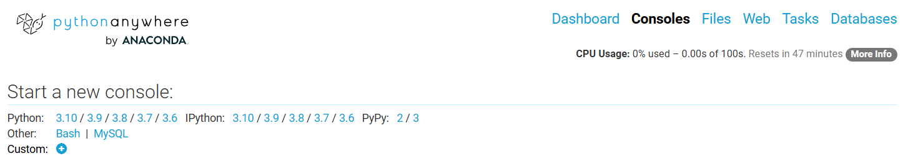
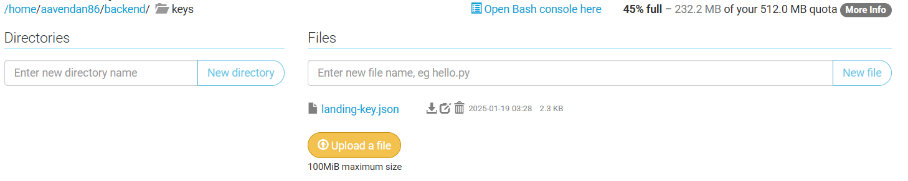
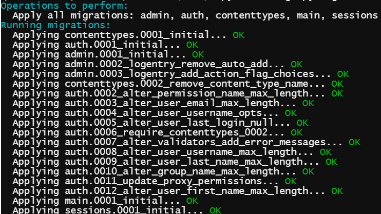
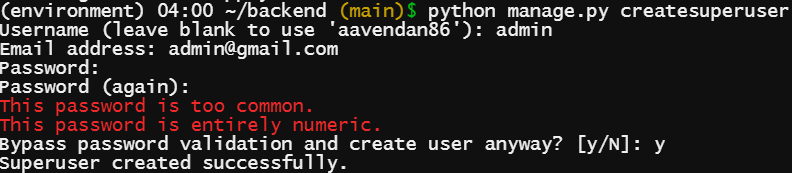
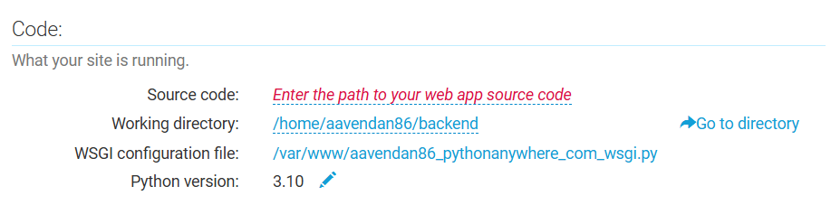
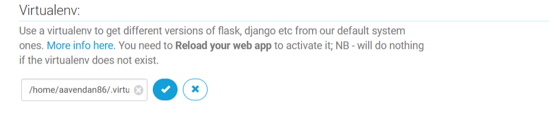
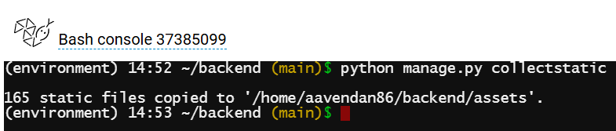

## Guía 25

[DAWM](/DAWM/) / [Proyecto05](/DAWM/proyectos/2024/proyecto05)

<link href="styles/mystyle.css" rel="stylesheet" />

### Objetivo general

<pre class="purpose">Desarrollar una aplicación backend robusta y escalable utilizando Django que integre una interfaz de administrador intuitiva para la gestión eficiente de datos y funcionalidades junto con un REST API completo que facilite la comunicación con las aplicaciones cliente de tal forma que garantice la seguridad, el rendimiento y la extensibilidad del sistema.</pre>

### Actividades previas

1. Obtenga una cuenta **Beginner account** en [PythonAnywhere](https://www.pythonanywhere.com/).

    <div align="center">
        
        <p>Fuente: <a href="https://www.pythonanywhere.com/pricing/">Python Anywhere</a> </p>
    </div>

### Actividades en clases

#### Consola de PythonAnywhere

1. Desde la interfaz de PythonAnywhere.
2. Acceda a la opción **Consoles**.
3. Cree una nueva consola en **Start a new console:** > **Bash**.

    <div align="center">
        
    </div>

3. (STOP 1) Mantenga abierta la consola del proyecto.

#### Ambiente de desarrollo y repositorio local/remoto + librerías

1. Desde la línea de comandos

    + Cree un entorno virtual con el nombre **environment** y con la versión de Python 3.10

    ```command
    mkvirtualenv --python=/usr/bin/python3.10 environment
    ```
    
    + Clone el repositorio **backend** y acceda a la carpeta _backend_.
    + Instale las librerías de _requirements.txt_, con:

    ```command
    pip install -r requirements.txt
    ```

2. (STOP 2) Verifique la instalación de los requerimientos

#### SDK Firebase Admin: Clave privada

1. Acceda a la [consola de Firebase](https://console.firebase.google.com/)
2. Ingrese al proyecto **landing**

    + Acceda a la Configuración de proyecto.
    + Genere y descargue una clave privada JSON.

3. (STOP 3) Desde la interfaz de PythonAnywhere acceda a la opción **Files**

    + Acceda a la carpeta **backend**
    + Cree la carpeta **keys** 
    + Cargue el archivo con las credenciales de Firebase utilizados en desarrollo. 

    <div align="center">
        
    </div>

#### Migración y Superusuario

1. Desde la línea de comandos del proyecto

    +  Aplique las migraciones

    ```command
    python manage.py makemigrations
    python manage.py migrate
    ```

    <div align="center">
        
    </div>

2. (STOP 4) Cree el SuperUsuario. Recuerde el **usuario** y la **contraseña** para probar el sistema de autenticación.

    ```command
    python manage.py createsuperuser
    ```

    <div align="center">
        
    </div>

#### WebApp

1. Desde la interfaz de Python Anywhere, en la opción **Web**, cee una aplicación web con el botón **Add a new web app**

    <div align="center">
        
    </div>

2. Seleccione la opción **» Manual configuration (including virtualenvs)**, con la versión de Python 3.10

    <div align="center">
        
    </div>

3. En la interfaz de la WebApp:

    + En la sección **CODE**, haga clic en la opción **Working directory** para modificar la ruta a la carpeta del proyecto

        ```command
        /home/<USUARIO-PYTHONANYWHERE>/backend
        ```

    <div align="center">
        
    </div>

    + En la sección **CODE**, haga clic en el **WSGI configuration file** y reemplace todo el contenido, por: 

        ```python
        # This file contains the WSGI configuration required to serve up your
        # web application at http://<USUARIO-PYTHONANYWHERE>.pythonanywhere.com/
        # It works by setting the variable 'application' to a WSGI handler of some
        # description.
        #
        # The below has been auto-generated for your Django project

        import os
        import sys

        # add your project directory to the sys.path
        project_home = '/home/<USUARIO-PYTHONANYWHERE>/backend'
        if project_home not in sys.path:
            sys.path.insert(0, project_home)

        # set environment variable to tell django where your settings.py is
        os.environ['DJANGO_SETTINGS_MODULE'] = 'backend.settings'


        # serve django via WSGI
        from django.core.wsgi import get_wsgi_application
        application = get_wsgi_application()
        ```

    + En la sección **VIRTUALENV** ingrese la ruta al ambiente de Python 

        ```command
        /home/<USUARIO-PYTHONANYWHERE>/.virtualenvs/environment/
        ```

    <div align="center">
        
    </div>

#### Seguridad

1. Desde la interfaz de PythonAnywhere y acceda a la opción **Files**

2. Modifique el archivo `backend/backend/settings.py` 
    
    + En el dominio **ALLOWED_HOSTS** agregue el dominio de su WebApp

        ```python
        ...
        ALLOWED_HOSTS = ['<USUARIO-PYTHONANYWHERE>.pythonanywhere.com']
        ...
        ```

#### Archivos estáticos

1. Desde la interfaz de PythonAnywhere y acceda a la opción **Files**

2. Modifique el archivo `backend/backend/settings.py` 

    + Agregue la ruta a los archivos estáticos **STATIC_ROOT**

        ```python
        ...

        STATICFILES_DIRS = [ ... ]

        STATIC_ROOT = "assets/"
        ...
        ```

3. Desde la interfaz de Python Anywhere y acceda en la opción **Console**

    + Genere los archivos estáticos

        ```command
        python manage.py collectstatic
        ```

        <div align="center">
            
        </div>

4. En el ambiente de configuración de la web app

    + Agregue la URL `/static/` y el directorio `/home/<USUARIO-PYTHONANYWHERE>/backend/assets/` 

    <div align="center">
        
    </div>


#### Verificación

1.  Acceda a los sitios

    + API [https://&lt;USUARIO-PYTHONANYWHERE&gt;.pythonanywhere.com/api/v1/landing/](https://&lt;USUARIO-PYTHONANYWHERE&gt;.pythonanywhere.com/api/v1/landing/)
    + Admin [https://&lt;USUARIO-PYTHONANYWHERE&gt;.pythonanywhere.com/admin](https://&lt;USUARIO-PYTHONANYWHERE&gt;.pythonanywhere.com/admin)
    + Sitio principal [https://&lt;USUARIO-PYTHONANYWHERE&gt;.pythonanywhere.com/](https://&lt;USUARIO-PYTHONANYWHERE&gt;.pythonanywhere.com/)

    <div align="center">
        
    </div>


### Documentación

* En [The PythonAnywhere help pages](https://help.pythonanywhere.com/pages/) puede encontrar la información general de PythonAnywhere

### Fundamental

* [Top 5 Reasons Why PythonAnywhere Should Be Your Next Project's Home](https://x.com/DavidayoAI/status/1872787250838376602)

<blockquote class="twitter-tweet"><p lang="en" dir="ltr">Top 5 Reasons Why PythonAnywhere Should Be Your Next Project&#39;s Home<br><br>1. Zero Setup Hassle<br>2. Collaboration Made Easy<br>3. Always Available, Anywhere Access<br>4. Scales With Your Needs<br>5. Fantastic for Web Apps<br><br>Over to you: What are your go-to tools for Python development? <a href="https://twitter.com/hashtag/python?src=hash&amp;ref_src=twsrc%5Etfw">#python</a> <a href="https://t.co/je9mAEH0jf">pic.twitter.com/je9mAEH0jf</a></p>&mdash; DavidayoTech (@DavidayoAI) <a href="https://twitter.com/DavidayoAI/status/1872787250838376602?ref_src=twsrc%5Etfw">December 27, 2024</a></blockquote> <script async src="https://platform.twitter.com/widgets.js" charset="utf-8"></script>

### Términos

PythonAnywhere

### Referencias

* PythonAnywere. (2016). Deploying an existing Django project on PythonAnywhere. Retrieved from https://help.pythonanywhere.com/pages/DeployExistingDjangoProject/
* PythonAnywere. (2015). How to setup static files in Django. Retrieved from https://help.pythonanywhere.com/pages/DjangoStaticFiles