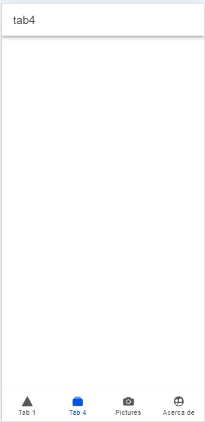

## Guía 27

[DAWM](/DAWM/) / [Proyecto05](/DAWM/proyectos/2024/proyecto05)

### Actividades previas

Revise [Angular y Signals: Transformando el desarrollo web](https://www.viewnext.com/angular-y-signals-transformando-el-desarrollo-web/) con la explicación de la implementación de Signals (arquitectura **suscripción** y **eventos**) para detectar y actualizar solo los cambios relevantes de un componente. 

### Actividades en clases

1. Clone localmente tu repositorio **hybrid**.
2. Abra el proyecto en VSCode y levante el servidor.
	
	```command
	ionic serve
	```

#### Ionic Page

1. Genere una página nueva, con:

	```command
	ionic generate page tab4
	```

2. Modifique _hybrid/src/app/tabs/page.ts_, con:

	```typescript
	import { ..., albums  } from 'ionicons/icons';
	...

	export class TabsPage {
	  ...

	  constructor() {
	    addIcons({ ..., albums });
	  }
	}
	```

2. Modifique _hybrid/src/app/tabs/page.hml_, con:

	```html
	<ion-tabs>
  		<ion-tab-bar slot="bottom">
  		
  		...

  		<ion-tab-button tab="tab4" href="/tabs/tab4">
	      <ion-icon aria-hidden="true" name="albums"></ion-icon>
	      <ion-label>Tab 4</ion-label>
	    </ion-tab-button>

	  </ion-tab-bar>
	</ion-tabs>
	```

3. 2. Modifique _hybrid/src/app/tabs/tabs.routes.ts_, con:

	```typescript
	...

	export const routes: Routes = [
	  {
	    ...
	    children: [
	      ...
	      {
	        path: 'tab4',
	        loadComponent: () =>
	          import('../tab4/tab4.page').then((m) => m.Tab4Page),
	      }
	];
	```

4. (STOP 2) Revise los cambios en el navegador

    <div align="center">
      
    </div>


#### Ionic Component

#### Angular Signal


### Documentación

[Ion-nav throws error when using input signals](https://github.com/ionic-team/ionic-framework/issues/29555)

### Fundamental

* Angular Signals en [X](https://x.com/AngularTrends/status/1824058459781836802)

<blockquote class="twitter-tweet"><p lang="en" dir="ltr">Signals in Angular: deep dive for busy developers <a href="https://twitter.com/hashtag/angular?src=hash&amp;ref_src=twsrc%5Etfw">#angular</a> <a href="https://twitter.com/hashtag/javascript?src=hash&amp;ref_src=twsrc%5Etfw">#javascript</a> <a href="https://twitter.com/hashtag/frontend?src=hash&amp;ref_src=twsrc%5Etfw">#frontend</a> <a href="https://twitter.com/hashtag/webdev?src=hash&amp;ref_src=twsrc%5Etfw">#webdev</a> <a href="https://twitter.com/hashtag/dormosheio?src=hash&amp;ref_src=twsrc%5Etfw">#dormosheio</a> <a href="https://twitter.com/hashtag/frontenddev?src=hash&amp;ref_src=twsrc%5Etfw">#frontenddev</a> <a href="https://t.co/wTz8qybA3W">https://t.co/wTz8qybA3W</a></p>&mdash; AngularTrends (@AngularTrends) <a href="https://twitter.com/AngularTrends/status/1824058459781836802?ref_src=twsrc%5Etfw">August 15, 2024</a></blockquote> <script async src="https://platform.twitter.com/widgets.js" charset="utf-8"></script>

### Términos

suscripción, eventos, signals

### Referencias

* Angular University. (2024). Angular Signal Inputs: Complete Guide to input(). Retrieved from https://blog.angular-university.io/angular-signal-inputs/
* Angular University. (2024). Angular Signal Components: input, output (Complete Guide). Retrieved from https://blog.angular-university.io/angular-signal-components/
* Ionic-Team. (n.d.). bug: Ion-nav throws error when using input signals · Issue #29555 · ionic-team/ionic-framework. Retrieved from https://github.com/ionic-team/ionic-framework/issues/29555