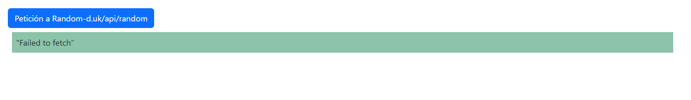

## Guía 09

[Regresar](/DAWM/)

### Contenidos

* Revisión de ejercicios previos: dudas y comentarios.
* Troubleshooting
	+ [CORS](https://javascript.info/fetch-crossorigin)

### Actividades

* Descargue y descomprima el archivo [fetch](../ejercicios/fetch.zip)
* Servidor HTTP
	+ Abra la línea de comando en la carpeta **fetch**
	+ Levante un servidor HTTP
	```
	python -m http.server 8056
	``` 
* Abra en su navegador el URL `http://localhost:8056/`


#### CORS

* En el navegador, acceda al URL `http://localhost:8056/cors/`
* Verifique el resultado de la petición
	+ En el navegador, abra el enlace al <a href="https://random-d.uk/api/random" title="API" target="_blank">API</a> del <a href="https://random-d.uk/" title="Abrir el sitio original" target="_blank">Random-d.uk</a>. Con la salida:

	<p align="center">
	  
	</p>
	
	+ En la página web, haga clic en el botón **Petición a Random-d.uk/api/random**.  Revise que la salida en la consola del navegador sea: `Solicitud desde otro origen bloqueada: la política de mismo origen impide leer el recurso remoto en https://random-d.uk/api/random (razón: falta la cabecera CORS 'Access-Control-Allow-Origin'). Código de estado: 200.`. 

		- En Chrome y en Mozilla, respectivamente:

	<p align="center">
	  
	  
	</p>

		

##### Problema

La solicitud fue bloqueada debido a la violación de las reglas de seguridad de <a href="https://developer.mozilla.org/es/docs/Web/HTTP/CORS/Errors" title="CORS" target="_blank">CORS</a> (solo peticiones desde el mismo dominio). La restricción de peticiones desde un servicio externo significa que un usuario de un sitio A no acceda fácilmente a los recursos del sitio B. 

##### Solución

* Cambios en el backend (servidor).
* Uso de un [reverse proxy](https://httptoolkit.tech/blog/cors-proxies/) en la petición desde el frontend (en el código de javascript).
	- Cambie el URL anterior por **`https://damp-beach-17296.herokuapp.com/https://random-d.uk/api/random`** para realizar la petición asincrónica. 
	- Recargue la página en el navegador, realice la petición desde el botón y verifique el resultado.


#### Manejo de respuesta y de errores

##### Problema

##### Solución

#### Local Storage y Session Storage

##### Problema

##### Solución

#### Slow response

##### Problema

##### Solución

#### Restricciones en el servidor

##### Problema

##### Solución


### Términos

dominio, `CORS`, proxy, reverse proxy

### Referencias

* Random-d.uk. (2022). Retrieved 8 November 2022, from https://random-d.uk/