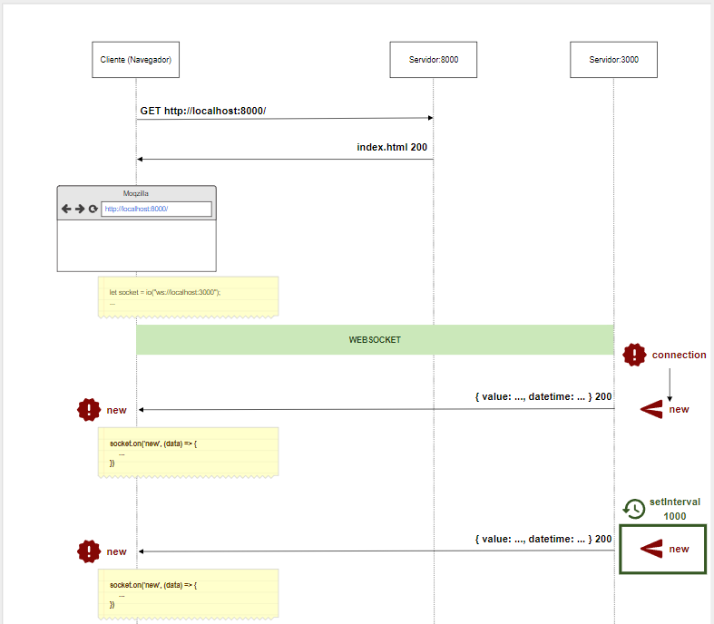

## Guía 11

[Regresar](/DAWM/)

### Contenidos

* Revisión de ejercicios previos: dudas y comentarios.
* **Web Sockets** es una tecnología avanzada que hace posible abrir una sesión de comunicación bidireccional entre el navegador del usuario y un servidor. Con esta [API](https://developer.mozilla.org/es/docs/Web/API/WebSockets_API), puede enviar mensajes a un servidor y  recibir respuestas controladas por eventos sin tener que consultar al servidor para una respuesta. En [Levelup](https://levelup.gitconnected.com/getting-started-with-node-js-and-websockets-f22dd0452105) se ilustra la arquitectura de conexión entre un cliente y un servidor mediante sockets de comunicación para un marco de trabajo de la web.

* [*Socket.IO*](https://socket.io/docs/v4/) es una librer[ia] que permite la comunicación de baja latencia, bidireccional y basada en eventos entre un cliente y un servidor. Se basa en el protocolo WebSocket y proporciona garantías adicionales, como el respaldo al sondeo largo HTTP o la reconexión automática.
	
	
	- El socket de comunicación consiste en emitir y escuchar eventos del cliente y del servidor.
	

	- El [cliente](https://socket.io/docs/v4/client-installation/) es una instancia a ejecutarse desde el navegador o desde cualquier otro software
	

	- El [servidor](https://socket.io/docs/v4/server-installation/) es una instancia de software que espera por conexiones 
	- Una [lista de eventos](https://socket.io/docs/v4/emit-cheatsheet/) entre el cliente y el servidor

### Actividades

* **Escenario:** Visualización de datos en tiempo real

	+ Descargue y descomprima el archivo [visualizacion.zip](../ejercicios/visualizacion.zip).
		- Servidor
			1. Desde la línea de comandos en la carpeta del proyecto `servidor`
			2. Instale los paquetes necesarios, con: `npm install`
			3. Inicie el servidor HTTP, con: `npm start`
		- Cliente
			1. Desde la línea de comandos en la carpeta del proyecto `cliente`
			2. Inicie el cliente HTTP, con: `python -m http.server 8001`
			3. Desde el navegador, abra una pestaña en el navegador para el URL `http://localhost:8001`	
	+ El protocolo de comunicación es:

	
	
* **Escenario:** Sistema de votación en tiempo real para elegir al mejor jugador de la FIFA de entre los 12 mejores.
	
	+ Descargue y descomprima el archivo [votacion.zip](../ejercicios/votacion.zip).
		- Desde la línea de comandos en al carpeta del proyecto `votacion`
		- Inicie el cliente HTTP, con: `python -m http.server 8001`
		- Desde el navegador, abra una pestaña en el navegador para el URL `http://localhost:8001/cliente`	
	+ Diseñe el protocolo de comunicación cliente-servidor para la comunicación en tiempo real
	+ Implemente la solución.

	
### Términos

protocolo de comunicación, baja latencia, `sockets`

### Referencias

* WebSockets - Referencia de la API Web MDN. (2022). Retrieved 11 July 2022, from https://developer.mozilla.org/es/docs/Web/API/WebSockets_API
* Getting Started With Node.js and WebSockets. (2020). Retrieved 11 July 2022, from https://levelup.gitconnected.com/getting-started-with-node-js-and-websockets-f22dd0452105
