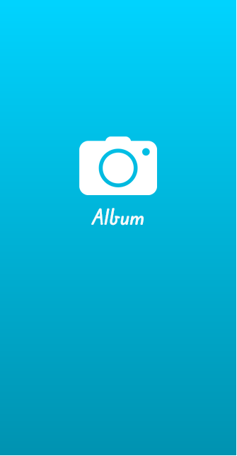

## Guía 15

[Regresar](/DAWM-2022/)

### Contenidos

* Revisión de ejercicios previos: dudas y comentarios.
* [Angular Material IO](https://material.angular.io/) es una librería de componente de UI. Los componentes de Angular Material ayudan a construir páginas web y aplicaciones web atractivas, consistentes y funcionales mientras se adhieren a los principios del diseño web moderno como la portabilidad del navegador, la independencia del dispositivo y la degradación elegante. Ayuda a crear sitios web más rápidos, hermosos y receptivos. Está inspirado en el diseño de materiales de Google.
	- [Material design](https://material.io/design) es una guía de diseño enfocado en la visualización del sistema operativo Android, además en la web y en cualquier plataforma. Fue desarrollado por Google y anunciado en la conferencia Google I/O del 2014.


### Actividades

* Genere una aplicación en Angular, siguiendo las instrucciones pertinentes de los tutoriales:
  
  + De [Angular - Local](https://dawfiec.github.io/DAWM-2022/tutoriales/angular_local.html) realice hasta la construcción de un **Sitio base**
  + De [Angular - Bootstrap](https://dawfiec.github.io/DAWM-2022/tutoriales/angular_bootstrap.html) realice la **Instalación de Bootstrap (y dependencias)**
  + De [Angular - Material](https://dawfiec.github.io/DAWM-2022/tutoriales/angular_material.html) realice la **Instalación de Angular Material**

* Descargue y descomprima los componentes
* Copie y guarde las carpetas **splash**, **principal** y **album** dentro de la carpeta `src/app`
* Copie y guarde la carpeta **imagenes** dentro de la carpeta `src/assets`
* Para utilizar los componentes copiados, registre los componentes en `src/app/app.module.ts`
  + Agregue la referencia a los componentes nuevos **splash**, **principal** y **album**.

    <pre><code>
  	...
  	import { BrowserAnimationsModule } from '@angular/platform-browser/animations';
  	<b style="color: red">
  	import { SplashComponent } from './splash/splash.component';
	import { PrincipalComponent } from './principal/principal.component';
	import { AlbumComponent } from './album/album.component';
	</b>

	@NgModule({
  		declarations: [
  	...
    </code></pre>

  + Agregue los componentes nuevos en el arreglo *declarations*

    <pre><code>
  	...
  	@NgModule({
	  declarations: [
	    AppComponent,
	    <b style="color: red">
	    SplashComponent,
	    PrincipalComponent,
	    AlbumComponent
	    </b>
	  ],
	  imports: [
  	...
    </code></pre>

    + Agregue la referencia a los módulos de Angular Material: `MatGridListModule`, `MatIconModule` y `MatButtonModule`

	<pre><code>
	...
	import { PrincipalComponent } from './principal/principal.component';
	import { AlbumComponent } from './album/album.component';
	...
	<b style="color: red">
	import {MatGridListModule} from '@angular/material/grid-list';
	import {MatIconModule} from '@angular/material/icon';
	import {MatButtonModule} from '@angular/material/button';
	</b>
	...
	@NgModule({
	  declarations: [
	    AppComponent,
	...
	</code></pre>

	+ Agregue los módulos de Angular Material en el arreglo *imports*

    <pre><code>
  	...
  	imports: [
	    BrowserModule,
	    AppRoutingModule,
	    BrowserAnimationsModule,
	    <b style="color: red">
	    MatGridListModule,
	    MatIconModule,  
	    MatButtonModule
	    </b>
	  ],
	providers: [],
	bootstrap: [AppComponent]
  	...
    </code></pre>

* Para manejar las rutas en el URL, modifique el archivo **src/app/app-routing.module.ts**
  + Agregue la referencia a los componentes **splash**, **principal** y **album**.
  
    <pre><code>
  	import { NgModule } from '@angular/core';
  	import { RouterModule, Routes } from '@angular/router';

  	<b style="color: red">
  	import { SplashComponent } from './splash/splash.component';
  	import { PrincipalComponent } from './principal/principal.component';
  	import { AlbumComponent } from './album/album.component';
  	</b>
  	...
  	</code></pre>

  + Agregue las rutas a sus correspondientes componentes.
  
  	<pre><code>
  	...
  	<b style="color: red">
  	const routes: Routes = [
       { path: "splash", component: SplashComponent },
       { path: "principal", component: PrincipalComponent },
   	   { path: "album", component: AlbumComponent },
   	   { path: "**", redirectTo: "splash" }
    ];
  	</b>
    
  	@NgModule({
  	  imports: [RouterModule.forRoot(routes)],
  	...  
  	</code></pre>


* Modifique la vista (**src/app/app.component.html**) del AppComponent
  + La etiqueta `<router-outlet>` le dice al enrutador dónde mostrar las vistas enrutadas.
  + Reemplace TODO el contenido por
    
    ```html
    <router-outlet></router-outlet>
    ```
* Actualice el navegador o (re)inicie el servidor
* Cambie la vista al tamaño de un dispositivo móvil. 
  + Para la ruta `http://localhost:4200/splash` debe lucir similar a

	<p align="center">
	  
	  
	  
	</p>


### Términos

Despliegue, material design

### Referencias

* Angular Material Tutorial. (2022). Retrieved 20 July 2022, from https://www.tutorialspoint.com/angular_material/index.htm