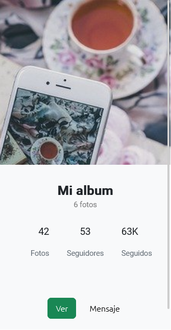

## Guía 15

[Regresar](/DAWM/)

### Contenidos

* Revisión de ejercicios previos: dudas y comentarios.
* [Angular Material IO](https://material.angular.io/) es una librería de componente de UI. Los componentes de Angular Material ayudan a construir páginas web y aplicaciones web atractivas, consistentes y funcionales mientras se adhieren a los principios del diseño web moderno como la portabilidad del navegador, la independencia del dispositivo y la degradación elegante. Ayuda a crear sitios web más rápidos, hermosos y receptivos. Está inspirado en el diseño de materiales de Google.
	- [Material design](https://material.io/design) es una guía de diseño enfocado en la visualización del sistema operativo Android, además en la web y en cualquier plataforma. Fue desarrollado por Google y anunciado en la conferencia Google I/O del 2014.


### Prerrequisito

* Genere una aplicación nueva en Angular, siguiendo las instrucciones pertinentes de los tutoriales:
  
  + Cree un proyecto base, de acuerdo con [Angular - Local](https://dawfiec.github.io/DAWM/tutoriales/angular_local.html).
  + Agregue Bootstrap al proyecto base, de acuerdo con [Angular - Bootstrap](https://dawfiec.github.io/DAWM/tutoriales/angular_bootstrap.html).
  + Cree los componentes `splash`, `album` y `foto`, de acuerdo con [Angular - Componentes, Comunicación y Directivas](https://dawfiec.github.io/DAWM/tutoriales/angular_bases.html).
  + Agregue Angular Material al proyecto base, de acuerdo con [Angular - Material](https://dawfiec.github.io/DAWM/tutoriales/angular_material.html).
  	

* Descargue y descomprima los [componentes y assets](archivos/guia15_recursos.zip)
* Guarde las carpetas `splash`, `album` y `foto` dentro de la carpeta `src/app` del proyecto en Angular. 
* Guarde la carpeta `imagenes` dentro de la carpeta `src/assets` del proyecto en Angular.


### Actividades

#### Componentes: Splash, Album y Foto

* Compruebe que los componentes `splash`, `album` y `foto` se encuentren registrados en la aplicación.

#### Angular Material (Módulos GridList, Icon y Button)

* Registre los módulos `MatGridListModule`,`MatIconModule` y `MatButtonModule` en la aplicación.

#### Rutas

* Asocie:
	+ La ruta `"splash"` con el componente `splash`
	+ La ruta `"album"` con el componente `album`
	+ La ruta `"foto"` con el componente `foto`
	+ La ruta `"**"` con el componente `splash`

#### Salida de las rutas (`<router-outlet>`)

* Reemplace el contenido de la vista **AppComponent** por la etiqueta:

	```html
  <router-outlet></router-outlet>
  ```

* Actualice el navegador o (re)inicie el servidor
* Cambie la vista al tamaño de un dispositivo móvil. 
  + Las rutas `http://localhost:4200/splash`, `http://localhost:4200/album` y `http://localhost:4200/foto` deben lucir similares a:

	<p align="center">
	  
	  
	  
	</p>

### Términos

material design, componentes, servicios, it's a wrap

### Referencias

* Angular Material Tutorial. (2022). Retrieved 20 July 2022, from https://www.tutorialspoint.com/angular_material/index.htm
* Angular. (2022). Retrieved 26 July 2022, from https://angular.io/tutorial/toh-pt5
* Khan, R. (2022). La función setTimeout() en Angular. Retrieved 26 July 2022, from https://www.delftstack.com/es/howto/angular/settimeout-function-in-angular/