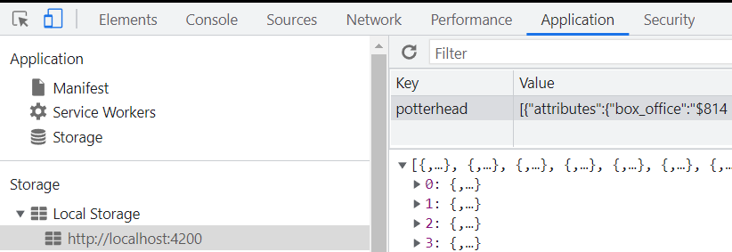

## Guía 15

[Regresar](/DAWM/)

### Contenidos

* Revisión de ejercicios previos: dudas y comentarios.
* [Angular Material IO](https://material.angular.io/) es una librería de componente de UI. Los componentes de Angular Material ayudan a construir páginas web y aplicaciones web atractivas, consistentes y funcionales mientras se adhieren a los principios del diseño web moderno como la portabilidad del navegador, la independencia del dispositivo y la degradación elegante. Ayuda a crear sitios web más rápidos, hermosos y receptivos. Está inspirado en el diseño de materiales de Google.
	- [Material design](https://material.io/design) es una guía de diseño enfocado en la visualización del sistema operativo Android, además en la web y en cualquier plataforma. Fue desarrollado por Google y anunciado en la conferencia Google I/O del 2014.


### Prerrequisito

* Genere una aplicación nueva en Angular, siguiendo las instrucciones de [Apuntes](https://dawfiec.github.io/DAWM/paginas/apuntes.html):
  
  + Cree el proyecto: **potterhead**
  + Cree los componentes `components/splash`, `components/movies` y `components/movie`.
  + Cree la interfaz `interface/movie`
  + Cree el servicio `service/resources`
  + Agregue Bootstrap.
  + Agregue Angular Material.
  + En `app-routing.module.ts` agregue las referencia a los componentes y las rutas:
  
```
  ...
  import { SplashComponent } from './components/splash/splash.component';
  import { MoviesComponent } from './components/movies/movies.component';
  import { MovieComponent } from './components/movie/movie.component';

  const routes: Routes = [
    { path: "splash", component: SplashComponent },
    { path: "movies", component: MoviesComponent },
    { path: "movie", component: MovieComponent },
    { path: "**", redirectTo: "splash" }
  ];
  ...
```

  + Reemplace el contenido de `app/app.componente.html` por 

```
  <router-outlet></router-outlet>
```
  
  + Levante el servidor con recarga automática:

```
  ng serve -o --live-reload
```
* Compruebe las rutas con el navegador en modo responsivo, para las rutas:

  + `http://localhost:4200`
  + `http://localhost:4200/splash`
  + `http://localhost:4200/movies`
  + `http://localhost:4200/movie`


### Actividades

* Descargue y descomprima los recursos de [Potterhead](archivos/potterhead.zip)
	+ Reemplace los componentes, el servicio y la interfaz descargados por los recursos correspondientes que se encuentran dentro de su proyecto en Angular. 
* Guarde la carpeta `images` dentro de la carpeta `src/assets` de su proyecto en Angular.
* En `app.module.ts` 
  + Importe los módulos `HttpClientModule`,`MatCardModule`, `MatListModule`, `MatToolbarModule` y `MatIconModule`

```
  ...
  import {HttpClientModule} from '@angular/common/http';
  import {MatCardModule} from '@angular/material/card';
  import {MatListModule} from '@angular/material/list';
  import {MatToolbarModule} from '@angular/material/toolbar';
  import {MatIconModule} from '@angular/material/icon';  
  ...
```

  + Registre los módulos en el import

```
  imports: [
    ...
    HttpClientModule,
    MatCardModule,
    MatListModule,
    MatToolbarModule,
    MatIconModule
    ...
  ]
```

* Compruebe las rutas con el navegador en modo responsivo, para las rutas:

  + `http://localhost:4200`
  + `http://localhost:4200/splash`
  + `http://localhost:4200/movies`
  + `http://localhost:4200/movie`

  <p align="center">
    
    
    
  </p>

#### Local Storage: Registro

* En `components/splash/splash.component.ts` 
  + En el método *ngOnInit*, reemplace el contenido del _callback_ en la suscripción del servicio.

```
  ...
  ngOnInit() {
    this.resourcesService.getData().subscribe(response => {
      
      let potterhead = localStorage.getItem("potterhead");
      if(!potterhead) {
        localStorage.setItem("potterhead", JSON.stringify(response));
      }

    })
  }
  ...
```

* Acceda a la ruta `http://localhost:4200/splash`
  
  + Con el inspector del navegador (en `Application > Storage > Local Storage`), identifique la entrada **potterhead**

<p align="center">
  
</p>

#### Local Storage: Lectura

* En `components/movies/movies.component.ts`
  + En el constructor, agregue la lectura de la entrada **potterhead**.

```
  ...
  constructor() {

    /* Leer desde el localStorage */
    let potterhead = JSON.parse(localStorage.getItem("potterhead")!);
      
    if(potterhead) {
      this.movies = potterhead as Movie[]
    }
    
  }
  ...
```

* En `components/movies/movies.component.html`
  + Itere sobre el arreglo *movies*.

```
  
  ...
  <div class="col-6 col-md-2" *ngFor="let movie of movies">
    ...
  </div>
  ...
  
```

  + Para cada elemento, renderice los atributos *poster*, *slug* y *title* 

```
  
  ...
  
  ...
  <a routerLink="/movie">{{movie.attributes.title}}</a>
  ...
  
```

* Compruebe el resultado en el navegador para la ruta `http://localhost:4200/movies`

<p align="center">
  
</p>

#### Parámetros en la ruta: creación de rutas

* En `app-routing.module.ts`
  + Modifique la ruta `"movie"` por `"movie/:id"` 

* En `components/movies/movies.component.html`
  + Modifique la referencia a la ruta `"movie/:id"` 

```
  
  ...
  <a routerLink="/movie/{{movie.id}}">{{movie.attributes.title}}</a>
  ...
  
```

* Compruebe el resultado en el navegador para las rutas

  + `http://localhost:4200/movie/b5c93f7c-49bb-43a6-84f3-796daa75f354`
  + `http://localhost:4200/movie/eca3b065-d34d-4b31-aed4-7f2586b0e5dc` 


#### Parámetros en la ruta: Lectura 

* En `components/movie/movie.component.ts`
  + Agregue la referencia a *ActivatedRoute* para extraer los parámetros desde la ruta

```
  ...
  import { ActivatedRoute } from '@angular/router';
  ...
```

  + Inyecte la dependencia al *ActivatedRoute* en el constructor.

```
  ...
  constructor(private route: ActivatedRoute) {
    
  }
  ...
```

  + Agregue el código para leer el parámetro *id* en la ruta. 

```
  ...
  constructor(private route: ActivatedRoute) {

    this.route.params.subscribe(params => {
      let id = params['id']; 

      ...

    });

  }
  ...
```

  + Lea la entrada *potterhead* del localStorage y filtre el objeto con el atributo _id_ igual que el parámetro. 

```
  ...
  this.route.params.subscribe(params => {
      let id = params['id']; 

      let potterhead = JSON.parse(localStorage.getItem("potterhead")!);
          
      if(potterhead) {
        let movies = potterhead as Array<Movie>  
        let moviesfiltered = movies.filter(movie => movie["id"] == id)    
        this.movie = moviesfiltered[0];
      }

  });
  ...
```

* En `components/movie/movie.component.html`

  + Renderice los atributos *poster*, *slug*, *title*, *summary*, *box_office* y *budget* 

```
  
  ...
  
  ...
  <h5 class="card-title">{{movie.attributes.title}}</h5>
  ...
  <p class="card-text">{{movie.attributes.summary}}</p>
  ...
  <div class="stat">{{movie.attributes.box_office}}</div>
  ...
  <div class="stat">{{movie.attributes.budget}}</div>
  ...
  
```

* Compruebe el resultado en el navegador para la ruta `http://localhost:4200/movie/04df07f4-6647-4b82-b9eb-6be4020352c9`

<p align="center">
  
</p>

#### Redireccionamiento automático 

* En `components/splash/splash.component.ts`
  + Agregue la referencia al módulo `Router`

```
  ...
  import { Router } from '@angular/router';
  ...
```
  + Agregue la inyección de dependencia al módulo `Router`

```
  ...
  constructor(private resourcesService: ResourcesService, private router: Router) {}
  ...
```

  + En el método `ngOnInit`, agregue un redireccionamiento automático

```
  ...
  ngOnInit() {
    this.resourcesService.getData().subscribe(response => {
      
      ...

    })


    setTimeout(() => {
      this.router.navigate(['movies']);
    }, 1500);

  }
  ...
```

#### Angular - Cordova 

* Siga las instrucciones en [Angular - Cordova](https://dawfiec.github.io/DAWM/tutoriales/angular_cordova.html) para generar el `apk` de la aplicación.

### Términos

material design, componentes, servicios, it's a wrap

### Referencias

* Angular Material Tutorial. (2022). Retrieved 20 July 2022, from https://www.tutorialspoint.com/angular_material/index.htm
* Angular. (2022). Retrieved 26 July 2022, from https://angular.io/tutorial/toh-pt5
* Khan, R. (2022). La función setTimeout() en Angular. Retrieved 26 July 2022, from https://www.delftstack.com/es/howto/angular/settimeout-function-in-angular/
* Using Route Parameters - Rangle.io : Angular Training. (2022). Retrieved 9 December 2022, from https://angular-training-guide.rangle.io/routing/routeparams
* Working with Angular Local Storage. (2019). Retrieved 10 December 2022, from https://blog.jscrambler.com/working-with-angular-local-storage/
* Savani, H. (2022). How to Declare Global Variable in Angular 9/8?. Retrieved 10 December 2022, from https://www.itsolutionstuff.com/post/how-to-declare-global-variable-in-angular-8example.html
* &#39;string&#39;, A., Nys, W., & Khalil, S. (2017). Argument of type 'string  null' is not assignable to parameter of type 'string'. Type 'null' is not assignable to type 'string'. Retrieved 10 December 2022, from https://stackoverflow.com/questions/46915002/argument-of-type-string-null-is-not-assignable-to-parameter-of-type-string
* Angular. (2022). Retrieved 12 December 2022, from https://angular.io/api/router/ActivatedRoute