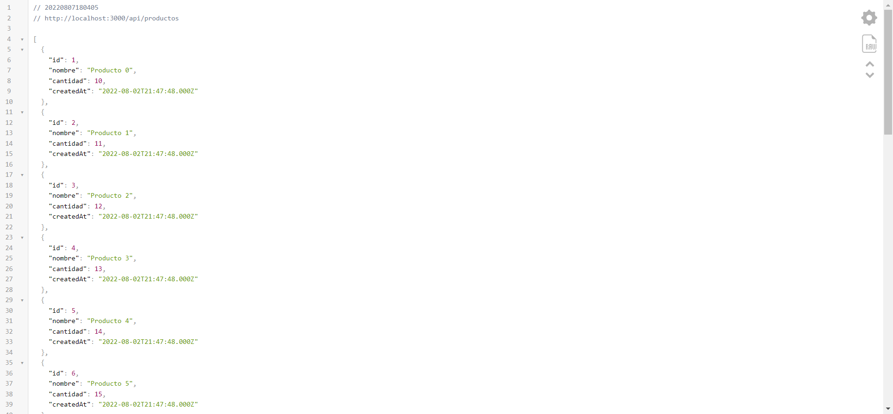
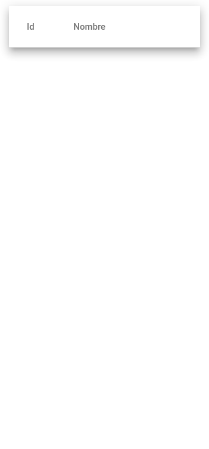
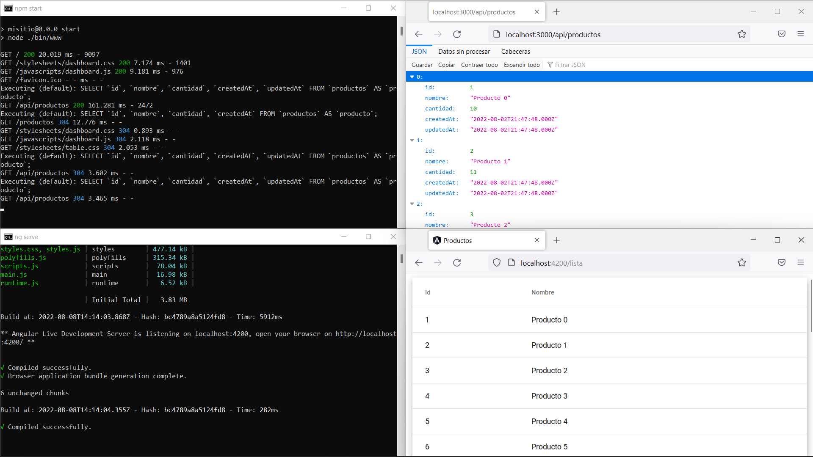
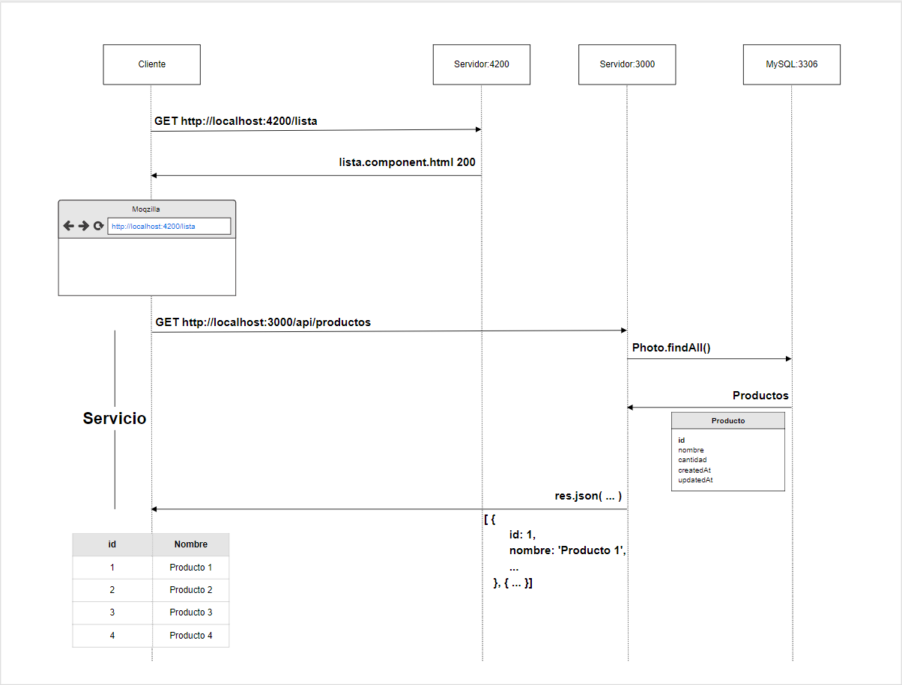

## Guía 18

[Regresar](/DAWM/)

### Contenidos

* Revisión de ejercicios previos: dudas y comentarios.
* [Sequelize](https://sequelize.org/docs/v6/) es una herramienta ORM de Node.js basada en promesas para Postgres, MySQL, MariaDB, SQLite, Microsoft SQL Server, Amazon Redshift y Snowflake's Data Cloud. Cuenta con un sólido soporte de transacciones, relaciones, carga _eager_ y _lazy_, replicación de lectura y más.
  + Los [modelos](https://sequelize.org/docs/v6/core-concepts/model-basics/) son una abstracción para representa una tabla en la base de datos. 
  + Las [migraciones](https://sequelize.org/docs/v6/other-topics/migrations/) se usan para dar seguimiento a los cambios en la base de datos, pasando de un estado a otro.
  + Los [generadores](https://sequelize.org/docs/v6/other-topics/migrations/#creating-the-first-seed) son utilizados para llenar las tablas de la base de datos con datos de muestra o de prueba.
* Para [MVC](https://desarrolloweb.com/articulos/que-es-mvc.html) es un patrón de arquitectura del software utilizada para separar el código por sus distintas responsabilidades, manteniendo distintas capas que se encargan de hacer una tarea muy concreta, lo que ofrece beneficios diversos.
  + El modelo es la capa donde se trabaja con los datos, por tanto contendrá mecanismos para acceder a la información y también para actualizar su estado.
  + La vista contienen el código de nuestra aplicación que va a producir la visualización de las interfaces de usuario, o sea, el código que nos permitirá renderizar los estados de nuestra aplicación en HTML.
  + El controlador contiene el código necesario para responder a las acciones que se solicitan en la aplicación, como visualizar un elemento, realizar una compra, una búsqueda de información, etc.


### Actividades

#### Servidor

* Utilice la aplicacion web en backend o genere una aplicación en Express, siguiendo las instrucciones pertinentes de los tutoriales:
  + De [Express - Bases](https://dawfiec.github.io/DAWM/tutoriales/express_bases.html) realice el **Esqueleto de un proyecto web**.
  + De [Express - Bootstrap](https://dawfiec.github.io/DAWM/tutoriales/express_bootstrap.html) realice hasta el **Bootstrap - Dashboard example**.
  + De [Express - Layouts y Partials](https://dawfiec.github.io/DAWM/tutoriales/express_partials.html) hasta **Productos: layout y partial**.
  + De [Express - ORM (Básico)](https://dawfiec.github.io/DAWM/tutoriales/express_ormbasico.html) hasta la **Vista** de Productos.

* Desde la línea de comandos del proyecto, agregue el módulo **cors**, con: `npm install cors`

* Agregue la referencia al módulo **cors** el **app.js**

  <pre><code>
  ...
  var logger = require('morgan');
  <b style="color:red">
  var cors = require('cors')
  </b>
  ...

  app.set('view engine', 'ejs');
  <b style="color:red">
  app.use(cors())
  </b>
  app.use(logger('dev'));
  ...
  </code></pre>

* Cree el ruteador **routes/api.js**
* Agregue la referencia del ruteador **routes/api.js** en el `app.js` a la ruta `/api`

* En el ruteador **routes/api.js** agregue: 
  + El método **GET** de la subruta **`/productos`** que retorna un _json_ con todos los productos.

  En lugar de renderizar la respuesta en la vista

  ```
  .then(resultado => {  
        res.render('vista', { arrResultado: resultado });  
    })  
  ```

  Renderice el json:

  ```
  then(resultado => {  
      res.json(resultado)
  })
  ``` 

* Compruebe el funcionamiento del servidor, con: **npm run devstart**
* Acceda al URL `http://localhost:3000/api/productos` 

<p align="center">
  
</p>


#### Cliente

* Proyecto **Productos** en Angular
  + De [Angular - Local](https://dawfiec.github.io/DAWM/tutoriales/angular_local.html) realice hasta la construcción del sitio.
  + De [Angular - Bootstrap](https://dawfiec.github.io/DAWM/tutoriales/angular_bootstrap.html) agregue bootstrap.
  + De [Angular - Material](https://dawfiec.github.io/DAWM/tutoriales/angular_material.html) agregue angular material.
  + De [Angular - Componentes, Comunicación y Directivas](https://dawfiec.github.io/DAWM/tutoriales/angular_bases.html). 
    - Cree el componente **lista**.

  + De [Angular - Rutas](https://dawfiec.github.io/DAWM/tutoriales/angular_rutas.html) agregue las rutas:
    - De la ruta `lista` al componente **lista**.
    - De la ruta `**` al componente **lista**.

* Descargue y descomprima los [componentes y assets](archivos/guia18_recursos.zip)

* Copie y reemplace la carpeta **lista** dentro de la carpeta `src/app` del proyecto en Angular. 

* Agregue el módulo **MatTableModule** al `app.module.ts`
  + Importe el módulo
    ```
    ...
    import {MatTableModule} from '@angular/material/table';
    ...
    ```
  + Y agregue la clave **imports**

  ```
  ...
  imports: [
    ...
    MatTableModule
  ],
  ...
  ```

* Modifique el **app.component.html** con 
  ```
  <router-outlet></router-outlet>
  ```

* La aplicación debe lucir así

<p align="center">
  
</p>

* A partir del tutorial [Angular - Servicios](https://dawfiec.github.io/DAWM/tutoriales/angular_servicios.html):
  + Cree el servicio **servicio/producto**
  + Inyecte la dependencia del servicio **servicio/producto** al componente **lista**
 
  + Peticiones HTTP
    - Registre el módulo **HttpClientModule** en el **app.module.ts**
    - Agregue el módulo **HttpClient** en el servicio **servicio/producto**
    - Agregue el método **obtenerProductos** al servicio **servicio/producto** 
    ```
    obtenerProductos() {
      return this.http.get('http://localhost:3000/api/productos')
    }
    ```

* Para consumir el servicio en el componente **lista**. En **lista.component.ts** agregue

  + Importe el servicio 

  ```
  ...
  import { ProductoService } from '../servicios/producto.service';
  ...
  ```

  + Inyecte la dependencia en el constructor

  ```
  ...
  constructor(private productoService: ProductoService) { }
  ...
  ```

  + Realice la petición en el método **ngOnInit**

  ```
  ...
  ngOnInit(): void {
    this.productoService.obtenerProductos().subscribe(respuesta => {
      this.dataSource = respuesta as any
    })
  }
  ...
  ```

* El resultado de unir el cliente y el servidor debe lucir así:

<p align="center">
  
</p>

<p align="center">
  
</p>


### Términos

Parámetros de consulta, Parámetros de ruta

### Referencias

* Sequelize v6 Sequelize. (2022). Retrieved 7 August 2022, from https://sequelize.org/docs/v6/
* Concepts, C., & Basics, M. (2022). Model Basics Sequelize. Retrieved 7 August 2022, from https://sequelize.org/docs/v6/core-concepts/model-basics/
* topics, O. (2022). Migrations Sequelize. Retrieved 7 August 2022, from https://sequelize.org/docs/v6/other-topics/migrations/
* Qué es MVC. (2022). Retrieved 7 August 2022, from https://desarrolloweb.com/articulos/que-es-mvc.html