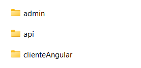

## Guía 18

[Regresar](/DAWM/)

### Contenidos

* Revisión de ejercicios previos: dudas y comentarios.
* [Sequelize](https://sequelize.org/docs/v6/) es una herramienta ORM de Node.js basada en promesas para Postgres, MySQL, MariaDB, SQLite, Microsoft SQL Server, Amazon Redshift y Snowflake's Data Cloud. Cuenta con un sólido soporte de transacciones, relaciones, carga _eager_ y _lazy_, replicación de lectura y más.
  + Los [modelos](https://sequelize.org/docs/v6/core-concepts/model-basics/) son una abstracción para representa una tabla en la base de datos. 
  + Las [migraciones](https://sequelize.org/docs/v6/other-topics/migrations/) se usan para dar seguimiento a los cambios en la base de datos, pasando de un estado a otro.
  + Los [generadores](https://sequelize.org/docs/v6/other-topics/migrations/#creating-the-first-seed) son utilizados para llenar las tablas de la base de datos con datos de muestra o de prueba.
* Para [MVC](https://desarrolloweb.com/articulos/que-es-mvc.html) es un patrón de arquitectura del software utilizada para separar el código por sus distintas responsabilidades, manteniendo distintas capas que se encargan de hacer una tarea muy concreta, lo que ofrece beneficios diversos.
  + El modelo es la capa donde se trabaja con los datos, por tanto contendrá mecanismos para acceder a la información y también para actualizar su estado.
  + La vista contienen el código de nuestra aplicación que va a producir la visualización de las interfaces de usuario, o sea, el código que nos permitirá renderizar los estados de nuestra aplicación en HTML.
  + El controlador contiene el código necesario para responder a las acciones que se solicitan en la aplicación, como visualizar un elemento, realizar una compra, una búsqueda de información, etc.


### Aplicación

**Nota:** Aquí optamos por clonar el proyecto y unir las ramas de cada aplicación. 

* Desde la línea de comandos:
  
  + Clone el proyecto con las [aplicaciones del curso](https://github.com/DAWFIEC/DAWM-apps)
  ```
  git clone https://github.com/DAWFIEC/DAWM-apps.git 
  ```
  + Acceda a la carpeta del proyecto
  ```
  cd DAWM-apps
  ```
  + Ubique el proyecto en la rama _hito2-api_
  ```
  git checkout hito2-api
  ```
  + Una la rama _hito3-admin_
  ```
  git merge origin/hito3-admin
  ```
  + Una la rama _hito7-album_
  ```
  git merge origin/hito7-album
  ```
* Verifique que aparezcan los tres proyectos: `album/api`, `album/admin` y `album/clienteAngular`

<p align="center">
  
</p>

### Actividades

#### API

* Descargue y descomprima el [guia18_recursos.zip](archivos/guia18_recursos.zip).
  + Copie la carpeta `images` y pegue la carpeta en la ruta `album/api/public` 

* En la línea de comandos (1):

  + Acceda a la ruta del proyecto `album/api`
  + Instale los módulos, con: `npm install`
  + Instale el módulo **cors** (para permitir las peticiones desde otros dominios), con: `npm install cors`

* En `app.js`, agregue la referencia al middleware **cors** 

  <pre><code>
  ...
  var logger = require('morgan');
  <b style="color:red">var cors = require('cors')</b>
  
  app.set('view engine', 'ejs');
  <b style="color:red">app.use(cors())</b>
  app.use(logger('dev'));
  ...
  </code></pre>

* En la base de datos:
  + Verifique:
    - Que exista el schema `album` y la tabla `foto`
    - Las credenciales para acceder a la base de datos en `config/config.json`
  + En caso de ser necesario:
    - Cree el schema `album` en la base de datos
    - Ejecute las migraciones, con: `sequelize db:migrate`
    - Ejecute la generación de datos, con: `sequelize db:seed:all`

* En la línea de comandos (1):

  + Agregue la variable de entorno **PORT**, con: `set PORT=4444`
    - Puede verificar el valor de la variable de entorno, con: `echo %PORT%`
  + Ejecute el servidor, con: `npm run devstart`

+ En el navegador, compruebe la respuesta con el URL: `http://localhost:4444/fotos/findAll/json`


#### Admin

* En la línea de comandos (2):

  + Acceda a la ruta del proyecto `album/admin`
  + Instale los módulos, con: `npm i`


* En `routes/index.js`, modifique el controlador de la ruta `'/photos'` con:
  + La ruta de petición de datos
  + Preprocesamiento al agregar la clave **url** a cada objeto del resultado.

  <pre><code>
  ...
  router.get('/photos', async function(req, res, next) {
  
    <b style="color:red">const URL = 'http://localhost:4444/fotos/findAll/json'
    const config = {
      proxy: {
        host: 'localhost',
        port: 4444
      }
    }
    const response = await axios.get(URL, config)
    </b>

    <b style="color:red">response.data.map( item => { item.url = 'http://localhost:4444/'+item.ruta.replace('public/','') } )</b>

    res.render('fotos', { title: 'Fotos', fotos: response.data });
  })
  ...
  </code></pre>

* En la línea de comandos (2):

  + Agregue la variable de entorno **PORT**, con: `set PORT=3080`
    - Puede verificar el valor de la variable de entorno, con: `echo %PORT%`
  + Ejecute el servidor, con: `npm run devstart`

+ En el navegador, compruebe la respuesta con el URL: `http://localhost:3080/photos`


#### clienteAngular

* En la línea de comandos (3):

  + Acceda a la ruta del proyecto `album/clienteAngular`
  + Instale los módulos, con: `npm i`

* En `app/servicios/recursos.service.ts`, modifique la función **obtenerDatos**
  + La ruta de petición de datos

  <pre><code>
  ...
  obtenerDatos() {
    <b style="color:red">return this.http.get('http://localhost:4444/fotos/findAll/json')</b>
  }
  ...
  </code></pre>

* En `app/app.component.ts`, modifique el **constructor**
  + Preprocesamiento al agregar la clave **url** a cada objeto del resultado.

  <pre><code>
  ...
  recursosService.obtenerDatos().subscribe(respuesta => {
        
    <b style="color:red">
    let arregloFotos = respuesta as Array&lt;any&gt;

    arregloFotos.map( item => { item.url = 'http://localhost:4444/'+item.ruta.replace('public/','') } )

    this.fotos = arregloFotos as Array&lt;Foto&gt;
    </b>

  })
  ...
  </code></pre>

* En la línea de comandos (3):
  + Ejecute el servidor, con: `ng serve -o`


### Referencias

* Sequelize v6 Sequelize. (2022). Retrieved 7 August 2022, from https://sequelize.org/docs/v6/
* Concepts, C., & Basics, M. (2022). Model Basics Sequelize. Retrieved 7 August 2022, from https://sequelize.org/docs/v6/core-concepts/model-basics/
* topics, O. (2022). Migrations Sequelize. Retrieved 7 August 2022, from https://sequelize.org/docs/v6/other-topics/migrations/
* Qué es MVC. (2022). Retrieved 7 August 2022, from https://desarrolloweb.com/articulos/que-es-mvc.html