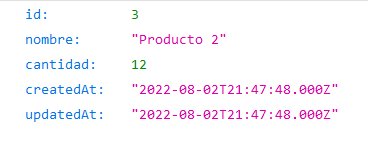

## Guía 19

[Regresar](/DAWM-2022/)

### Contenidos

* Revisión de ejercicios previos: dudas y comentarios.
* [REST](https://openwebinars.net/blog/que-es-rest-conoce-su-potencia/) es una interfaz para conectar varios sistemas basados en el protocolo HTTP (uno de los protocolos más antiguos) y nos sirve para obtener y generar datos y operaciones, devolviendo esos datos en formatos muy específicos, como XML y JSON. 

REST se apoya en HTTP, los verbos que utiliza son exactamente los mismos, con ellos se puede hacer GET, POST, PUT y DELETE. 

### Actividades

#### Servidor

* Utilice la aplicacion web en backend o genere una aplicación en Express, siguiendo las instrucciones pertinentes de los tutoriales:
  + De [Express - Bases](https://dawfiec.github.io/DAWM-2022/tutoriales/express_bases.html) realice el **Esqueleto de un proyecto web**.
  + De [Express - Bootstrap](https://dawfiec.github.io/DAWM-2022/tutoriales/express_bootstrap.html) realice hasta el **Bootstrap - Dashboard example**.
  + De [Express - Layouts y Partials](https://dawfiec.github.io/DAWM-2022/tutoriales/express_partials.html) hasta **Productos: layout y partial**.
  + De [Express - ORM (Básico)](https://dawfiec.github.io/DAWM-2022/tutoriales/express_ormbasico.html) hasta la **Vista** de Productos.

* Asegúrese de contar con la referencia al módulo **cors** el **app.js**

* Verifique la referencia del ruteador **routes/api.js** en el `app.js` a la ruta `/api`

* En el ruteador **routes/api.js** agregue: 
  + El método **GET** de la subruta **`/productos/:id`** que retorna un _json_ del producto dado el **id**.

* Compruebe el funcionamiento del servidor, con: **npm run devstart**
* Acceda al URL `http://localhost:3000/api/productos/3` 

  

#### Cliente

* Proyecto **Productos** en Angular
  + De [Angular - Local](https://dawfiec.github.io/DAWM-2022/tutoriales/angular_local.html) realice hasta la construcción del sitio.
  + De [Angular - Bootstrap](https://dawfiec.github.io/DAWM-2022/tutoriales/angular_bootstrap.html) agregue bootstrap.
  + De [Angular - Material](https://dawfiec.github.io/DAWM-2022/tutoriales/angular_material.html) agregue angular material.
  + De [Angular - Componentes, Comunicación y Directivas](https://dawfiec.github.io/DAWM-2022/tutoriales/angular_bases.html). 
    - Cree el componente **producto**.

    + De [Angular - Rutas](https://dawfiec.github.io/DAWM-2022/tutoriales/angular_rutas.html) realice la ruta:
    - De la ruta `producto/:id` al componente **producto**.

* Descargue y descomprima los [componentes y assets](archivos/guia19_recursos.zip)

### Términos

### Referencias

* ¿Qué es REST? Conoce su potencia. (2018). Retrieved 9 August 2022, from https://openwebinars.net/blog/que-es-rest-conoce-su-potencia/

