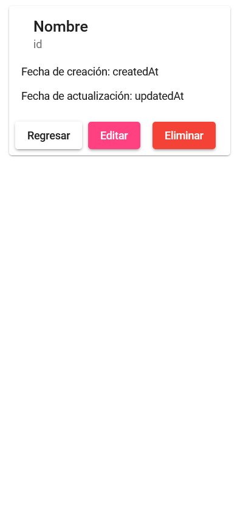

## Guía 19

[Regresar](/DAWM/)

### Contenidos

* Revisión de ejercicios previos: dudas y comentarios.
* [REST](https://openwebinars.net/blog/que-es-rest-conoce-su-potencia/) es una interfaz para conectar varios sistemas basados en el protocolo HTTP (uno de los protocolos más antiguos) y nos sirve para obtener y generar datos y operaciones, devolviendo esos datos en formatos muy específicos, como XML y JSON. 

REST se apoya en HTTP, los verbos que utiliza son exactamente los mismos, con ellos se puede hacer **GET**, **POST**, **PUT** y **DELETE**. 


### Actividades

#### Servidor

* Utilice la aplicacion web en backend o genere una aplicación en Express, siguiendo las instrucciones pertinentes de los tutoriales:
  + De [Express - Bases](https://dawfiec.github.io/DAWM/tutoriales/express_bases.html) realice el **Esqueleto de un proyecto web**.
  + De [Express - Bootstrap](https://dawfiec.github.io/DAWM/tutoriales/express_bootstrap.html) realice hasta el **Bootstrap - Dashboard example**.
  + De [Express - Layouts y Partials](https://dawfiec.github.io/DAWM/tutoriales/express_partials.html) hasta **Productos: layout y partial**.
  + De [Express - ORM (Básico)](https://dawfiec.github.io/DAWM/tutoriales/express_ormbasico.html) hasta la **Vista** de Productos.

* Asegúrese de contar con la referencia al módulo **cors** el **app.js**

* Verifique la referencia del ruteador **routes/api.js** en el `app.js` a la ruta `/api`

* En el ruteador **routes/api.js** agregue: 
  + El método **GET** de la subruta **`/productos/:id`** que retorna un _json_ del producto dado el **id**.

    - Para obtener un elemento mediante Sequelize revise el método [findOne](https://sequelize.org/docs/v6/core-concepts/model-querying-finders/#findone)
    - Para obtener el **id**, revise **Parámetros de ruta** del tutorial [Express - Parámetros de consulta y Parámetros de ruta](https://dawfiec.github.io/DAWM/tutoriales/express_pcpr.html)

* Compruebe el funcionamiento del servidor, con: **npm run devstart**
* Acceda al URL `http://localhost:3000/api/productos/3` 

<p align="center">
  
</p>

#### Cliente

* Proyecto **Productos** en Angular
  + De [Angular - Local](https://dawfiec.github.io/DAWM/tutoriales/angular_local.html) realice hasta la construcción del sitio.
  + De [Angular - Bootstrap](https://dawfiec.github.io/DAWM/tutoriales/angular_bootstrap.html) agregue bootstrap.
  + De [Angular - Material](https://dawfiec.github.io/DAWM/tutoriales/angular_material.html) agregue angular material.
  + De [Angular - Componentes, Comunicación y Directivas](https://dawfiec.github.io/DAWM/tutoriales/angular_bases.html). 
    - Cree el componente **producto**.

    + De [Angular - Rutas](https://dawfiec.github.io/DAWM/tutoriales/angular_rutas.html) agregue la ruta:
    - De la ruta `producto/:id` al componente **producto**.

* Descargue y descomprima los [componentes y assets](archivos/guia19_recursos.zip)

* Copie y reemplace la carpeta **producto** dentro de la carpeta `src/app` del proyecto en Angular. 

* Agregue el módulo **MatCardModule** y **MatButtonModule** al `app.module.ts`

* La aplicación debe lucir así

<p align="center">
  
</p>

* A partir del tutorial [Angular - Servicios](https://dawfiec.github.io/DAWM/tutoriales/angular_servicios.html):
  
  + Inyecte la dependencia del servicio **servicio/producto** al componente **producto**
 
  + Peticiones HTTP
    - Agregue el método **obtenerProductos** al servicio **servicio/producto** 
    ```
    obtenerProductoPorId(id: number) {
      return this.http.get('http://localhost:3000/api/productos/'+id.toString())
    }
    ```

  + Cree la interfaz **interfaz/producto** con los atributos `id: number`, `nombre: string`, `cantidad: number`, `createdAt: string` y `updatedAt: string`

* Para consumir el servicio en el componente **producto**. En **producto.component.ts** agregue

  + Importe el servicio 

  ```
  ...
  import { ProductoService } from '../servicios/producto.service';
  ...
  ```

  + Importe la interfaz 

  ```
  ...
  import { Producto } from '../interfaz/producto';
  ...
  ```

  + Agregue la propiedad **item** de la interfaz **Producto** con los valores predeterminados

  ```
  ...
  export class ProductoComponent implements OnInit {
      item : Producto = {
        id: -1,
        nombre: "",
        cantidad: 0,
        createdAt: "",
        updatedAt: ""
      };

      constructor( ... 
  ...
  ```

  + Inyecte la dependencia en el constructor

  ```
  ...
  constructor(private productoService: ProductoService) { }
  ...
  ```

  + Realice la petición en el método **ngOnInit**

  ```
  ...
  ngOnInit(): void {
    this.productoService.obtenerProductoPorId(3).subscribe(respuesta => {
      this.item = respuesta as Producto
    })
  }
  ...
  ```

* Modifique la vista **producto.component.html** con los valores del producto

  ```
  ...
    
    <mat-card-title>{{item.nombre}}</mat-card-title>
    <mat-card-subtitle>{{item.id}}</mat-card-subtitle>
    
  ...
    
    <mat-card-content>
      <p>Fecha de creación: {{item.createdAt | date:'MMM d, y h:mm'}}</p>
      <p>Fecha de actualización: {{item.updatedAt | date:'MMM d, y h:mm'}}</p>
    </mat-card-content>
    
  ...
  ``` 

* Compruebe el funcionamiento del servidor, con: **npm start**
* Acceda al URL `http://localhost:4200/producto/3` 

<p align="center">
  
</p>


Para recibir el parámetro del URL al componente **Producto**

* Modifique el **producto.component.ts**

  + Importe el **ActivatedRoute** 

  ```
  ...
  import { ActivatedRoute } from '@angular/router';
  ...
  ```

  + Inyecte la dependencia al **ActivatedRoute** en el contructor

  ```
  ...
  constructor(private productoService: ProductoService, private activatedRoute: ActivatedRoute) {}
  ...
  ```

  + Extraiga el parámetro de la ruta y modifique la petición **obtenerProductoPorId** con el _id_

  ```
  ...
  ngOnInit(): void {

    let params = this.activatedRoute.snapshot.params;
    let id = params["id"]

    this.productoService.obtenerProductoPorId(id).subscribe(respuesta => {
      ...
    })
  }
  ...
  ```

Para enviar el parámetro del URL al componente **List**

* Modifique el **lista.component.html**
  
  Cambie la etiqueta

  ```
  ...
  
  <td mat-cell *matCellDef="let element"> {{element.nombre}} </td>
  
  ...
  ```

  por un enlace

  ```
  ...
  
  <td mat-cell *matCellDef="let element"> 
    <a [routerLink]="['/producto', element.id]" title="">{{element.nombre}}</a>
  </td>
  
  ...
  ```

* Compruebe el funcionamiento del servidor, con: **npm start**
* Acceda al URL `http://localhost:4200/` y seleccione cualquier elemento de la tabla 

<p align="center">
  
  
</p>

### Términos

API REST

### Referencias

* ¿Qué es REST? Conoce su potencia. (2018). Retrieved 9 August 2022, from https://openwebinars.net/blog/que-es-rest-conoce-su-potencia/
* Using Default values with Interfaces in TypeScript. (2022) Retrieved 9 August 2022, from https://bobbyhadz.com/blog/typescript-interface-default-values
* What is the activated route?. (2022). Retrieved 9 August 2022, from https://blog.briebug.com/blog/what-is-the-activated-route
* Singhal, G., & AcitivatedRouteSnapshot, A. (2022). Accessing Route Parameters with ActivatedRoute vs. AcitivatedRouteSnapshot Pluralsight. Retrieved 9 August 2022, from https://www.pluralsight.com/guides/accessing-route-parameters-with-activatedroute-vs.-acitivatedroutesnapshot