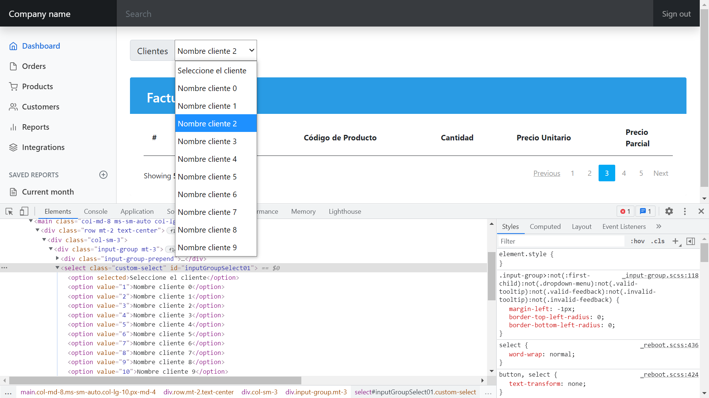

## Guía 20

[Regresar](/DAWM/)

### Contenidos

* Revisión de ejercicios previos: dudas y comentarios.
* [Firebase](https://firebase.google.com/?hl=es) es una plataforma para el desarrollo de aplicaciones web y aplicaciones móviles lanzada en 2011 y adquirida por Google en 2014.
  + [Realtime database](https://firebase.google.com/products/realtime-database) es una base de datos NoSQL alojada en la nube que te permite almacenar y sincronizar datos entre tus usuarios en tiempo real.

### Actividades

* Realice completamente el tutorial:
  + [Realtime Database](https://dawfiec.github.io/DAWM/tutoriales/firebase_realtime_database.html)

* Realice un reporte de compras con las siguientes características:

* Debe aparecer en el dashboard en la ruta `/reporte`
* La lista desplegable contiene los **nombres de los productos** de la **base de datos relacional**.
* La tabla contiene la **colección de productos** de la **base de datos no relacional**.
* Al seleccionar un elemento de la lista desplegable se actualiza el contenido de la tabla de acuerdo con el valor seleccionado.

La imagen de abajo es solo un ejemplo del reporte.

  

### Términos

reporte, `base de datos no relacional`, firebase, `rest api`

### Referencias

* Angular: Sending a POST Request with Firebase. (2020). Retrieved 14 August 2022, from https://medium.com/@monalisorathiya8/angular-sending-a-post-request-with-firebase-820f4046c89
* Firebase, I., Williams, R., & singh, s. (2018). Iterate with ngFor on objects obtained from Firebase. Retrieved 14 August 2022, from https://stackoverflow.com/questions/48243273/iterate-with-ngfor-on-objects-obtained-from-firebase
* Recupera datos Firebase Realtime Database. (2022). Retrieved 15 August 2022, from https://firebase.google.com/docs/database/rest/retrieve-data?hl=es