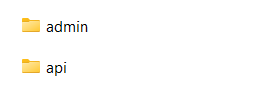

## Guía 20

[Regresar](/DAWM/)

### Contenidos

* Revisión de ejercicios previos: dudas y comentarios.
* [REST](https://openwebinars.net/blog/que-es-rest-conoce-su-potencia/) es una interfaz para conectar varios sistemas basados en el protocolo HTTP (uno de los protocolos más antiguos) y nos sirve para obtener y generar datos y operaciones, devolviendo esos datos en formatos muy específicos, como XML y JSON. 

REST se apoya en los verbos del protocolo HTTP: **GET**, **POST**, **PUT** y **DELETE** para realizar las operaciones sobre un recurso provisto por un servicio. 


### Aplicación

**Nota:** Aquí optaremos por clonar el proyecto en diferentes carpetas, una por cada rama (aplicaciones). 

* De [las aplicaciones del curso](https://github.com/DAWFIEC/DAWM-apps)
  
  + Línea de comandos (1) para la aplicación **album/api** en el _hito8-api_, con: 
```
git clone --branch hito8-api https://github.com/DAWFIEC/DAWM-apps.git DAWM-apps-api
```
  
  + Línea de comandos (2) para la aplicación **album/admin** en el _hito4-admin_, con: 
```
git clone --branch hito4-admin https://github.com/DAWFIEC/DAWM-apps.git DAWM-apps-admin
```


* Verifique que aparezcan los dos proyectos: `DAWM-apps-api/album/api` y `DAWM-apps-admin/album/admin`

<p align="center">
  
</p>

### Actividades

* Realice completamente los tutoriales [Express - Formularios I](https://dawfiec.github.io/DAWM/tutoriales/express_forms1.html) y [Express - Formularios II](https://dawfiec.github.io/DAWM/tutoriales/express_forms2.html)
* Complete la funcionalidad para los métodos HTTP `DELETE` y `PUT` del modelo **foto**.


### Términos

API REST, formularios, carga de archivos

### Referencias

* ¿Qué es REST? Conoce su potencia. (2018). Retrieved 9 August 2022, from https://openwebinars.net/blog/que-es-rest-conoce-su-potencia/
* Using Default values with Interfaces in TypeScript. (2022) Retrieved 9 August 2022, from https://bobbyhadz.com/blog/typescript-interface-default-values
* What is the activated route?. (2022). Retrieved 9 August 2022, from https://blog.briebug.com/blog/what-is-the-activated-route
* Singhal, G., & AcitivatedRouteSnapshot, A. (2022). Accessing Route Parameters with ActivatedRoute vs. AcitivatedRouteSnapshot Pluralsight. Retrieved 9 August 2022, from https://www.pluralsight.com/guides/accessing-route-parameters-with-activatedroute-vs.-acitivatedroutesnapshot