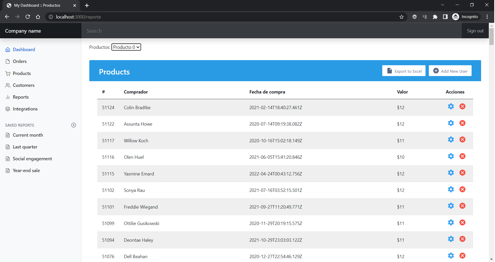

## Guía 20

[Regresar](/DAWM-2022/)

### Contenidos

* Revisión de ejercicios previos: dudas y comentarios.
* [Firebase](https://firebase.google.com/?hl=es) es una plataforma para el desarrollo de aplicaciones web y aplicaciones móviles lanzada en 2011 y adquirida por Google en 2014.
  + [Realtime database](https://firebase.google.com/products/realtime-database) es una base de datos NoSQL alojada en la nube que te permite almacenar y sincronizar datos entre tus usuarios en tiempo real.

### Actividades

* Obtenga una cuenta en la [consola de Firebase](https://console.firebase.google.com/)

  

* Cree un proyecto para Firebase

  
  
  

* Acceda a la opción **Realtime Database** a través de la opción **`Build > Realtime Database`** para **Create Database**

  

  + Durante el proceso de creación de la base de datos no relacional, se establece que de manera predeterminada ningún cliente EXTERNO puede leer o escribir sobre los datos. 

  
  

 

* En la interfaz a la **Realtime Database**

  

 

  + Agregue una _colección_

  
  

 

* En la _colección_

  

 
   
  + Importe los [datos](archivos/datos.json) en formato `.json`

  

 

  

 

  + Cambie las reglas de acceso para que los datos puedan ser leídos y modificados desde una aplicación de terceros

  

* Para realizar peticiones a la base de datos relacional, 

  + Instale el módulo `jsontool` de manera global, con: `npm i -g jsontool`
  + Utilice la url que aparece en la interfaz. Por ejemplo:

  

  + Realice una petición GET-All con cURL, con:

  `curl -X GET https://productos-375bf-default-rtdb.firebaseio.com/collection.json | json`

  + Realice una petición GET-One con cURL, con:

  `curl -X GET https://productos-375bf-default-rtdb.firebaseio.com/collection/3.json | json`

### Reporte

Realice un reporte de compras con las siguientes características:

* Debe aparecer en el dashboard en la ruta `/reporte`
* La lista desplegable contiene los **nombres de los productos** de la **base de datos relacional**.
* La tabla contiene la **colección de productos** de la **base de datos no relacional**.
* Al seleccionar un elemento de la lista desplegable, se actualiza el contenido de la tabla de acuerdo con el valor seleccionado.

La imagen de abajo es solo un ejemplo del reporte.

  

### Términos

### Referencias

* Angular: Sending a POST Request with Firebase. (2020). Retrieved 14 August 2022, from https://medium.com/@monalisorathiya8/angular-sending-a-post-request-with-firebase-820f4046c89
* Firebase, I., Williams, R., & singh, s. (2018). Iterate with ngFor on objects obtained from Firebase. Retrieved 14 August 2022, from https://stackoverflow.com/questions/48243273/iterate-with-ngfor-on-objects-obtained-from-firebase

