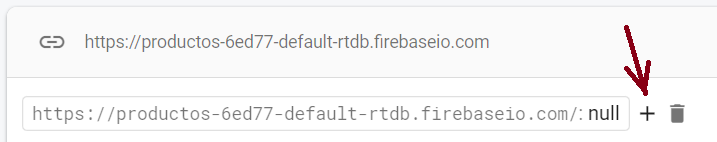

## Guía 20

[Regresar](/DAWM-2022/)

### Contenidos

* Revisión de ejercicios previos: dudas y comentarios.
* 

### Actividades

* Obtenga una cuenta en la [consola de Firebase](https://console.firebase.google.com/)

  

* Cree un proyecto 

  
  
  

* Cree una **Realtime Database** a través de la opción **`Build > Realtime Database`** 

  
  

  + De manera predeterminada, ningún cliente puede leer o escribir sobre la base de datos no relacional. 

  
  

 

* En la interfaz a la **Realtime Database**

  

 

  + Agregue una _colección_

  
  

 

* En la _colección_

  

 
   
  + Importe los datos en formato `.json`

  

 

  

 

  + Cambie las reglas de acceso para que los datos puedan ser leídos y modificados desde una aplicación de terceros

  

### Términos

### Referencias

* 

