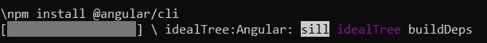
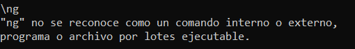
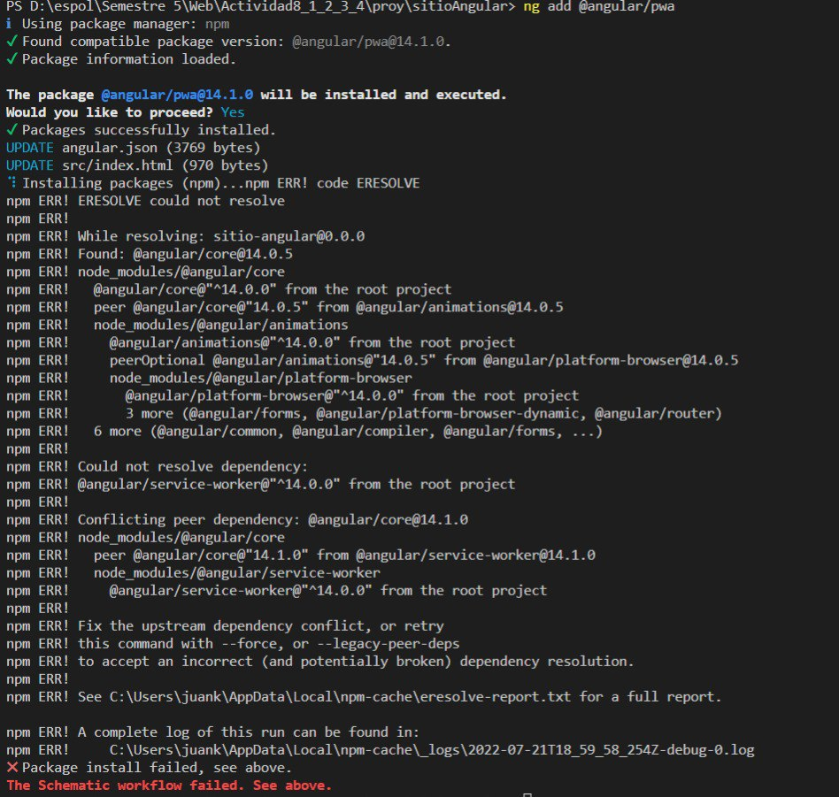

[Regresar](/DAWM/)

## NPM

### Descarga de módulos

* Al ejecutar desde la línea de comandos `npm install @angular/cli`
	+ **Problema:** no descarga o descarga detenida de módulos vía npm 
	  
	+ **Solución:**
		- Agregue un proxy para la petición de módulos
		```
		npm config set proxy <URL-PROXY>
		npm config set https-proxy <URL-PROXY>
		```

### ng (Comando executable)
* Al ejecutar desde la línea de comandos `ng`
	+ **Problema:** no se reconoce el comando ng luego de instalar `npm install @angular/cli`
	
	+ **Solución:**
		- Liste la ubicación por defecto que npm reconoce los comandos instalados
		```
		npm config get prefix
		```
		- Agregue la ruta a la variable de entorno `PATH`
		- Reinice el cmd, de ser necesario.

## Angular

### No resuelve la ruta de archivos estáticos

* Al ejecutar desde la línea de comandos `ng serve`
	+ **Problema:**   
		```
		Can't resolve '../yyy/zzz/image.jpg' in file ...
		``` 
	+ **Solución:**
		- Cambie la ruta inicial (`'../assets/yyy/zzz/image.jpg'`) por la ruta dentro del proyecto (`'assets/yyy/zzz/image.jpg'`)

### Property has no initializer and is not definitely assigned in the constructor

* Al ejecutar desde la línea de comandos `ng serve`
	+ **Problema:**  

		```
		"Property has no initializer and is not definitely assigned in the constructor"
		```

	+ **Solución:**

		- Asigne un valor por defecto a la propiedad
		- O, use una aserción no nula: Al final del identificador agregue el operador **`!`**

		```
		navbar!: Navbar;
		```


### Error de dependencias

* Por línea de comandos, al instalar: `ng add @angular/pwa`
	+ **Problema:** error al resolver las dependencias de ciertos módulos
	
	+ **Solución:** 

	```
	npm uninstall -g angular-cli
	npm cache clean
	npm install -g angular-cli@latest
	```

# Referencias: 

* project?, H., Dagger, T., B, J., & Dagger, T. (2016). How to upgrade Angular CLI project?. Retrieved 29 November 2022, from https://stackoverflow.com/questions/41403810/how-to-upgrade-angular-cli-project
* Property has no initializer and is not definitely assigned in the constructor. Retrieved 29 November 2022, from https://bobbyhadz.com/blog/typescript-property-has-no-initializer