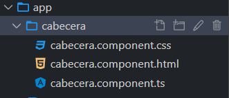

[Regresar](/DAWM-2022/)

Angular - Bases
====================


Es un framework, en JavaScript, para crear aplicaciones web con html, css y typescript. Incorpora la combinación de plantillas, la inyección de dependencias, programación reactiva, directivas y más; mediante la aplicación buenas prácticas de programación. Las aplicaciones desarrolladas con Angular para la web, móvil o para escritorio.

Introducción
============

* * *

En el proyecto Angular tiene la siguiente estructura de archivos con su descripción:

*   **angular.json** con la descripción del proyecto
*   **package.json** con los paquetes instalados
*   **styles.css** estilo global de la app
*   **index.html** página de inicio
*   **src/app** para componentes y servicios
*   **src/assets** para los archivos estáticos como imágenes
*   **app.module.ts** punto inicial de la aplicación
*   **Componentes**: ts, .html y .css; o todo embebido en un .ts  
    

Componentes
===========

* * *

Los componentes son los componentes básicos de una interfaz de usuario en una aplicación Angular. Estos componentes están asociados con una plantilla y son un subconjunto de directivas.


* Para crear un componente:

    + Desde la línea de comandos, en la ruta raíz del proyecto de Angular:
      ```
      ng g c <nombre del componente>
      ```
    + Se creará una carpeta con el nombre del componente, con los componentes: **.html**, **.css** y **.ts** (luego, Angular se encargará de convertir a **.js**).
    
    
    
    + El mensaje de `update` indica que el componente creado está incluido en el arreglo de declaraciones del componente principal (`src/app.module.ts`).

* Para modificar (la vista) un componente:

    + Agregue/modifique las etiquetas html, en el archivo **.html** del componente.
    + Agregue/modifique el estilo de las etiquetas html con los selectores y propiedades css, en el archivo **.css** del componente.
    + Actualice el navegador o (re)inicie el servidor

* Para usar (renderizar) un componente:
    
    + Identifique el selector del componente hijo en el decorador de la clase:
      ```
      @Component({
          selector: 'app-cabecera',
          templateUrl: './cabecera.component.html',
          styleUrls: ['./cabecera.component.css']
      })
      ```
    + Use el selector en el **.html** de cualquier otro componente
      ```
      <app-cabecera></app-cabecera>
      ``` 

    + Actualice el navegador o (re)inicie el servidor


Comunicación de una via (one-way binding) 
=========================================

* * *

* En el **.ts** del componente

  + Agregue el atributo `mensaje` dentro de la clase

    ```
    mensaje:string = "Este es un mensaje"
    ```
* En el **.html** del componente
  
  + Agregue las etiquetas necesarias y coloque como texto el atributo `mensaje`
  
    
    ```<div>```{{mensaje}}```</div>```
       

* Actualice el navegador o (re)inicie el servidor
    


Referencias 
===========

* * *

* Angular. (2021). Retrieved 1 December 2021, from [https://angular.io/](https://angular.io/)
* Introduction to Angular Components and How to Implement It? (20202) https://www.simplilearn.com/tutorials/angular-tutorial/angular-components
* Guía de iniciación al data binding en Angular Qué es y cómo se utiliza. (2019). Retrieved 13 July 2022, from https://www.acontracorrientech.com/guia-practica-del-databinding-en-angular/
* Angular. (2021). Retrieved 1 December 2021, from [https://angular.io/tutorial](https://angular.io/tutorial)
* 19 Things You Need to Learn to Become an Effective Angular Developer. (2021). Retrieved 1 December 2021, from https://www.dottedsquirrel.com/things-to-learn-angular/