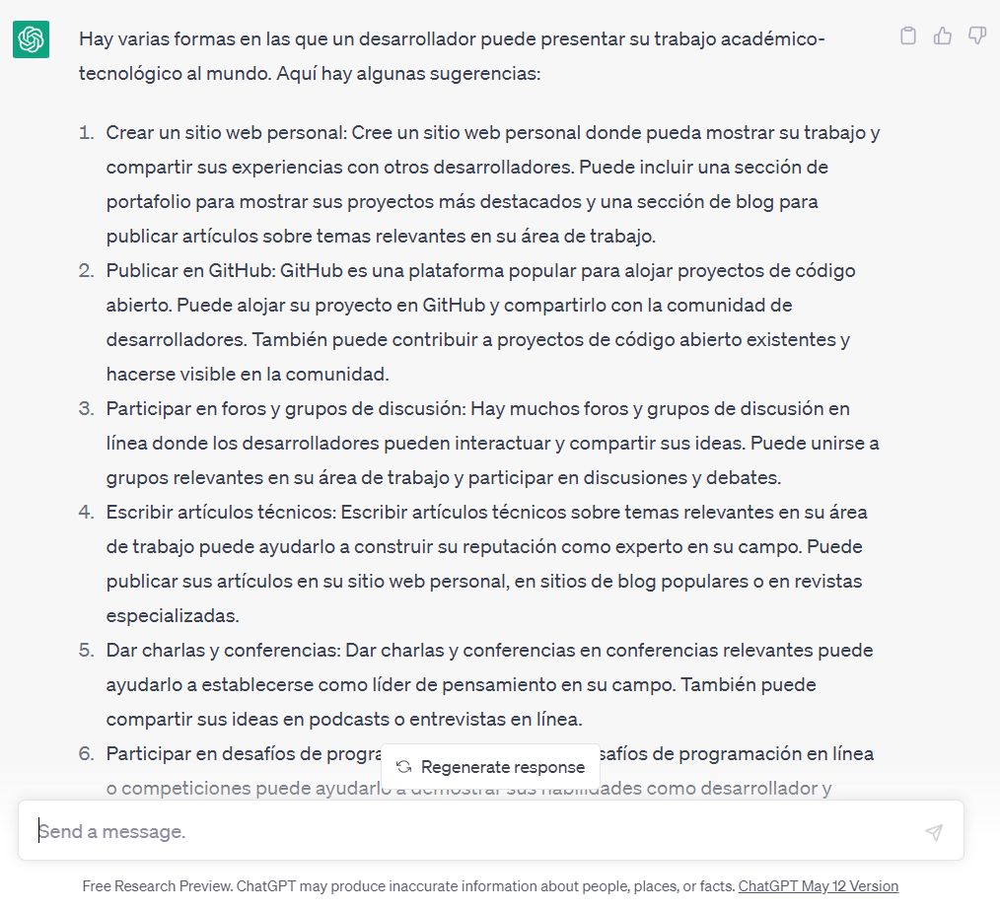

## Proyecto 01: Repositorio del desarrollador

[Regresar](/DAWM/)

### ¿Cómo presentar al mundo mi trabajo académico-tecnológico desarrollado hasta ahora?

### Antecedentes

Durante la etapa académica se desarrolla una serie de soluciones tecnológicas a problemas bajo diferentes contextos. Dichas soluciones fueron escritas con diversos lenguajes de programación, utilizando diversas plataformas y con la implementación de varios frameworks. 

### ChatGPT

Utilice la referencia según [**ChatGPT**](https://chat.openai.com/), para:

```
Como desarrollador, ¿Cómo presentar al mundo mi trabajo 
académico-tecnológico desarrollado hasta ahora?
```

Las respuestas son:



Una de las posibles soluciones consiste en: 

```
Publicar en GitHub: GitHub es una plataforma popular para alojar proyectos de 
código abierto. Puede alojar su proyecto en GitHub y compartirlo con la 
comunidad de desarrolladores. También puede contribuir a proyectos de código 
abierto existentes y hacerse visible en la comunidad.
```

### Guías

* [Guía 01: Git + GitHub](/DAWM/guias/2023/guia01)

### Términos

github, chatpgt