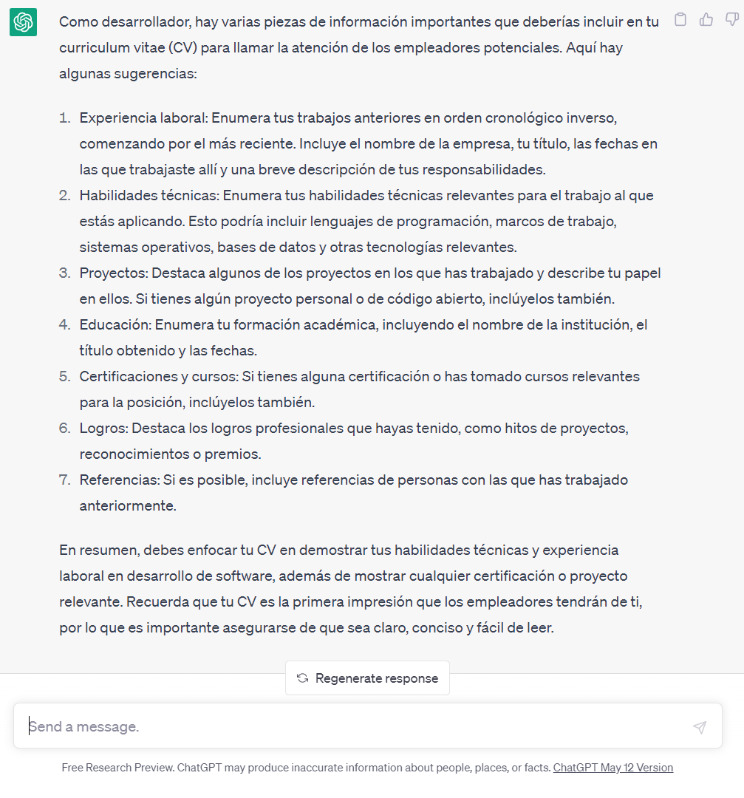

## Proyecto 02: Curriculum vitae

[DAWM](/DAWM/)

### Como desarrollador, ¿Qué tipo de información debo mostrar en mi curriculum vitae?

### Antecedentes

Es esencial presentar tus habilidades y experiencia de manera clara y efectiva a los empleadores potenciales o colaboradores mediante un CV. De tal forma que sea posible destacar tus habilidades organizativas y tus posibilidades para ser seleccionado.

### ChatGPT

Para el prompt: 

```
Como desarrollador, ¿Qué tipo de información debo mostrar en mi curriculum vitae?
```
La respuesta es:



Mientras que para el prompt: 

```
Como desarrollador, ¿Qué tipo de información NO debo mostrar en mi curriculum vitae?
```
La respuesta es:


### Guías

* [Guía 02: HTML - Estructura global, semánticas y etiquetas](/DAWM/guias/2023/guia02)
* [Guía 03: HTML - Contenedores, formularios y multimedia](/DAWM/guias/2023/guia03)
* [Guía 04: CSS - Selectores y propiedades](guias/2023/guia04)
* [Guía 05: CSS - Modelo de caja, Grid vs Flexbox](guias/2023/guia05)

