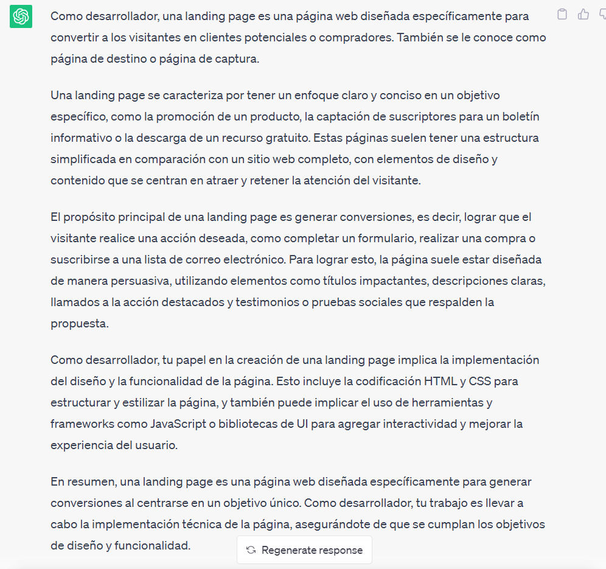

## Proyecto 03: Landing Page

[DAWM](/DAWM/)

### Como desarrollador, ¿Qué es una landing page?

### Antecedentes

Si tienes un producto o servicio es necesario promocionarlo de manera efectiva. Además, que sea un medio de comunicación directa con los potenciales clientes, promocionar descuentos y exponer beneficios del servicio o producto. 

### ChatGPT

Para el prompt: 

```
Como desarrollador, ¿Qué tipo de información debo mostrar en mi curriculum vitae?
```

La respuesta es:



### Guías

* [Guía 06: Responsive Design](/DAWM/guias/2023/guia06)
* [Guía 07: Bootstrap](/DAWM/guias/2023/guia07)

