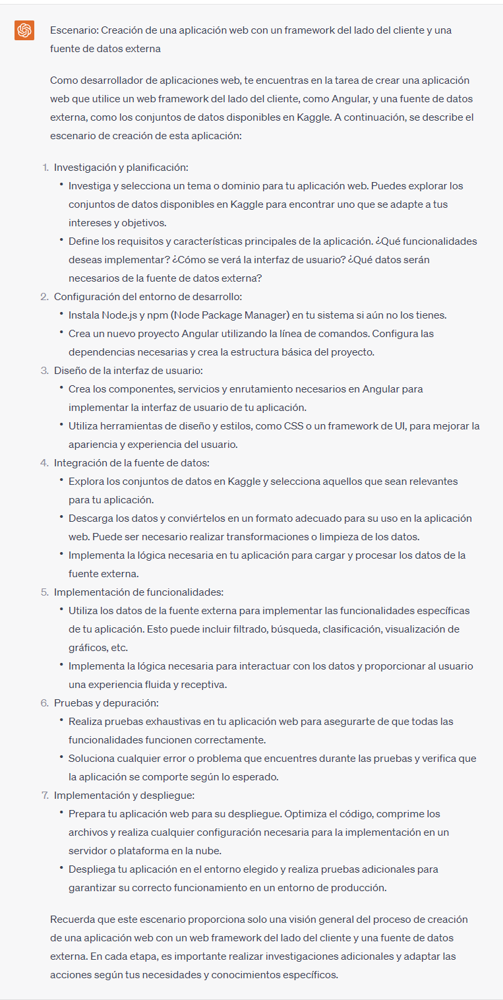

## Proyecto 04: Clima - Dashboard

[DAWM](/DAWM/)

### Como desarrollador de aplicaciones web, ¿Qué es un dashboard y qué información debe tener un dashboard?

### Antecedentes

Más allá de promocionar un producto o servicio en la web, los sitios web sirven permiten consolidar y presentar datos relevantes de manera intuitiva, lo que ayuda a los usuarios a comprender rápidamente la situación actual y tomar decisiones fundamentadas. A estos sitios se conocen como dashboards. Incluso, los dashboard permiten vigilar en tiempo real, o de forma periódica, para identificar el rendimiento y los cambios en los datos.

### ChatGPT

Para el prompt: 

```
Como desarrollador de aplicaciones web, ¿Qué es un dashboard y qué información debe tener un dashboard?
```
La respuesta es:



### Guías

* [Guía 08: Javascript - Introducción y DOM](/DAWM/guias/2023/guia08)
* [Guía 09: Javascript - Sincronía/Asincronía y Promesas](/DAWM/guias/2023/guia09)
* [Guía 10: Javascript - Async/Await y LocalStorage](/DAWM/guias/2023/guia10)
* [Guía 11: Javascript - CORS](/DAWM/guias/2023/guia11)
* [Guía 12: Typescript](/DAWM/guias/2023/guia12)