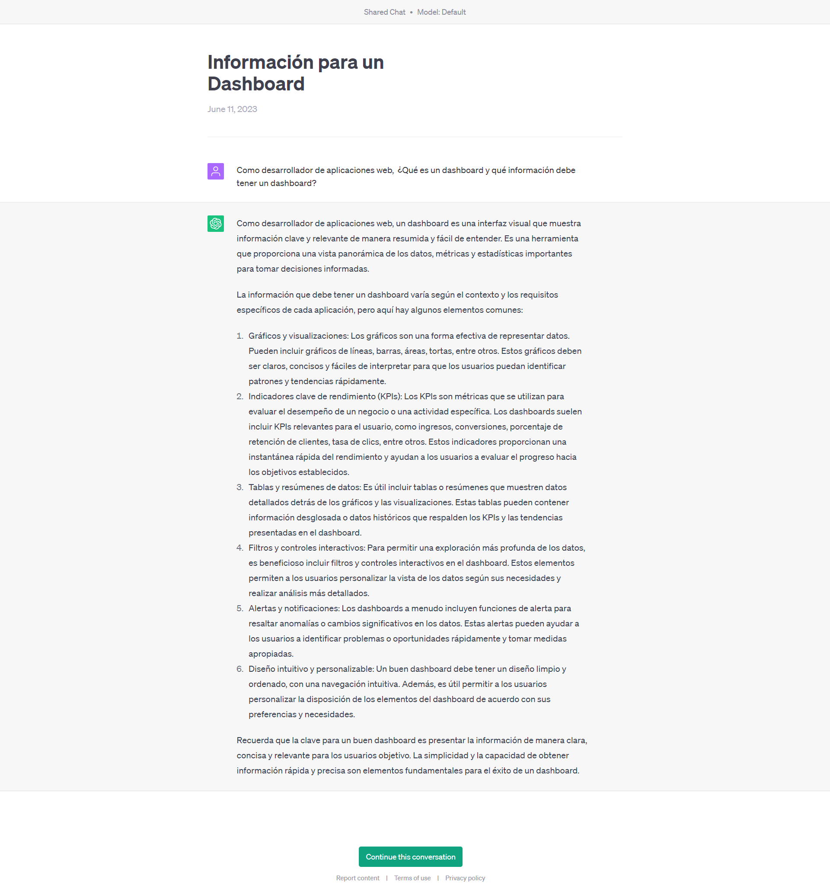

## Proyecto 04: Calculadora - Material

[DAWM](/DAWM/)

### ¿Qué debo considerar para elaborar un presupuesto de un sitio web con solo tecnologías de frontend (HTML, CSS y Javascript)?

### Antecedentes

Es bastante común que luego de conocer las tecnologías de frontend (HTML, CSS y Javascript) recibas propuestas para crear sitios web; sin embargo, no siempre es fácil estimar el tiempo y el costo del proyecto.  

### 

Para el prompt: 

```
Elabora un presupuesto para la implementación de una aplicación web con tecnologías HTML, CSS y Javascript. Por cada elemento, coloca el costo y tiempo estimado. 
```
La respuesta es:



### Guías

* [Guía 08: Javascript - Introducción, DOM y Eventos](/DAWM/guias/2023/guia08)

