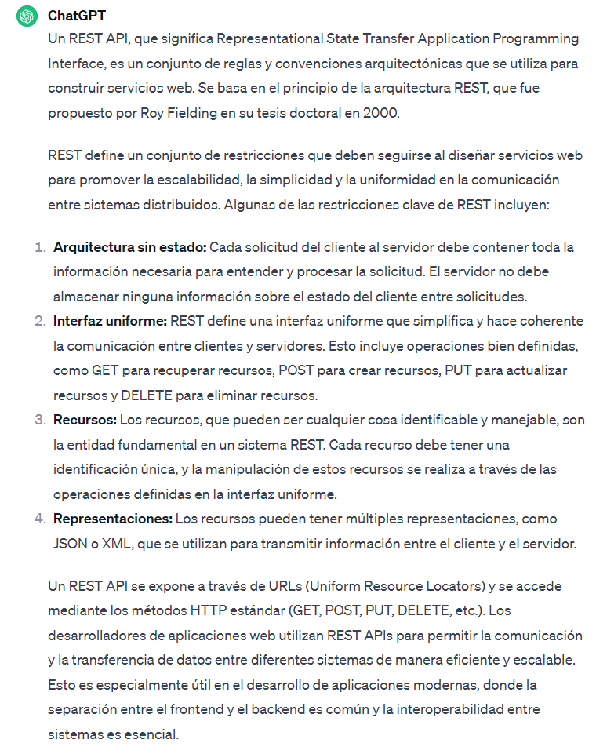

## Proyecto 05: Dataset MPA - Angular y Express

[DAWM](/DAWM/)

### Como desarrollador de aplicaciones web, redacta un escenario para crear una aplicación web con un web framework del lado del cliente (como Angular) y una fuente de datos (como las disponibles en Kaggle). No incluyas código.

### Antecedentes

La creación de una aplicación web a partir de un dataset es crucial para democratizar el acceso y la comprensión de datos. Al transformar información cruda en una interfaz interactiva y accesible, se facilita a los usuarios, incluso aquellos sin experiencia técnica, la exploración y comprensión de patrones y tendencias. Esto no solo mejora la toma de decisiones informada, sino que también amplía el alcance de la información contenida en el dataset. Una aplicación web puede proporcionar visualizaciones claras, herramientas de filtrado y funciones interactivas, permitiendo a diversos usuarios, desde profesionales hasta el público en general, aprovechar los insights contenidos en los datos de una manera más eficiente y efectiva.

### ChatGPT

Para el prompt: 

```
Como desarrollador de aplicaciones web, redacta un escenario para crear una aplicación 
web con un web framework del lado del cliente (como Angular) y una fuente de datos 
(como las disponibles en Kaggle). No incluyas código.
```
La respuesta es:



### Guías

* [Guía 12: Typescript](/DAWM/guias/2023/guia12)
* [Guía 13: Angular - Introducción y Plantilla](/DAWM/guias/2023/guia13)
* [Guía 14: Angular - Componentes y Rutas](/DAWM/guias/2023/guia14)