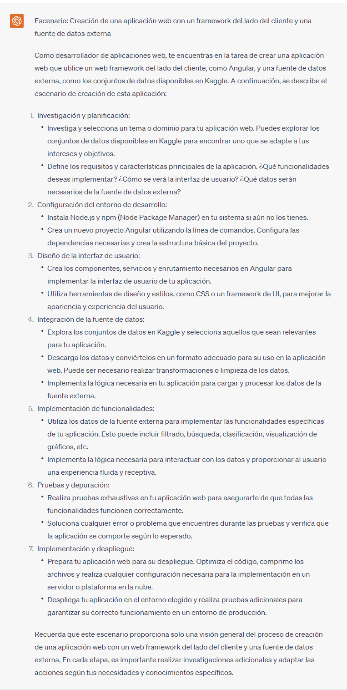

## Proyecto 05:

[DAWM](/DAWM/)

### Como desarrollador de aplicaciones web, ¿Qué es un dashboard y qué información debe tener un dashboard?

### Antecedentes

Más allá de promocionar un producto o servicio en la web, los sitios web sirven permiten consolidar y presentar datos relevantes de manera intuitiva, lo que ayuda a los usuarios a comprender rápidamente la situación actual y tomar decisiones fundamentadas. A estos sitios se conocen como dashboards. Incluso, los dashboard permiten monitorear en tiempo real o actualizarse de forma periódica, para monitorear el rendimiento y los cambios en los datos en tiempo real.

### 

Para el prompt: 

```
Como desarrollador de aplicaciones web, ¿Qué es un dashboard y qué información debe tener un dashboard?
```
La respuesta es:



### Guías

* [Guía 09: Javascript - Diseño del dashboard](/DAWM/guias/2023/guia09)

