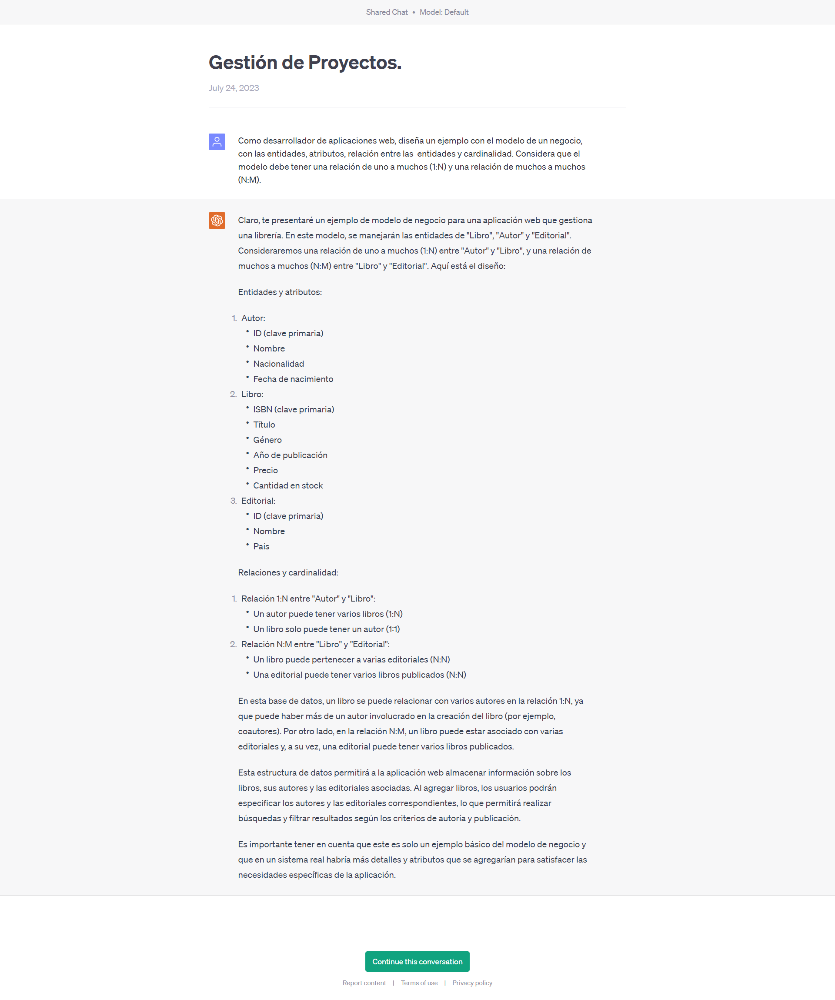

## Proyecto 07: Dataset MPA - Angular

[DAWM](/DAWM/)

### Proyecto

### Antecedentes

Como desarrollador de aplicaciones web, 

### ChatGPT

Para el prompt: 

```
Como desarrollador de aplicaciones web, 
```
La respuesta es:



### Guías

* [Guía 19: Angular - Material y Routing](/DAWM/guias/2023/guia19)
* [Guía 20: Angular - PWA](/DAWM/guias/2023/guia20)
* [Guía 21: Angular - Cordova](/DAWM/guias/2023/guia21)