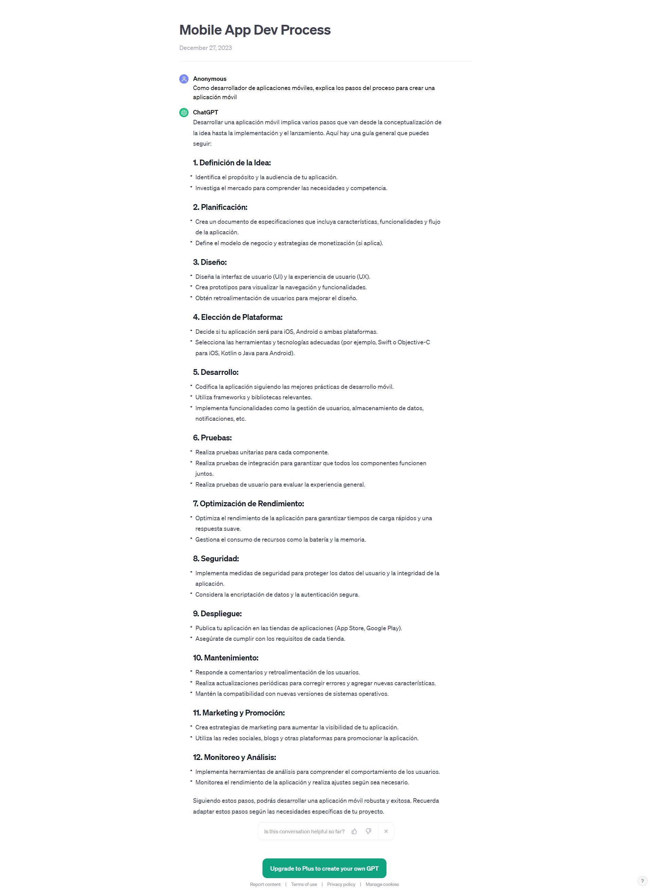

## Proyecto 07: Móvil - Ionic y Firebase

[DAWM](/DAWM/)

### ¿Cuáles son los pasos en el proceso para el desarrollo de aplicaciones móviles?

### Antecedentes

El desarrollo de una aplicación móvil exitosa requiere una cuidadosa consideración de diversos antecedentes para asegurar su viabilidad y relevancia en el mercado actual. Antes de comenzar, es esencial tener en cuenta los siguientes factores clave:

1. Análisis de Mercado. Comprender el mercado objetivo al identificar necesidades no satisfechas, evaluar la competencia y definir el posicionamiento único de la aplicación. La investigación de usuarios proporciona información valiosa sobre sus preferencias, comportamientos y desafíos, lo que permite diseñar una experiencia de usuario (UX) altamente efectiva.
2. Plataforma y Dispositivos Compatibles. Asegurarse de que la aplicación sea compatible con una variedad de tamaños de pantalla y versiones de sistema operativo garantiza una mayor accesibilidad.
3. Desarrollo Ágil y Pruebas Rigurosas. Adoptar metodologías de desarrollo ágil permite una adaptación más rápida a los cambios y comentarios del usuario para identificar y corregir errores antes del lanzamiento. 
4. Soporte Continuo y Actualizaciones. Garantizar un soporte continuo, recibir comentarios de los usuarios y realizar actualizaciones periódicas son elementos cruciales para mantener la relevancia y la calidad a lo largo del tiempo

### ChatGPT

Para el prompt: 

```
Como desarrollador de aplicaciones móviles, explicas los pasos del proceso para crear una aplicación móvil.
```
La respuesta es:



Para el prompt: 

```
Redacta posibles problemas cuya solución implique el desarrollo y uso de una aplicación móvil.
```
La respuesta es:


### Guías

* [Guía 24: Ionic - Introducción y Componentes](/DAWM/guias/2023/guia24)
* [Guía 25: Ionic](/DAWM/guias/2023/guia25)
* [Guía 26: Ionic](/DAWM/guias/2023/guia26)
* [Guía 27: Ionic](/DAWM/guias/2023/guia27)
* [Guía 28: Ionic](/DAWM/guias/2023/guia28)