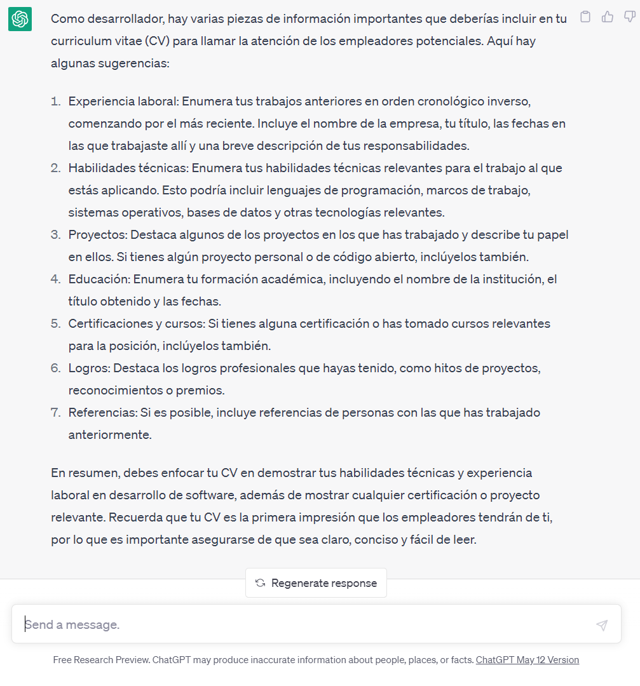

## Proyecto 02:  Landing Page SPA - Bootstrap & Javascript

[DAWM](/DAWM/)

### Como desarrollador, ¿Qué es una landing page?

### Antecedentes

Si tienes un producto o servicio es necesario promocionarlo de manera efectiva. Además, que sea un medio de comunicación directa con los potenciales clientes, promocionar descuentos y exponer beneficios del servicio o producto. 

### ChatGPT

Para el prompt: 

```
Como desarrollador, ¿Qué es una landing page?
```

La respuesta es:



### Guías

* [Guía 06: Bootstrap](/DAWM/guias/2024/guia06)
* [Guía 07: Javascript - Introducción, DOM y Eventos](/DAWM/guias/2024/guia07)
* [Guía 08: Javascript - Firebase, JSON, HTTP POST y Asincronía](/DAWM/guias/2024/guia08)
* [Guía 09: Javascript - HTTP POST, Asincronía, LocalStorage](/DAWM/guias/2024/guia09)