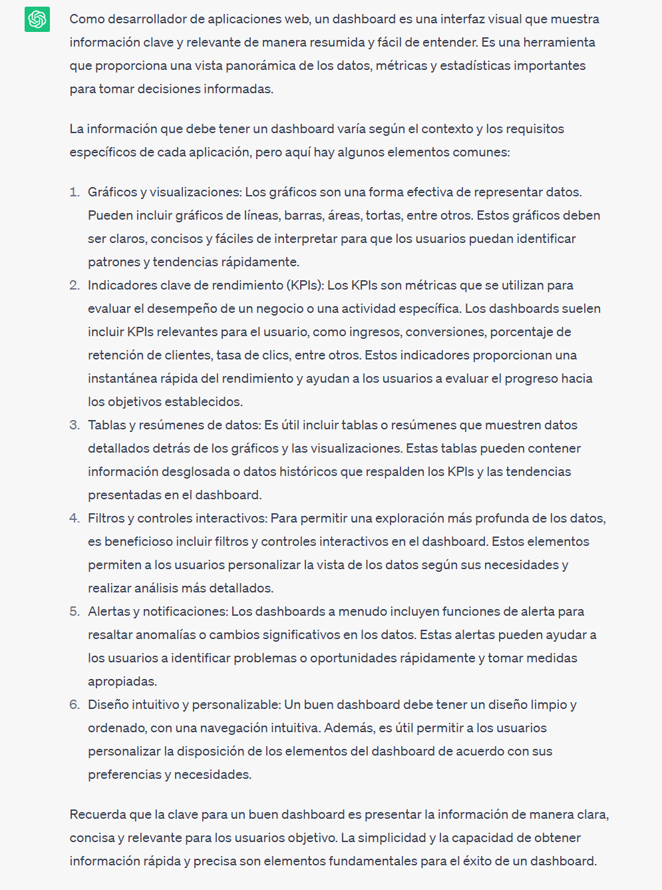

## Proyecto 03:Dashboard - Bootstrap & React

[DAWM](/DAWM/)

### Como desarrollador de aplicaciones web, ¿Qué es un dashboard y qué información debe tener un dashboard?

### Antecedentes

Más allá de promocionar un producto o servicio en la web, los sitios web sirven permiten consolidar y presentar datos relevantes de manera intuitiva, lo que ayuda a los usuarios a comprender rápidamente la situación actual y tomar decisiones fundamentadas. A estos sitios se conocen como dashboards. Incluso, los dashboard permiten vigilar en tiempo real, o de forma periódica, para identificar el rendimiento y los cambios en los datos.

### ChatGPT

Para el prompt: 

```
Como desarrollador de aplicaciones web, ¿Qué es un dashboard y qué información debe tener un dashboard?
```
La respuesta es:



### Guías

* [Guía 06: Responsive Design y Bootstrap](/DAWM/guias/2023/guia06)
* [Guía 07: Validación de HTML y CSS](/DAWM/guias/2023/guia07)

