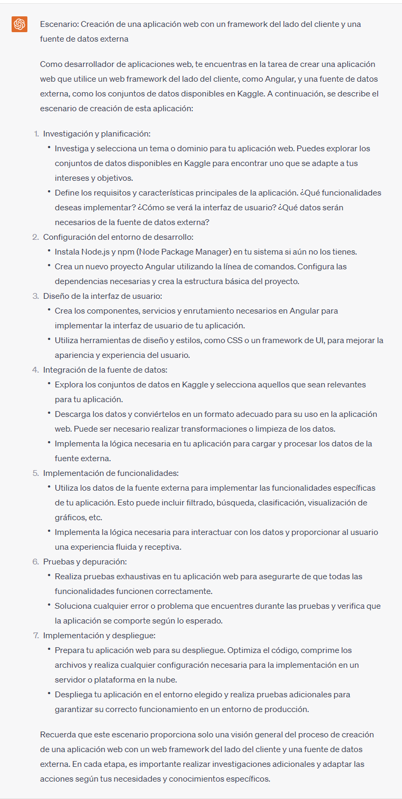

## Proyecto 04: REST API - Express

[DAWM](/DAWM/)

### Como desarrollador de aplicaciones web, ¿Qué es un REST API?

### Antecedentes

Como desarrollador de aplicaciones web, necesitas desarrollar una solución basada en datos en modelos no relacionales y que pueda ser administrada desde múltiplices interfaces.

### ChatGPT

Para el prompt: 

```
Como desarrollador de aplicaciones web, ¿Qué es un REST API? 
```
La respuesta es:



### Guías

* [Guía 15: REST API (Datos) - Express, Firebase - Firestore y cURL](/DAWM/guias/2024/guia15)
* [Guía 16: REST API (Datos) - Swagger y Postman](/DAWM/guias/2024/guia16)