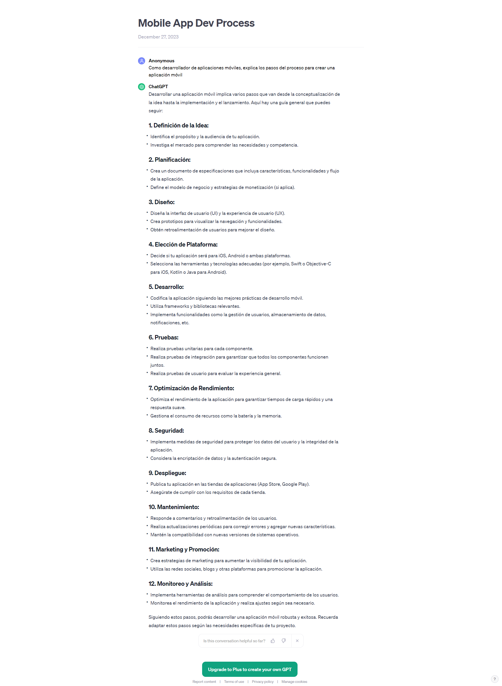

## Proyecto 04: Aplicación Híbrida - Angular y Ionic

[DAWM](/DAWM/)

### ¿Cuáles son los pasos en el proceso para el desarrollo de aplicaciones móviles?

### Antecedentes

El desarrollo de una aplicación móvil exitosa requiere una cuidadosa consideración de diversos antecedentes para asegurar su viabilidad y relevancia en el mercado actual. Antes de comenzar, es esencial tener en cuenta los siguientes factores clave: análisis de Mercado, plataforma y dispositivos Compatibles, desarrollo ágil y pruebas rigurosas y soporte continuo y actualizaciones.

### ChatGPT

Para el prompt: 

```
Como desarrollador de aplicaciones móviles, explica los pasos del proceso para crear una aplicación móvil.
```
La respuesta es:



Para el prompt: 

```
Redacta posibles problemas cuya solución implique el desarrollo y uso de una aplicación móvil.
```
La respuesta es:


### Guías

* [Guía 15: Angular y Ionic - TeachableMachine](/DAWM/guias/2024/guia15)
* [Guía 16: Angular y Ionic - Introducción y Componentes](/DAWM/guias/2024/guia16)
* [Guía 17: Angular y Ionic - Formularios, Servicios y Firebase](/DAWM/guias/2024/guia17)
* [Guía 18: Angular y Ionic - Ventanas Modales y Signals](/DAWM/guias/2024/guia18)
* [Guía 19: Angular y Ionic - Generación del apk](/DAWM/guias/2024/guia19)