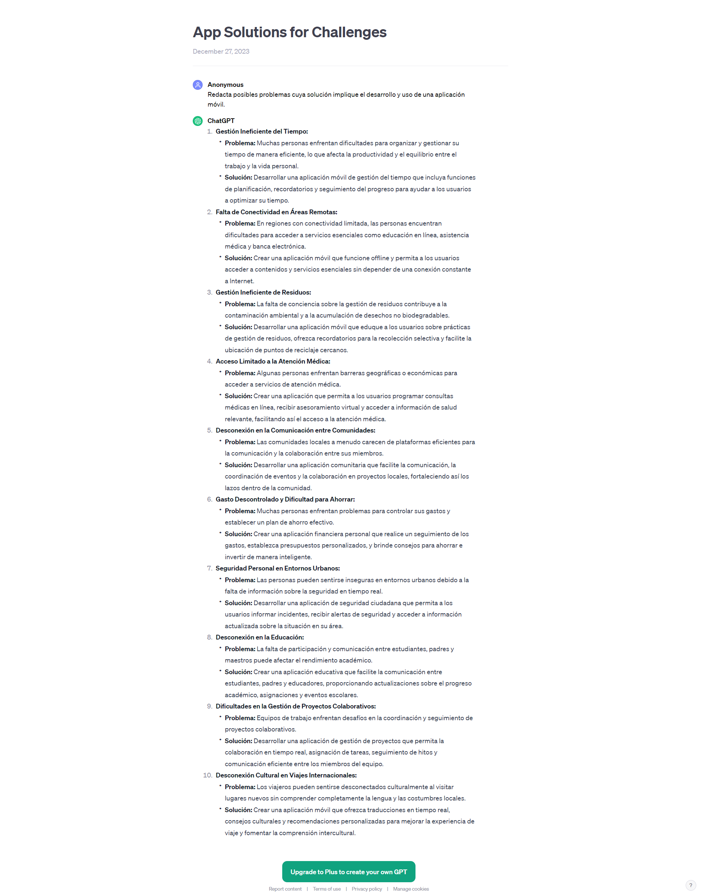

## Proyecto 05: Móvil - Ionic y Firebase

[DAWM](/DAWM/)

### ¿Cuáles son los pasos en el proceso para el desarrollo de aplicaciones móviles?

### Antecedentes

El desarrollo de una aplicación móvil exitosa requiere una cuidadosa consideración de diversos antecedentes para asegurar su viabilidad y relevancia en el mercado actual. Antes de comenzar, es esencial tener en cuenta los siguientes factores clave: análisis de Mercado, plataforma y dispositivos Compatibles, desarrollo ágil y pruebas rigurosas y soporte continuo y actualizaciones.

### ChatGPT

Para el prompt: 

```
Como desarrollador de aplicaciones móviles, explica los pasos del proceso para crear una aplicación móvil.
```
La respuesta es:


Para el prompt: 

```
Redacta posibles problemas cuya solución implique el desarrollo y uso de una aplicación móvil.
```
La respuesta es:



### Guías

* [Guía 24: Ionic - Introducción y Componentes](/DAWM/guias/2024/guia24)
* [Guía 25: Ionic - Funcionalidad nativa: Cámara](/DAWM/guias/2024/guia25)
* [Guía 26: Ionic - Servicios y Firebase](/DAWM/guias/2024/guia26)
* [Guía 27: Ionic - Modales y Signals](/DAWM/guias/2024/guia27)
* [Guía 28: Ionic - Generación del apk](/DAWM/guias/2024/guia28)