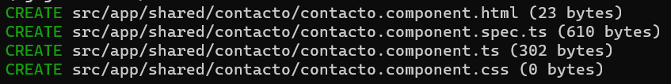
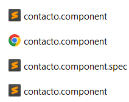
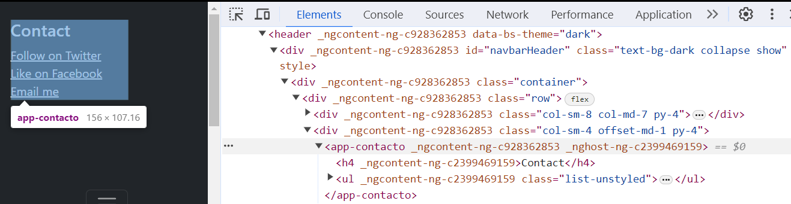
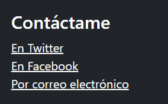

[Regresar](/DAWM/)

Angular - Componentes, Comunicación y Directivas 
================================================

Proyecto en Angular
===================

* * *

Utiliza el proyecto que desarrollaste con los tutoriales de [Angular - Local](https://dawmfiec.github.io/DAWM/tutoriales/angular_local.html) y [Angular - Boostrap](https://dawmfiec.github.io/DAWM/tutoriales/angular_bootstrap.html).


Componentes
===========

* * *

Los componentes son las unidades básicas de una interfaz de usuario en una aplicación Angular. Estos componentes están asociados con una plantilla y un subconjunto de directivas.


* Desde la línea de comandos, en la ruta raíz del proyecto de Angular, cree el componente **contacto**: `ng g c shared/contacto`
    + El mensaje de `update` indica que el componente creado está incluido en el arreglo de declaraciones del componente principal (`src/app/app.module.ts`).

    

    + Se creará una carpeta con el nombre del componente, con los elementos: **.html**, **.css**, **.ts** (luego, Angular se encargará de transpilar a **.js**) y **.spec.ts** (pruebas unitarias sobre el componente).

    


contacto.component dentro de app.component
===========

* * *

* De `app.component.html`, extraiga las siguientes etiquetas HTML:

  ```html
  ...
  <h4>Contact</h4>
  <ul class="list-unstyled">
    <li><a href="#" class="text-white">Follow on Twitter</a></li>
    <li><a href="#" class="text-white">Like on Facebook</a></li>
    <li><a href="#" class="text-white">Email me</a></li>
  </ul>
  ...
  ```

* Reemplace el contenido de `contacto.component.html` por las etiquetas HTML copiadas previamente.

* Renderice el componente **contacto** dentro del componente **app**:
    
    + En el _ts_ (el controlador) del componente **app**, importe y agregue la referencia al componente _contacto_:

    ```javascript
    ...
    import { ContactoComponent } from './shared/contacto/contacto.component';

    @Component({
      selector: 'app-root',
      standalone: true,
      imports: [CommonModule, RouterOutlet, ContactoComponent],
      templateUrl: './app.component.html',
      styleUrl: './app.component.css'
    })
    export class AppComponent {
    ...
    ```

    + En el _html_ (la vista) del componente **app**, coloque el selector **`<app-contacto>`**:

    ```html
      <div class="col-sm-4 offset-md-1 py-4">
        <app-contacto></app-contacto>
      </div>
    ``` 

    + Reinicie el servidor
    + Inspeccione el html y compruebe el componente renderizado.

    
    

  
Comunicación 
============

* * *

Hay [más de un mecanismo de comunicación](https://www.acontracorrientech.com/guia-practica-del-databinding-en-angular/) entre el **.html** y el **.ts**: string interpolation, property binding, event binding y two way databinding.

<p align="center">
  
</p>

De una vía (one-way binding) - string interpolation
---------------------------------------------------

La interpolación se refiere a incrustar expresiones en texto marcado. De forma predeterminada, la interpolación utiliza llaves dobles {{ y }} como delimitadores.

* En el _.ts_ (el controlador) del componente **contacto**

    + Agregue el atributo *titulo*, con su tipo, dentro de la clase
    ```javascript
    ...
    export class ContactoComponent {
        titulo:string = "Contáctame"
    }
    ...
    ```

* En el _html_ (la vista) del componente **contacto**
  
    + Reemplace el contenido
    ```
      <h4 class="text-white">Contáctame</h4>
    ```
    por
    ```
      <h4 class="text-white">  {{titulo}}  </h4>
    ```

* Actualice el navegador o (re)inicie el servidor
* Notará que al abrir la barra superior aparece la vista modificada.

    
    
Directivas 
==========

Las directivas sirven para extender la vista y usar lógica que será ejecutada en el DOM (Document Object Model). Existen [tres tipos de directivas](https://ngchallenges.gitbook.io/project/directivas): directivas de atributo, directivas estructurales y componentes.

<p align="center">
  
</p>


Directivas estructurales - (\*ngFor)
------------------------------------

Con esta directiva estructural [\*ngFor](https://angular.io/api/common/NgForOf) podemos repetir n veces un bloque de etiquetas.

* En el _.ts_ (el controlador) del componente **contacto**

    + Agregue el atributo *mecanismos*, dentro de la clase
    ```javascript
    ...
    export class ContactoComponent {
        ...
        medios:any[] = [
          { "texto":"En Twitter"},
          {"texto":"En Facebook"},
          {"texto":"Por correo electrónico"}
        ]
    ...
    ```

* En el _html_ (la vista) del componente **contacto**
  
    + Reemplace el contenido
    ```
      <ul class="list-unstyled">
        <li><a href="#" class="text-white">Medio 1</a></li>
        <li><a href="#" class="text-white">Medio 2</a></li>
        <li><a href="#" class="text-white">Medio 3</a></li>
      </ul>
    ```
    por
    ```
      <ul class="list-unstyled">
        <li *ngFor="let medio of medios">
          <a href="#" class="text-white">
             {{medio.texto}} 
          </a>
        </li>
      </ul>
    ```

* Actualice el navegador o (re)inicie el servidor
* Notará que al abrir la barra superior aparece la vista modificada.

    


Referencias 
===========

* * *

* Angular. (2021). Retrieved 1 December 2021, from [https://angular.io/](https://angular.io/)
* Introduction to Angular Components and How to Implement It? (20202) https://www.simplilearn.com/tutorials/angular-tutorial/angular-components
* Guía de iniciación al data binding en Angular Qué es y cómo se utiliza. (2019). Retrieved 13 July 2022, from https://www.acontracorrientech.com/guia-practica-del-databinding-en-angular/
* 🧑‍🎨Directivas🧑‍🎨 - Aprendiendo Angular. (2022). Retrieved 15 July 2022, from https://ngchallenges.gitbook.io/project/directivas
* Introducción a las directivas y tipos de directivas en Angular - Java desde 0. (2020). Retrieved 15 July 2022, from https://javadesde0.com/introduccion-a-las-directivas-y-tipos-de-directivas-en-angular/
